

  🌙
  <h1>मीठे सपनों की कहानियाँ</h1>
  
4–7 साल के बच्चों के लिए 140 हिंदी सुलाने वाली कहानियाँ — 112 मूल कहानियाँ और 28 कालजयी क्लासिक कहानियाँ।

  

    <input id="story-search" type="search" placeholder="🔍 कहानी खोजें…" aria-label="search">
    🔍
  

  
📚 140 कहानियाँ &nbsp;·&nbsp; 📕 मुफ़्त सचित्र PDF &nbsp;·&nbsp; 🌙 रोज़ नई कहानियाँ

  

  <a href="book/night-time-stories.pdf">
    🌙
    
      ✨ ख़ास किताब
      <h2>🌙 रात की कहानियों की किताब</h2>
      
एक ही खूबसूरत किताब में 26 सपनीली सुलाने वाली कहानियाँ — बत्ती बुझाकर पढ़ने के लिए बिल्कुल सही।

    
    →
  </a>

<main class="shelf">

😴 कोई कहानी नहीं मिली — कोई और शब्द आज़माएँ!

<!-- DAILY-NEW-START -->
<article class="story-card" data-search="मीरा और तारों के सिक्के 2026-10-01-mira-and-the-starlit-coins">
  <a class="card-art" href="stories/2026-10-01-mira-and-the-starlit-coins.html" aria-label="मीरा और तारों के सिक्के">
    🌟
    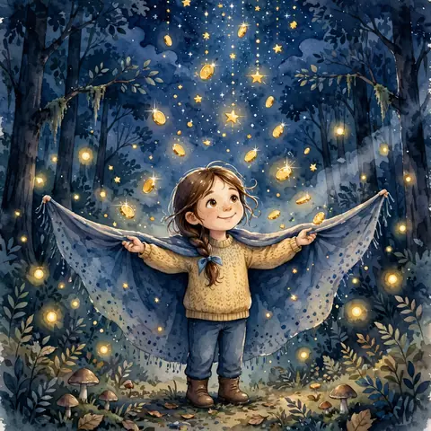
  </a>
  

    <h3><a href="stories/2026-10-01-mira-and-the-starlit-coins.html">मीरा और तारों के सिक्के</a></h3>
    

      <a class="btn btn-read" href="stories/2026-10-01-mira-and-the-starlit-coins.html">📖 पढ़ें</a>
      <a class="btn btn-share" href="https://wa.me/?text=%E0%A4%AE%E0%A5%80%E0%A4%B0%E0%A4%BE%20%E0%A4%94%E0%A4%B0%20%E0%A4%A4%E0%A4%BE%E0%A4%B0%E0%A5%8B%E0%A4%82%20%E0%A4%95%E0%A5%87%20%E0%A4%B8%E0%A4%BF%E0%A4%95%E0%A5%8D%E0%A4%95%E0%A5%87%20%E2%80%94%20%E0%A4%AE%E0%A5%80%E0%A4%A0%E0%A5%87%20%E0%A4%B8%E0%A4%AA%E0%A4%A8%E0%A5%8B%E0%A4%82%20%E0%A4%95%E0%A5%80%20%E0%A4%95%E0%A4%B9%E0%A4%BE%E0%A4%A8%E0%A4%BF%E0%A4%AF%E0%A5%8B%E0%A4%82%0Ahttps%3A%2F%2Fniteshlhsnda-droid.github.io%2Fkids-book-videos-hindi%2Fstories%2F2026-10-01-mira-and-the-starlit-coins.html" target="_blank" rel="noopener" title="WhatsApp पर भेजें" aria-label="WhatsApp पर भेजें">📲</a>
    

  

</article>
<article class="story-card" data-search="ऊना उल्लू और रात का गाना 2026-09-30-oona-the-owl-and-the-night-song">
  <a class="card-art" href="stories/2026-09-30-oona-the-owl-and-the-night-song.html" aria-label="ऊना उल्लू और रात का गाना">
    🦉
    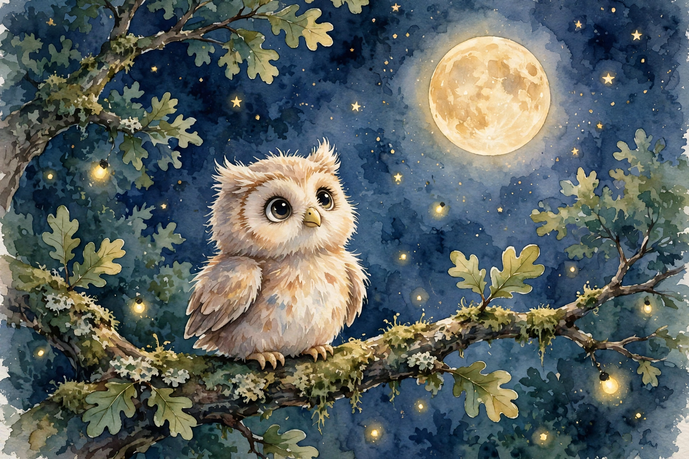
  </a>
  

    <h3><a href="stories/2026-09-30-oona-the-owl-and-the-night-song.html">ऊना उल्लू और रात का गाना</a></h3>
    

      <a class="btn btn-read" href="stories/2026-09-30-oona-the-owl-and-the-night-song.html">📖 पढ़ें</a>
      <a class="btn btn-share" href="https://wa.me/?text=%E0%A4%8A%E0%A4%A8%E0%A4%BE%20%E0%A4%89%E0%A4%B2%E0%A5%8D%E0%A4%B2%E0%A5%82%20%E0%A4%94%E0%A4%B0%20%E0%A4%B0%E0%A4%BE%E0%A4%A4%20%E0%A4%95%E0%A4%BE%20%E0%A4%97%E0%A4%BE%E0%A4%A8%E0%A4%BE%20%E2%80%94%20%E0%A4%AE%E0%A5%80%E0%A4%A0%E0%A5%87%20%E0%A4%B8%E0%A4%AA%E0%A4%A8%E0%A5%8B%E0%A4%82%20%E0%A4%95%E0%A5%80%20%E0%A4%95%E0%A4%B9%E0%A4%BE%E0%A4%A8%E0%A4%BF%E0%A4%AF%E0%A5%8B%E0%A4%82%0Ahttps%3A%2F%2Fniteshlhsnda-droid.github.io%2Fkids-book-videos-hindi%2Fstories%2F2026-09-30-oona-the-owl-and-the-night-song.html" target="_blank" rel="noopener" title="WhatsApp पर भेजें" aria-label="WhatsApp पर भेजें">📲</a>
    

  

</article>
<section class="category cat-new" id="cat-new">
  <h2>🆕 नई कहानियाँ</h2>
  
हर दिन ताज़ा — सबसे नई कहानी सबसे पहले।

  

<article class="story-card" data-search="विली विंकी और ऊँघता शहर 2026-09-29-willie-winkie-and-the-sleepy-town">
  <a class="card-art" href="stories/2026-09-29-willie-winkie-and-the-sleepy-town.html" aria-label="विली विंकी और ऊँघता शहर">
    🌙
    
  </a>
  

    <h3><a href="stories/2026-09-29-willie-winkie-and-the-sleepy-town.html">विली विंकी और ऊँघता शहर</a></h3>
    

      <a class="btn btn-read" href="stories/2026-09-29-willie-winkie-and-the-sleepy-town.html">📖 पढ़ें</a>
      <a class="btn btn-share" href="https://wa.me/?text=%E0%A4%B5%E0%A4%BF%E0%A4%B2%E0%A5%80%20%E0%A4%B5%E0%A4%BF%E0%A4%82%E0%A4%95%E0%A5%80%20%E0%A4%94%E0%A4%B0%20%E0%A4%8A%E0%A4%81%E0%A4%98%E0%A4%A4%E0%A4%BE%20%E0%A4%B6%E0%A4%B9%E0%A4%B0%20%E2%80%94%20%E0%A4%AE%E0%A5%80%E0%A4%A0%E0%A5%87%20%E0%A4%B8%E0%A4%AA%E0%A4%A8%E0%A5%8B%E0%A4%82%20%E0%A4%95%E0%A5%80%20%E0%A4%95%E0%A4%B9%E0%A4%BE%E0%A4%A8%E0%A4%BF%E0%A4%AF%E0%A5%8B%E0%A4%82%0Ahttps%3A%2F%2Fniteshlhsnda-droid.github.io%2Fkids-book-videos-hindi%2Fstories%2F2026-09-29-willie-winkie-and-the-sleepy-town.html" target="_blank" rel="noopener" title="WhatsApp पर भेजें" aria-label="WhatsApp पर भेजें">📲</a>
    

  

</article>
<article class="story-card" data-search="पॉपी साही और पैबंद वाली रज़ाई 2026-09-28-poppy-the-porcupine-and-the-patchwork-quilt">
  <a class="card-art" href="stories/2026-09-28-poppy-the-porcupine-and-the-patchwork-quilt.html" aria-label="पॉपी साही और पैबंद वाली रज़ाई">
    🦔
    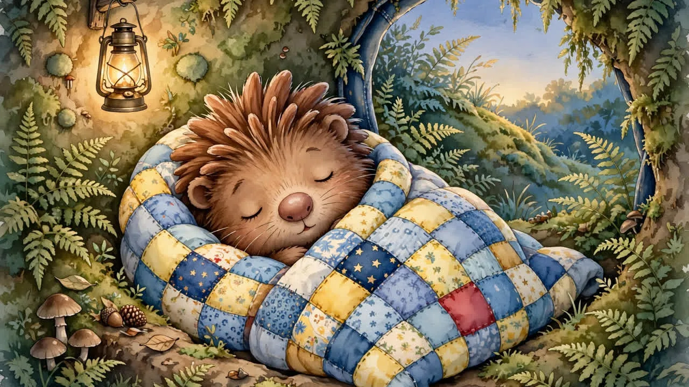
  </a>
  

    <h3><a href="stories/2026-09-28-poppy-the-porcupine-and-the-patchwork-quilt.html">पॉपी साही और पैबंद वाली रज़ाई</a></h3>
    

      <a class="btn btn-read" href="stories/2026-09-28-poppy-the-porcupine-and-the-patchwork-quilt.html">📖 पढ़ें</a>
      <a class="btn btn-share" href="https://wa.me/?text=%E0%A4%AA%E0%A5%89%E0%A4%AA%E0%A5%80%20%E0%A4%B8%E0%A4%BE%E0%A4%B9%E0%A5%80%20%E0%A4%94%E0%A4%B0%20%E0%A4%AA%E0%A5%88%E0%A4%AC%E0%A4%82%E0%A4%A6%20%E0%A4%B5%E0%A4%BE%E0%A4%B2%E0%A5%80%20%E0%A4%B0%E0%A4%9C%E0%A4%BC%E0%A4%BE%E0%A4%88%20%E2%80%94%20%E0%A4%AE%E0%A5%80%E0%A4%A0%E0%A5%87%20%E0%A4%B8%E0%A4%AA%E0%A4%A8%E0%A5%8B%E0%A4%82%20%E0%A4%95%E0%A5%80%20%E0%A4%95%E0%A4%B9%E0%A4%BE%E0%A4%A8%E0%A4%BF%E0%A4%AF%E0%A5%8B%E0%A4%82%0Ahttps%3A%2F%2Fniteshlhsnda-droid.github.io%2Fkids-book-videos-hindi%2Fstories%2F2026-09-28-poppy-the-porcupine-and-the-patchwork-quilt.html" target="_blank" rel="noopener" title="WhatsApp पर भेजें" aria-label="WhatsApp पर भेजें">📲</a>
    

  

</article>
<article class="story-card" data-search="राजकुमार मिलो और नन्ही सफ़ेद बिल्ली 2026-09-27-prince-milo-and-the-little-white-cat">
  <a class="card-art" href="stories/2026-09-27-prince-milo-and-the-little-white-cat.html" aria-label="राजकुमार मिलो और नन्ही सफ़ेद बिल्ली">
    🐱
    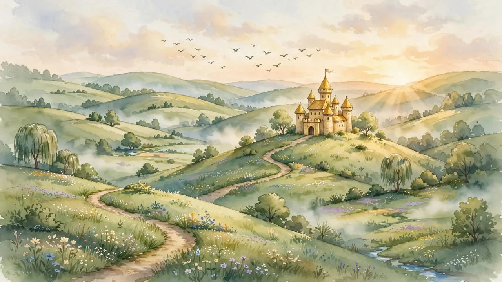
  </a>
  

    <h3><a href="stories/2026-09-27-prince-milo-and-the-little-white-cat.html">राजकुमार मिलो और नन्ही सफ़ेद बिल्ली</a></h3>
    

      <a class="btn btn-read" href="stories/2026-09-27-prince-milo-and-the-little-white-cat.html">📖 पढ़ें</a>
      <a class="btn btn-share" href="https://wa.me/?text=%E0%A4%B0%E0%A4%BE%E0%A4%9C%E0%A4%95%E0%A5%81%E0%A4%AE%E0%A4%BE%E0%A4%B0%20%E0%A4%AE%E0%A4%BF%E0%A4%B2%E0%A5%8B%20%E0%A4%94%E0%A4%B0%20%E0%A4%A8%E0%A4%A8%E0%A5%8D%E0%A4%B9%E0%A5%80%20%E0%A4%B8%E0%A4%AB%E0%A4%BC%E0%A5%87%E0%A4%A6%20%E0%A4%AC%E0%A4%BF%E0%A4%B2%E0%A5%8D%E0%A4%B2%E0%A5%80%20%E2%80%94%20%E0%A4%AE%E0%A5%80%E0%A4%A0%E0%A5%87%20%E0%A4%B8%E0%A4%AA%E0%A4%A8%E0%A5%8B%E0%A4%82%20%E0%A4%95%E0%A5%80%20%E0%A4%95%E0%A4%B9%E0%A4%BE%E0%A4%A8%E0%A4%BF%E0%A4%AF%E0%A5%8B%E0%A4%82%0Ahttps%3A%2F%2Fniteshlhsnda-droid.github.io%2Fkids-book-videos-hindi%2Fstories%2F2026-09-27-prince-milo-and-the-little-white-cat.html" target="_blank" rel="noopener" title="WhatsApp पर भेजें" aria-label="WhatsApp पर भेजें">📲</a>
    

  

</article>
<article class="story-card" data-search="विलो व्हेल और चाँदनी का गीत 2026-09-26-willow-the-whale-and-the-moonlit-song">
  <a class="card-art" href="stories/2026-09-26-willow-the-whale-and-the-moonlit-song.html" aria-label="विलो व्हेल और चाँदनी का गीत">
    🐳
    
  </a>
  

    <h3><a href="stories/2026-09-26-willow-the-whale-and-the-moonlit-song.html">विलो व्हेल और चाँदनी का गीत</a></h3>
    

      <a class="btn btn-read" href="stories/2026-09-26-willow-the-whale-and-the-moonlit-song.html">📖 पढ़ें</a>
      <a class="btn btn-share" href="https://wa.me/?text=%E0%A4%B5%E0%A4%BF%E0%A4%B2%E0%A5%8B%20%E0%A4%B5%E0%A5%8D%E0%A4%B9%E0%A5%87%E0%A4%B2%20%E0%A4%94%E0%A4%B0%20%E0%A4%9A%E0%A4%BE%E0%A4%81%E0%A4%A6%E0%A4%A8%E0%A5%80%20%E0%A4%95%E0%A4%BE%20%E0%A4%97%E0%A5%80%E0%A4%A4%20%E2%80%94%20%E0%A4%AE%E0%A5%80%E0%A4%A0%E0%A5%87%20%E0%A4%B8%E0%A4%AA%E0%A4%A8%E0%A5%8B%E0%A4%82%20%E0%A4%95%E0%A5%80%20%E0%A4%95%E0%A4%B9%E0%A4%BE%E0%A4%A8%E0%A4%BF%E0%A4%AF%E0%A5%8B%E0%A4%82%0Ahttps%3A%2F%2Fniteshlhsnda-droid.github.io%2Fkids-book-videos-hindi%2Fstories%2F2026-09-26-willow-the-whale-and-the-moonlit-song.html" target="_blank" rel="noopener" title="WhatsApp पर भेजें" aria-label="WhatsApp पर भेजें">📲</a>
    

  

</article>
<article class="story-card" data-search="हूफ़ी ऊँट और मददगार कूबड़ 2026-09-25-hoofy-the-camel-and-the-helpful-hump">
  <a class="card-art" href="stories/2026-09-25-hoofy-the-camel-and-the-helpful-hump.html" aria-label="हूफ़ी ऊँट और मददगार कूबड़">
    🐫
    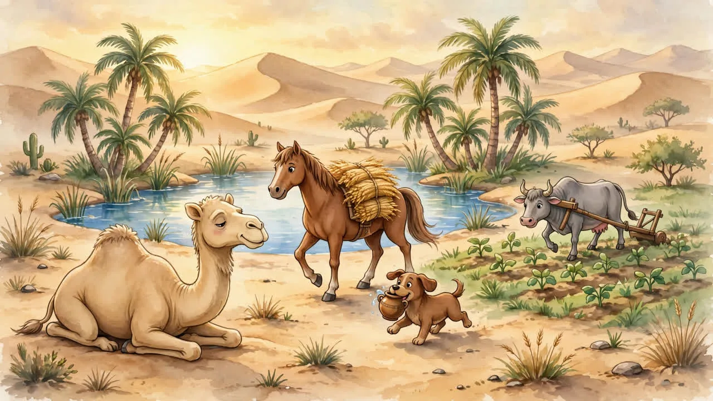
  </a>
  

    <h3><a href="stories/2026-09-25-hoofy-the-camel-and-the-helpful-hump.html">हूफ़ी ऊँट और मददगार कूबड़</a></h3>
    

      <a class="btn btn-read" href="stories/2026-09-25-hoofy-the-camel-and-the-helpful-hump.html">📖 पढ़ें</a>
      <a class="btn btn-share" href="https://wa.me/?text=%E0%A4%B9%E0%A5%82%E0%A4%AB%E0%A4%BC%E0%A5%80%20%E0%A4%8A%E0%A4%81%E0%A4%9F%20%E0%A4%94%E0%A4%B0%20%E0%A4%AE%E0%A4%A6%E0%A4%A6%E0%A4%97%E0%A4%BE%E0%A4%B0%20%E0%A4%95%E0%A5%82%E0%A4%AC%E0%A4%A1%E0%A4%BC%20%E2%80%94%20%E0%A4%AE%E0%A5%80%E0%A4%A0%E0%A5%87%20%E0%A4%B8%E0%A4%AA%E0%A4%A8%E0%A5%8B%E0%A4%82%20%E0%A4%95%E0%A5%80%20%E0%A4%95%E0%A4%B9%E0%A4%BE%E0%A4%A8%E0%A4%BF%E0%A4%AF%E0%A5%8B%E0%A4%82%0Ahttps%3A%2F%2Fniteshlhsnda-droid.github.io%2Fkids-book-videos-hindi%2Fstories%2F2026-09-25-hoofy-the-camel-and-the-helpful-hump.html" target="_blank" rel="noopener" title="WhatsApp पर भेजें" aria-label="WhatsApp पर भेजें">📲</a>
    

  

</article>
<article class="story-card" data-search="ब्रम्मू बिज्जू और फुसफुसाते चीड़ के पेड़ 2026-09-24-bram-the-badger-and-the-whispering-woods">
  <a class="card-art" href="stories/2026-09-24-bram-the-badger-and-the-whispering-woods.html" aria-label="ब्रम्मू बिज्जू और फुसफुसाते चीड़ के पेड़">
    🦡
    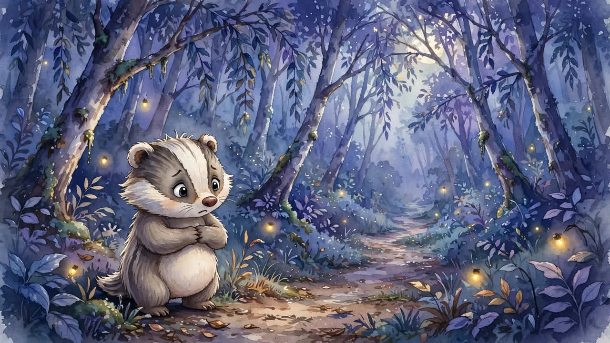
  </a>
  

    <h3><a href="stories/2026-09-24-bram-the-badger-and-the-whispering-woods.html">ब्रम्मू बिज्जू और फुसफुसाते चीड़ के पेड़</a></h3>
    

      <a class="btn btn-read" href="stories/2026-09-24-bram-the-badger-and-the-whispering-woods.html">📖 पढ़ें</a>
      <a class="btn btn-share" href="https://wa.me/?text=%E0%A4%AC%E0%A5%8D%E0%A4%B0%E0%A4%AE%E0%A5%8D%E0%A4%AE%E0%A5%82%20%E0%A4%AC%E0%A4%BF%E0%A4%9C%E0%A5%8D%E0%A4%9C%E0%A5%82%20%E0%A4%94%E0%A4%B0%20%E0%A4%AB%E0%A5%81%E0%A4%B8%E0%A4%AB%E0%A5%81%E0%A4%B8%E0%A4%BE%E0%A4%A4%E0%A5%87%20%E0%A4%9A%E0%A5%80%E0%A4%A1%E0%A4%BC%20%E0%A4%95%E0%A5%87%20%E0%A4%AA%E0%A5%87%E0%A4%A1%E0%A4%BC%20%E2%80%94%20%E0%A4%AE%E0%A5%80%E0%A4%A0%E0%A5%87%20%E0%A4%B8%E0%A4%AA%E0%A4%A8%E0%A5%8B%E0%A4%82%20%E0%A4%95%E0%A5%80%20%E0%A4%95%E0%A4%B9%E0%A4%BE%E0%A4%A8%E0%A4%BF%E0%A4%AF%E0%A5%8B%E0%A4%82%0Ahttps%3A%2F%2Fniteshlhsnda-droid.github.io%2Fkids-book-videos-hindi%2Fstories%2F2026-09-24-bram-the-badger-and-the-whispering-woods.html" target="_blank" rel="noopener" title="WhatsApp पर भेजें" aria-label="WhatsApp पर भेजें">📲</a>
    

  

</article>
<article class="story-card" data-search="टिल्ली कछुआ और दौड़ने वाला खरगोश 2026-09-23-tilly-the-tortoise-and-the-racing-hare">
  <a class="card-art" href="stories/2026-09-23-tilly-the-tortoise-and-the-racing-hare.html" aria-label="टिल्ली कछुआ और दौड़ने वाला खरगोश">
    🐢
    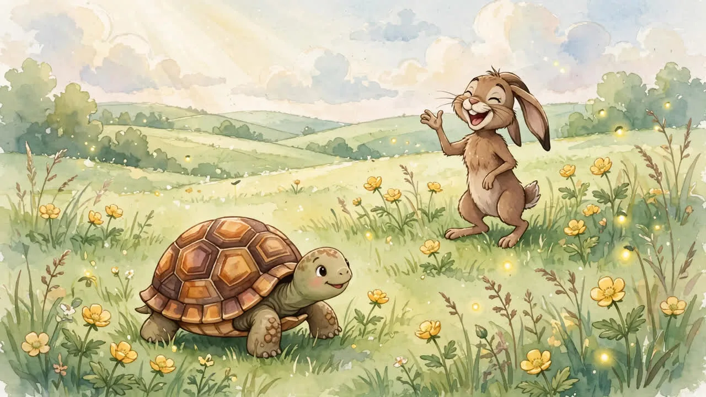
  </a>
  

    <h3><a href="stories/2026-09-23-tilly-the-tortoise-and-the-racing-hare.html">टिल्ली कछुआ और दौड़ने वाला खरगोश</a></h3>
    

      <a class="btn btn-read" href="stories/2026-09-23-tilly-the-tortoise-and-the-racing-hare.html">📖 पढ़ें</a>
      <a class="btn btn-share" href="https://wa.me/?text=%E0%A4%9F%E0%A4%BF%E0%A4%B2%E0%A5%8D%E0%A4%B2%E0%A5%80%20%E0%A4%95%E0%A4%9B%E0%A5%81%E0%A4%86%20%E0%A4%94%E0%A4%B0%20%E0%A4%A6%E0%A5%8C%E0%A4%A1%E0%A4%BC%E0%A4%A8%E0%A5%87%20%E0%A4%B5%E0%A4%BE%E0%A4%B2%E0%A4%BE%20%E0%A4%96%E0%A4%B0%E0%A4%97%E0%A5%8B%E0%A4%B6%20%E2%80%94%20%E0%A4%AE%E0%A5%80%E0%A4%A0%E0%A5%87%20%E0%A4%B8%E0%A4%AA%E0%A4%A8%E0%A5%8B%E0%A4%82%20%E0%A4%95%E0%A5%80%20%E0%A4%95%E0%A4%B9%E0%A4%BE%E0%A4%A8%E0%A4%BF%E0%A4%AF%E0%A5%8B%E0%A4%82%0Ahttps%3A%2F%2Fniteshlhsnda-droid.github.io%2Fkids-book-videos-hindi%2Fstories%2F2026-09-23-tilly-the-tortoise-and-the-racing-hare.html" target="_blank" rel="noopener" title="WhatsApp पर भेजें" aria-label="WhatsApp पर भेजें">📲</a>
    

  

</article>
<article class="story-card" data-search="निया और ऊँघता तारा 2026-09-22-nia-and-the-sleepy-star">
  <a class="card-art" href="stories/2026-09-22-nia-and-the-sleepy-star.html" aria-label="निया और ऊँघता तारा">
    ⭐
    
  </a>
  

    <h3><a href="stories/2026-09-22-nia-and-the-sleepy-star.html">निया और ऊँघता तारा</a></h3>
    

      <a class="btn btn-read" href="stories/2026-09-22-nia-and-the-sleepy-star.html">📖 पढ़ें</a>
      <a class="btn btn-share" href="https://wa.me/?text=%E0%A4%A8%E0%A4%BF%E0%A4%AF%E0%A4%BE%20%E0%A4%94%E0%A4%B0%20%E0%A4%8A%E0%A4%81%E0%A4%98%E0%A4%A4%E0%A4%BE%20%E0%A4%A4%E0%A4%BE%E0%A4%B0%E0%A4%BE%20%E2%80%94%20%E0%A4%AE%E0%A5%80%E0%A4%A0%E0%A5%87%20%E0%A4%B8%E0%A4%AA%E0%A4%A8%E0%A5%8B%E0%A4%82%20%E0%A4%95%E0%A5%80%20%E0%A4%95%E0%A4%B9%E0%A4%BE%E0%A4%A8%E0%A4%BF%E0%A4%AF%E0%A5%8B%E0%A4%82%0Ahttps%3A%2F%2Fniteshlhsnda-droid.github.io%2Fkids-book-videos-hindi%2Fstories%2F2026-09-22-nia-and-the-sleepy-star.html" target="_blank" rel="noopener" title="WhatsApp पर भेजें" aria-label="WhatsApp पर भेजें">📲</a>
    

  

</article>
  

</section>
<!-- DAILY-NEW-END -->

<section class="category cat-night" id="cat-night">
  <h2>🌙 रात की कहानियाँ</h2>
  
चाँद, तारों, जुगनुओं और निंदिया के दोस्तों की प्यारी कहानियाँ।

  

<article class="story-card" data-search="ऊँघता लाइटहाउस the-sleepy-lighthouse">
  <a class="card-art" href="stories/the-sleepy-lighthouse.html" aria-label="ऊँघता लाइटहाउस">
    😴
    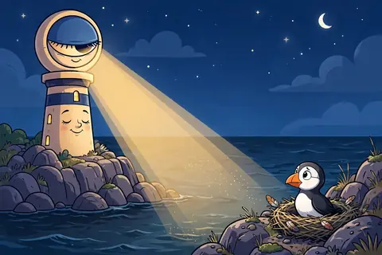
  </a>
  

    <h3><a href="stories/the-sleepy-lighthouse.html">ऊँघता लाइटहाउस</a></h3>
    

      <a class="btn btn-read" href="stories/the-sleepy-lighthouse.html">📖 पढ़ें</a>
      <a class="btn btn-pdf" href="book/stories/the-sleepy-lighthouse.pdf">📕 PDF</a>
      <a class="btn btn-share" href="https://wa.me/?text=%E0%A4%8A%E0%A4%81%E0%A4%98%E0%A4%A4%E0%A4%BE%20%E0%A4%B2%E0%A4%BE%E0%A4%87%E0%A4%9F%E0%A4%B9%E0%A4%BE%E0%A4%89%E0%A4%B8%20%E2%80%94%20%E0%A4%AE%E0%A5%80%E0%A4%A0%E0%A5%87%20%E0%A4%B8%E0%A4%AA%E0%A4%A8%E0%A5%8B%E0%A4%82%20%E0%A4%95%E0%A5%80%20%E0%A4%95%E0%A4%B9%E0%A4%BE%E0%A4%A8%E0%A4%BF%E0%A4%AF%E0%A4%BE%E0%A4%81%0Ahttps%3A%2F%2Fniteshlhsnda-droid.github.io%2Fkids-book-videos-hindi%2Fstories%2Fthe-sleepy-lighthouse.html" target="_blank" rel="noopener" title="WhatsApp पर भेजें" aria-label="WhatsApp पर भेजें">📲</a>
    

  

</article>
<article class="story-card" data-search="किरण की शुभ-रात्रि sunny-says-goodnight">
  <a class="card-art" href="stories/sunny-says-goodnight.html" aria-label="किरण की शुभ-रात्रि">
    🌙
    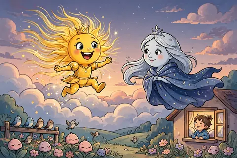
  </a>
  

    <h3><a href="stories/sunny-says-goodnight.html">किरण की शुभ-रात्रि</a></h3>
    

      <a class="btn btn-read" href="stories/sunny-says-goodnight.html">📖 पढ़ें</a>
      <a class="btn btn-pdf" href="book/stories/sunny-says-goodnight.pdf">📕 PDF</a>
      <a class="btn btn-share" href="https://wa.me/?text=%E0%A4%95%E0%A4%BF%E0%A4%B0%E0%A4%A3%20%E0%A4%95%E0%A5%80%20%E0%A4%B6%E0%A5%81%E0%A4%AD-%E0%A4%B0%E0%A4%BE%E0%A4%A4%E0%A5%8D%E0%A4%B0%E0%A4%BF%20%E2%80%94%20%E0%A4%AE%E0%A5%80%E0%A4%A0%E0%A5%87%20%E0%A4%B8%E0%A4%AA%E0%A4%A8%E0%A5%8B%E0%A4%82%20%E0%A4%95%E0%A5%80%20%E0%A4%95%E0%A4%B9%E0%A4%BE%E0%A4%A8%E0%A4%BF%E0%A4%AF%E0%A4%BE%E0%A4%81%0Ahttps%3A%2F%2Fniteshlhsnda-droid.github.io%2Fkids-book-videos-hindi%2Fstories%2Fsunny-says-goodnight.html" target="_blank" rel="noopener" title="WhatsApp पर भेजें" aria-label="WhatsApp पर भेजें">📲</a>
    

  

</article>
<article class="story-card" data-search="गब्बू उल्लू का रात का चक्कर hoots-sleepy-rounds">
  <a class="card-art" href="stories/hoots-sleepy-rounds.html" aria-label="गब्बू उल्लू का रात का चक्कर">
    🦉
    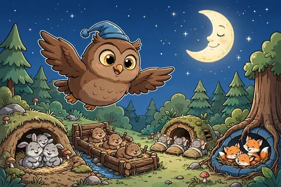
  </a>
  

    <h3><a href="stories/hoots-sleepy-rounds.html">गब्बू उल्लू का रात का चक्कर</a></h3>
    

      <a class="btn btn-read" href="stories/hoots-sleepy-rounds.html">📖 पढ़ें</a>
      <a class="btn btn-pdf" href="book/stories/hoots-sleepy-rounds.pdf">📕 PDF</a>
      <a class="btn btn-share" href="https://wa.me/?text=%E0%A4%97%E0%A4%AC%E0%A5%8D%E0%A4%AC%E0%A5%82%20%E0%A4%89%E0%A4%B2%E0%A5%8D%E0%A4%B2%E0%A5%82%20%E0%A4%95%E0%A4%BE%20%E0%A4%B0%E0%A4%BE%E0%A4%A4%20%E0%A4%95%E0%A4%BE%20%E0%A4%9A%E0%A4%95%E0%A5%8D%E0%A4%95%E0%A4%B0%20%E2%80%94%20%E0%A4%AE%E0%A5%80%E0%A4%A0%E0%A5%87%20%E0%A4%B8%E0%A4%AA%E0%A4%A8%E0%A5%8B%E0%A4%82%20%E0%A4%95%E0%A5%80%20%E0%A4%95%E0%A4%B9%E0%A4%BE%E0%A4%A8%E0%A4%BF%E0%A4%AF%E0%A4%BE%E0%A4%81%0Ahttps%3A%2F%2Fniteshlhsnda-droid.github.io%2Fkids-book-videos-hindi%2Fstories%2Fhoots-sleepy-rounds.html" target="_blank" rel="noopener" title="WhatsApp पर भेजें" aria-label="WhatsApp पर भेजें">📲</a>
    

  

</article>
<article class="story-card" data-search="गुड्डू की आधी रात की पिकनिक teddys-midnight-picnic">
  <a class="card-art" href="stories/teddys-midnight-picnic.html" aria-label="गुड्डू की आधी रात की पिकनिक">
    🧺
    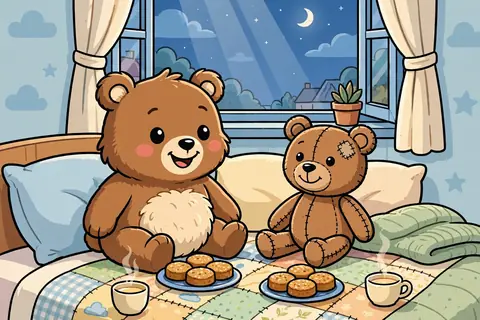
  </a>
  

    <h3><a href="stories/teddys-midnight-picnic.html">गुड्डू की आधी रात की पिकनिक</a></h3>
    

      <a class="btn btn-read" href="stories/teddys-midnight-picnic.html">📖 पढ़ें</a>
      <a class="btn btn-pdf" href="book/stories/teddys-midnight-picnic.pdf">📕 PDF</a>
      <a class="btn btn-share" href="https://wa.me/?text=%E0%A4%97%E0%A5%81%E0%A4%A1%E0%A5%8D%E0%A4%A1%E0%A5%82%20%E0%A4%95%E0%A5%80%20%E0%A4%86%E0%A4%A7%E0%A5%80%20%E0%A4%B0%E0%A4%BE%E0%A4%A4%20%E0%A4%95%E0%A5%80%20%E0%A4%AA%E0%A4%BF%E0%A4%95%E0%A4%A8%E0%A4%BF%E0%A4%95%20%E2%80%94%20%E0%A4%AE%E0%A5%80%E0%A4%A0%E0%A5%87%20%E0%A4%B8%E0%A4%AA%E0%A4%A8%E0%A5%8B%E0%A4%82%20%E0%A4%95%E0%A5%80%20%E0%A4%95%E0%A4%B9%E0%A4%BE%E0%A4%A8%E0%A4%BF%E0%A4%AF%E0%A4%BE%E0%A4%81%0Ahttps%3A%2F%2Fniteshlhsnda-droid.github.io%2Fkids-book-videos-hindi%2Fstories%2Fteddys-midnight-picnic.html" target="_blank" rel="noopener" title="WhatsApp पर भेजें" aria-label="WhatsApp पर भेजें">📲</a>
    

  

</article>
<article class="story-card" data-search="चाँद ने बाँटी अपनी रोशनी the-moon-shares-its-light">
  <a class="card-art" href="stories/the-moon-shares-its-light.html" aria-label="चाँद ने बाँटी अपनी रोशनी">
    🌙
    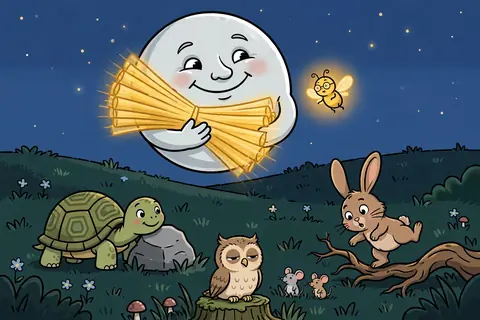
  </a>
  

    <h3><a href="stories/the-moon-shares-its-light.html">चाँद ने बाँटी अपनी रोशनी</a></h3>
    

      <a class="btn btn-read" href="stories/the-moon-shares-its-light.html">📖 पढ़ें</a>
      <a class="btn btn-pdf" href="book/stories/the-moon-shares-its-light.pdf">📕 PDF</a>
      <a class="btn btn-share" href="https://wa.me/?text=%E0%A4%9A%E0%A4%BE%E0%A4%81%E0%A4%A6%20%E0%A4%A8%E0%A5%87%20%E0%A4%AC%E0%A4%BE%E0%A4%81%E0%A4%9F%E0%A5%80%20%E0%A4%85%E0%A4%AA%E0%A4%A8%E0%A5%80%20%E0%A4%B0%E0%A5%8B%E0%A4%B6%E0%A4%A8%E0%A5%80%20%E2%80%94%20%E0%A4%AE%E0%A5%80%E0%A4%A0%E0%A5%87%20%E0%A4%B8%E0%A4%AA%E0%A4%A8%E0%A5%8B%E0%A4%82%20%E0%A4%95%E0%A5%80%20%E0%A4%95%E0%A4%B9%E0%A4%BE%E0%A4%A8%E0%A4%BF%E0%A4%AF%E0%A4%BE%E0%A4%81%0Ahttps%3A%2F%2Fniteshlhsnda-droid.github.io%2Fkids-book-videos-hindi%2Fstories%2Fthe-moon-shares-its-light.html" target="_blank" rel="noopener" title="WhatsApp पर भेजें" aria-label="WhatsApp पर भेजें">📲</a>
    

  

</article>
<article class="story-card" data-search="चाँदनी की चिट्ठी moonbeam-mail">
  <a class="card-art" href="stories/moonbeam-mail.html" aria-label="चाँदनी की चिट्ठी">
    🌙
    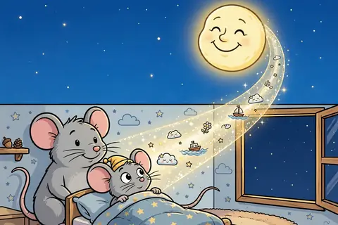
  </a>
  

    <h3><a href="stories/moonbeam-mail.html">चाँदनी की चिट्ठी</a></h3>
    

      <a class="btn btn-read" href="stories/moonbeam-mail.html">📖 पढ़ें</a>
      <a class="btn btn-pdf" href="book/stories/moonbeam-mail.pdf">📕 PDF</a>
      <a class="btn btn-share" href="https://wa.me/?text=%E0%A4%9A%E0%A4%BE%E0%A4%81%E0%A4%A6%E0%A4%A8%E0%A5%80%20%E0%A4%95%E0%A5%80%20%E0%A4%9A%E0%A4%BF%E0%A4%9F%E0%A5%8D%E0%A4%A0%E0%A5%80%20%E2%80%94%20%E0%A4%AE%E0%A5%80%E0%A4%A0%E0%A5%87%20%E0%A4%B8%E0%A4%AA%E0%A4%A8%E0%A5%8B%E0%A4%82%20%E0%A4%95%E0%A5%80%20%E0%A4%95%E0%A4%B9%E0%A4%BE%E0%A4%A8%E0%A4%BF%E0%A4%AF%E0%A4%BE%E0%A4%81%0Ahttps%3A%2F%2Fniteshlhsnda-droid.github.io%2Fkids-book-videos-hindi%2Fstories%2Fmoonbeam-mail.html" target="_blank" rel="noopener" title="WhatsApp पर भेजें" aria-label="WhatsApp पर भेजें">📲</a>
    

  

</article>
<article class="story-card" data-search="चिड़ियाँ कहाँ सोती हैं? where-do-birds-sleep">
  <a class="card-art" href="stories/where-do-birds-sleep.html" aria-label="चिड़ियाँ कहाँ सोती हैं?">
    🐦
    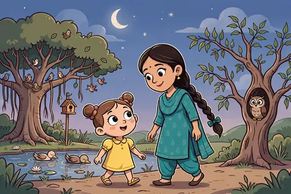
  </a>
  

    <h3><a href="stories/where-do-birds-sleep.html">चिड़ियाँ कहाँ सोती हैं?</a></h3>
    

      <a class="btn btn-read" href="stories/where-do-birds-sleep.html">📖 पढ़ें</a>
      <a class="btn btn-pdf" href="book/stories/where-do-birds-sleep.pdf">📕 PDF</a>
      <a class="btn btn-share" href="https://wa.me/?text=%E0%A4%9A%E0%A4%BF%E0%A4%A1%E0%A4%BC%E0%A4%BF%E0%A4%AF%E0%A4%BE%E0%A4%81%20%E0%A4%95%E0%A4%B9%E0%A4%BE%E0%A4%81%20%E0%A4%B8%E0%A5%8B%E0%A4%A4%E0%A5%80%20%E0%A4%B9%E0%A5%88%E0%A4%82%3F%20%E2%80%94%20%E0%A4%AE%E0%A5%80%E0%A4%A0%E0%A5%87%20%E0%A4%B8%E0%A4%AA%E0%A4%A8%E0%A5%8B%E0%A4%82%20%E0%A4%95%E0%A5%80%20%E0%A4%95%E0%A4%B9%E0%A4%BE%E0%A4%A8%E0%A4%BF%E0%A4%AF%E0%A4%BE%E0%A4%81%0Ahttps%3A%2F%2Fniteshlhsnda-droid.github.io%2Fkids-book-videos-hindi%2Fstories%2Fwhere-do-birds-sleep.html" target="_blank" rel="noopener" title="WhatsApp पर भेजें" aria-label="WhatsApp पर भेजें">📲</a>
    

  

</article>
<article class="story-card" data-search="जुगनुओं का नाच the-firefly-dance">
  <a class="card-art" href="stories/the-firefly-dance.html" aria-label="जुगनुओं का नाच">
    ✨
    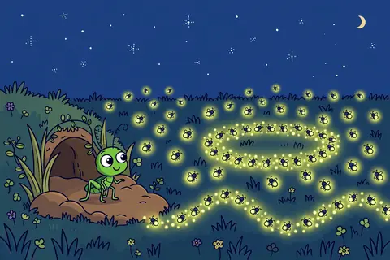
  </a>
  

    <h3><a href="stories/the-firefly-dance.html">जुगनुओं का नाच</a></h3>
    

      <a class="btn btn-read" href="stories/the-firefly-dance.html">📖 पढ़ें</a>
      <a class="btn btn-pdf" href="book/stories/the-firefly-dance.pdf">📕 PDF</a>
      <a class="btn btn-share" href="https://wa.me/?text=%E0%A4%9C%E0%A5%81%E0%A4%97%E0%A4%A8%E0%A5%81%E0%A4%93%E0%A4%82%20%E0%A4%95%E0%A4%BE%20%E0%A4%A8%E0%A4%BE%E0%A4%9A%20%E2%80%94%20%E0%A4%AE%E0%A5%80%E0%A4%A0%E0%A5%87%20%E0%A4%B8%E0%A4%AA%E0%A4%A8%E0%A5%8B%E0%A4%82%20%E0%A4%95%E0%A5%80%20%E0%A4%95%E0%A4%B9%E0%A4%BE%E0%A4%A8%E0%A4%BF%E0%A4%AF%E0%A4%BE%E0%A4%81%0Ahttps%3A%2F%2Fniteshlhsnda-droid.github.io%2Fkids-book-videos-hindi%2Fstories%2Fthe-firefly-dance.html" target="_blank" rel="noopener" title="WhatsApp पर भेजें" aria-label="WhatsApp पर भेजें">📲</a>
    

  

</article>
<article class="story-card" data-search="तारों की रज़ाई a-blanket-of-stars">
  <a class="card-art" href="stories/a-blanket-of-stars.html" aria-label="तारों की रज़ाई">
    ⭐
    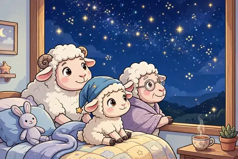
  </a>
  

    <h3><a href="stories/a-blanket-of-stars.html">तारों की रज़ाई</a></h3>
    

      <a class="btn btn-read" href="stories/a-blanket-of-stars.html">📖 पढ़ें</a>
      <a class="btn btn-pdf" href="book/stories/a-blanket-of-stars.pdf">📕 PDF</a>
      <a class="btn btn-share" href="https://wa.me/?text=%E0%A4%A4%E0%A4%BE%E0%A4%B0%E0%A5%8B%E0%A4%82%20%E0%A4%95%E0%A5%80%20%E0%A4%B0%E0%A4%9C%E0%A4%BC%E0%A4%BE%E0%A4%88%20%E2%80%94%20%E0%A4%AE%E0%A5%80%E0%A4%A0%E0%A5%87%20%E0%A4%B8%E0%A4%AA%E0%A4%A8%E0%A5%8B%E0%A4%82%20%E0%A4%95%E0%A5%80%20%E0%A4%95%E0%A4%B9%E0%A4%BE%E0%A4%A8%E0%A4%BF%E0%A4%AF%E0%A4%BE%E0%A4%81%0Ahttps%3A%2F%2Fniteshlhsnda-droid.github.io%2Fkids-book-videos-hindi%2Fstories%2Fa-blanket-of-stars.html" target="_blank" rel="noopener" title="WhatsApp पर भेजें" aria-label="WhatsApp पर भेजें">📲</a>
    

  

</article>
<article class="story-card" data-search="नायरा और जुगनुओं का नाच faye-the-deer-fawns-firefly-dance">
  <a class="card-art" href="stories/faye-the-deer-fawns-firefly-dance.html" aria-label="नायरा और जुगनुओं का नाच">
    ✨
    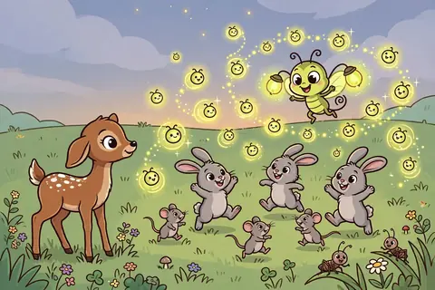
  </a>
  

    <h3><a href="stories/faye-the-deer-fawns-firefly-dance.html">नायरा और जुगनुओं का नाच</a></h3>
    

      <a class="btn btn-read" href="stories/faye-the-deer-fawns-firefly-dance.html">📖 पढ़ें</a>
      <a class="btn btn-pdf" href="book/stories/faye-the-deer-fawns-firefly-dance.pdf">📕 PDF</a>
      <a class="btn btn-share" href="https://wa.me/?text=%E0%A4%A8%E0%A4%BE%E0%A4%AF%E0%A4%B0%E0%A4%BE%20%E0%A4%94%E0%A4%B0%20%E0%A4%9C%E0%A5%81%E0%A4%97%E0%A4%A8%E0%A5%81%E0%A4%93%E0%A4%82%20%E0%A4%95%E0%A4%BE%20%E0%A4%A8%E0%A4%BE%E0%A4%9A%20%E2%80%94%20%E0%A4%AE%E0%A5%80%E0%A4%A0%E0%A5%87%20%E0%A4%B8%E0%A4%AA%E0%A4%A8%E0%A5%8B%E0%A4%82%20%E0%A4%95%E0%A5%80%20%E0%A4%95%E0%A4%B9%E0%A4%BE%E0%A4%A8%E0%A4%BF%E0%A4%AF%E0%A4%BE%E0%A4%81%0Ahttps%3A%2F%2Fniteshlhsnda-droid.github.io%2Fkids-book-videos-hindi%2Fstories%2Ffaye-the-deer-fawns-firefly-dance.html" target="_blank" rel="noopener" title="WhatsApp पर भेजें" aria-label="WhatsApp पर भेजें">📲</a>
    

  

</article>
<article class="story-card" data-search="नींद-नगर जाने वाली रात की रेलगाड़ी the-night-train">
  <a class="card-art" href="stories/the-night-train.html" aria-label="नींद-नगर जाने वाली रात की रेलगाड़ी">
    🚂
    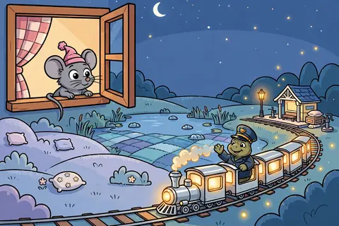
  </a>
  

    <h3><a href="stories/the-night-train.html">नींद-नगर जाने वाली रात की रेलगाड़ी</a></h3>
    

      <a class="btn btn-read" href="stories/the-night-train.html">📖 पढ़ें</a>
      <a class="btn btn-pdf" href="book/stories/the-night-train.pdf">📕 PDF</a>
      <a class="btn btn-share" href="https://wa.me/?text=%E0%A4%A8%E0%A5%80%E0%A4%82%E0%A4%A6-%E0%A4%A8%E0%A4%97%E0%A4%B0%20%E0%A4%9C%E0%A4%BE%E0%A4%A8%E0%A5%87%20%E0%A4%B5%E0%A4%BE%E0%A4%B2%E0%A5%80%20%E0%A4%B0%E0%A4%BE%E0%A4%A4%20%E0%A4%95%E0%A5%80%20%E0%A4%B0%E0%A5%87%E0%A4%B2%E0%A4%97%E0%A4%BE%E0%A4%A1%E0%A4%BC%E0%A5%80%20%E2%80%94%20%E0%A4%AE%E0%A5%80%E0%A4%A0%E0%A5%87%20%E0%A4%B8%E0%A4%AA%E0%A4%A8%E0%A5%8B%E0%A4%82%20%E0%A4%95%E0%A5%80%20%E0%A4%95%E0%A4%B9%E0%A4%BE%E0%A4%A8%E0%A4%BF%E0%A4%AF%E0%A4%BE%E0%A4%81%0Ahttps%3A%2F%2Fniteshlhsnda-droid.github.io%2Fkids-book-videos-hindi%2Fstories%2Fthe-night-train.html" target="_blank" rel="noopener" title="WhatsApp पर भेजें" aria-label="WhatsApp पर भेजें">📲</a>
    

  

</article>
<article class="story-card" data-search="बंटी कोआला और नींद वाली पत्ती koda-the-koala-and-the-sleepy-leaf">
  <a class="card-art" href="stories/koda-the-koala-and-the-sleepy-leaf.html" aria-label="बंटी कोआला और नींद वाली पत्ती">
    🐨
    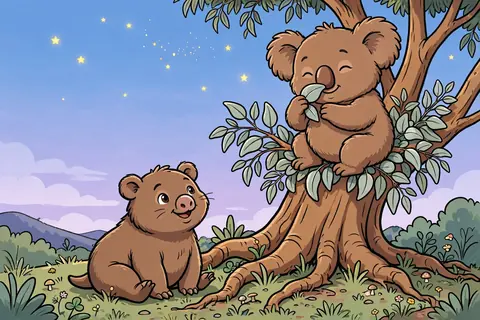
  </a>
  

    <h3><a href="stories/koda-the-koala-and-the-sleepy-leaf.html">बंटी कोआला और नींद वाली पत्ती</a></h3>
    

      <a class="btn btn-read" href="stories/koda-the-koala-and-the-sleepy-leaf.html">📖 पढ़ें</a>
      <a class="btn btn-pdf" href="book/stories/koda-the-koala-and-the-sleepy-leaf.pdf">📕 PDF</a>
      <a class="btn btn-share" href="https://wa.me/?text=%E0%A4%AC%E0%A4%82%E0%A4%9F%E0%A5%80%20%E0%A4%95%E0%A5%8B%E0%A4%86%E0%A4%B2%E0%A4%BE%20%E0%A4%94%E0%A4%B0%20%E0%A4%A8%E0%A5%80%E0%A4%82%E0%A4%A6%20%E0%A4%B5%E0%A4%BE%E0%A4%B2%E0%A5%80%20%E0%A4%AA%E0%A4%A4%E0%A5%8D%E0%A4%A4%E0%A5%80%20%E2%80%94%20%E0%A4%AE%E0%A5%80%E0%A4%A0%E0%A5%87%20%E0%A4%B8%E0%A4%AA%E0%A4%A8%E0%A5%8B%E0%A4%82%20%E0%A4%95%E0%A5%80%20%E0%A4%95%E0%A4%B9%E0%A4%BE%E0%A4%A8%E0%A4%BF%E0%A4%AF%E0%A4%BE%E0%A4%81%0Ahttps%3A%2F%2Fniteshlhsnda-droid.github.io%2Fkids-book-videos-hindi%2Fstories%2Fkoda-the-koala-and-the-sleepy-leaf.html" target="_blank" rel="noopener" title="WhatsApp पर भेजें" aria-label="WhatsApp पर भेजें">📲</a>
    

  

</article>
<article class="story-card" data-search="बहादुर छोटा जुगनू the-brave-little-firefly">
  <a class="card-art" href="stories/the-brave-little-firefly.html" aria-label="बहादुर छोटा जुगनू">
    ✨
    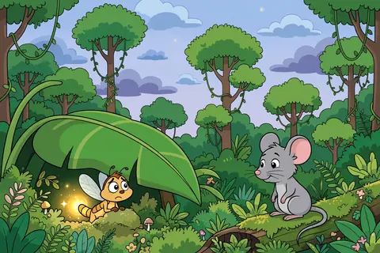
  </a>
  

    <h3><a href="stories/the-brave-little-firefly.html">बहादुर छोटा जुगनू</a></h3>
    

      <a class="btn btn-read" href="stories/the-brave-little-firefly.html">📖 पढ़ें</a>
      <a class="btn btn-pdf" href="book/stories/the-brave-little-firefly.pdf">📕 PDF</a>
      <a class="btn btn-share" href="https://wa.me/?text=%E0%A4%AC%E0%A4%B9%E0%A4%BE%E0%A4%A6%E0%A5%81%E0%A4%B0%20%E0%A4%9B%E0%A5%8B%E0%A4%9F%E0%A4%BE%20%E0%A4%9C%E0%A5%81%E0%A4%97%E0%A4%A8%E0%A5%82%20%E2%80%94%20%E0%A4%AE%E0%A5%80%E0%A4%A0%E0%A5%87%20%E0%A4%B8%E0%A4%AA%E0%A4%A8%E0%A5%8B%E0%A4%82%20%E0%A4%95%E0%A5%80%20%E0%A4%95%E0%A4%B9%E0%A4%BE%E0%A4%A8%E0%A4%BF%E0%A4%AF%E0%A4%BE%E0%A4%81%0Ahttps%3A%2F%2Fniteshlhsnda-droid.github.io%2Fkids-book-videos-hindi%2Fstories%2Fthe-brave-little-firefly.html" target="_blank" rel="noopener" title="WhatsApp पर भेजें" aria-label="WhatsApp पर भेजें">📲</a>
    

  

</article>
<article class="story-card" data-search="रात की आवाज़ों की लोरी night-sounds-lullaby">
  <a class="card-art" href="stories/night-sounds-lullaby.html" aria-label="रात की आवाज़ों की लोरी">
    🎵
    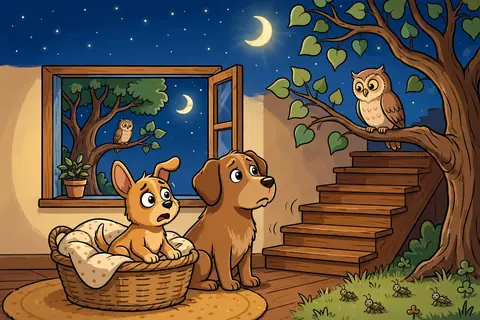
  </a>
  

    <h3><a href="stories/night-sounds-lullaby.html">रात की आवाज़ों की लोरी</a></h3>
    

      <a class="btn btn-read" href="stories/night-sounds-lullaby.html">📖 पढ़ें</a>
      <a class="btn btn-pdf" href="book/stories/night-sounds-lullaby.pdf">📕 PDF</a>
      <a class="btn btn-share" href="https://wa.me/?text=%E0%A4%B0%E0%A4%BE%E0%A4%A4%20%E0%A4%95%E0%A5%80%20%E0%A4%86%E0%A4%B5%E0%A4%BE%E0%A4%9C%E0%A4%BC%E0%A5%8B%E0%A4%82%20%E0%A4%95%E0%A5%80%20%E0%A4%B2%E0%A5%8B%E0%A4%B0%E0%A5%80%20%E2%80%94%20%E0%A4%AE%E0%A5%80%E0%A4%A0%E0%A5%87%20%E0%A4%B8%E0%A4%AA%E0%A4%A8%E0%A5%8B%E0%A4%82%20%E0%A4%95%E0%A5%80%20%E0%A4%95%E0%A4%B9%E0%A4%BE%E0%A4%A8%E0%A4%BF%E0%A4%AF%E0%A4%BE%E0%A4%81%0Ahttps%3A%2F%2Fniteshlhsnda-droid.github.io%2Fkids-book-videos-hindi%2Fstories%2Fnight-sounds-lullaby.html" target="_blank" rel="noopener" title="WhatsApp पर भेजें" aria-label="WhatsApp पर भेजें">📲</a>
    

  

</article>
<article class="story-card" data-search="रात की बेकरी the-night-bakery">
  <a class="card-art" href="stories/the-night-bakery.html" aria-label="रात की बेकरी">
    🍞
    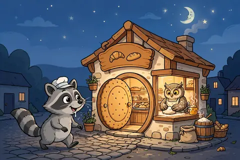
  </a>
  

    <h3><a href="stories/the-night-bakery.html">रात की बेकरी</a></h3>
    

      <a class="btn btn-read" href="stories/the-night-bakery.html">📖 पढ़ें</a>
      <a class="btn btn-pdf" href="book/stories/the-night-bakery.pdf">📕 PDF</a>
      <a class="btn btn-share" href="https://wa.me/?text=%E0%A4%B0%E0%A4%BE%E0%A4%A4%20%E0%A4%95%E0%A5%80%20%E0%A4%AC%E0%A5%87%E0%A4%95%E0%A4%B0%E0%A5%80%20%E2%80%94%20%E0%A4%AE%E0%A5%80%E0%A4%A0%E0%A5%87%20%E0%A4%B8%E0%A4%AA%E0%A4%A8%E0%A5%8B%E0%A4%82%20%E0%A4%95%E0%A5%80%20%E0%A4%95%E0%A4%B9%E0%A4%BE%E0%A4%A8%E0%A4%BF%E0%A4%AF%E0%A4%BE%E0%A4%81%0Ahttps%3A%2F%2Fniteshlhsnda-droid.github.io%2Fkids-book-videos-hindi%2Fstories%2Fthe-night-bakery.html" target="_blank" rel="noopener" title="WhatsApp पर भेजें" aria-label="WhatsApp पर भेजें">📲</a>
    

  

</article>
<article class="story-card" data-search="रुन्नी खरगोश और चाँदनी का फूल 2026-09-21-willa-the-bunny-and-the-moonflower">
  <a class="card-art" href="stories/2026-09-21-willa-the-bunny-and-the-moonflower.html" aria-label="रुन्नी खरगोश और चाँदनी का फूल">
    🌙
    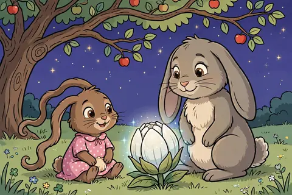
  </a>
  

    <h3><a href="stories/2026-09-21-willa-the-bunny-and-the-moonflower.html">रुन्नी खरगोश और चाँदनी का फूल</a></h3>
    

      <a class="btn btn-read" href="stories/2026-09-21-willa-the-bunny-and-the-moonflower.html">📖 पढ़ें</a>
      <a class="btn btn-pdf" href="book/stories/2026-09-21-willa-the-bunny-and-the-moonflower.pdf">📕 PDF</a>
      <a class="btn btn-share" href="https://wa.me/?text=%E0%A4%B0%E0%A5%81%E0%A4%A8%E0%A5%8D%E0%A4%A8%E0%A5%80%20%E0%A4%96%E0%A4%B0%E0%A4%97%E0%A5%8B%E0%A4%B6%20%E0%A4%94%E0%A4%B0%20%E0%A4%9A%E0%A4%BE%E0%A4%81%E0%A4%A6%E0%A4%A8%E0%A5%80%20%E0%A4%95%E0%A4%BE%20%E0%A4%AB%E0%A5%82%E0%A4%B2%20%E2%80%94%20%E0%A4%AE%E0%A5%80%E0%A4%A0%E0%A5%87%20%E0%A4%B8%E0%A4%AA%E0%A4%A8%E0%A5%8B%E0%A4%82%20%E0%A4%95%E0%A5%80%20%E0%A4%95%E0%A4%B9%E0%A4%BE%E0%A4%A8%E0%A4%BF%E0%A4%AF%E0%A4%BE%E0%A4%81%0Ahttps%3A%2F%2Fniteshlhsnda-droid.github.io%2Fkids-book-videos-hindi%2Fstories%2F2026-09-21-willa-the-bunny-and-the-moonflower.html" target="_blank" rel="noopener" title="WhatsApp पर भेजें" aria-label="WhatsApp पर भेजें">📲</a>
    

  

</article>
<article class="story-card" data-search="लोरी गाती नदी the-lullaby-river">
  <a class="card-art" href="stories/the-lullaby-river.html" aria-label="लोरी गाती नदी">
    🎵
    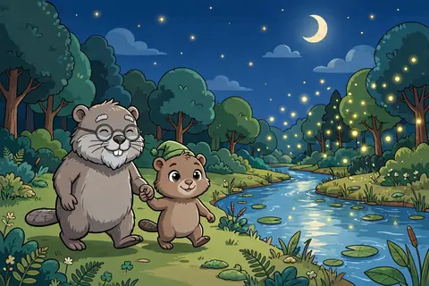
  </a>
  

    <h3><a href="stories/the-lullaby-river.html">लोरी गाती नदी</a></h3>
    

      <a class="btn btn-read" href="stories/the-lullaby-river.html">📖 पढ़ें</a>
      <a class="btn btn-pdf" href="book/stories/the-lullaby-river.pdf">📕 PDF</a>
      <a class="btn btn-share" href="https://wa.me/?text=%E0%A4%B2%E0%A5%8B%E0%A4%B0%E0%A5%80%20%E0%A4%97%E0%A4%BE%E0%A4%A4%E0%A5%80%20%E0%A4%A8%E0%A4%A6%E0%A5%80%20%E2%80%94%20%E0%A4%AE%E0%A5%80%E0%A4%A0%E0%A5%87%20%E0%A4%B8%E0%A4%AA%E0%A4%A8%E0%A5%8B%E0%A4%82%20%E0%A4%95%E0%A5%80%20%E0%A4%95%E0%A4%B9%E0%A4%BE%E0%A4%A8%E0%A4%BF%E0%A4%AF%E0%A4%BE%E0%A4%81%0Ahttps%3A%2F%2Fniteshlhsnda-droid.github.io%2Fkids-book-videos-hindi%2Fstories%2Fthe-lullaby-river.html" target="_blank" rel="noopener" title="WhatsApp पर भेजें" aria-label="WhatsApp पर भेजें">📲</a>
    

  

</article>
<article class="story-card" data-search="शनाया छछूंदर ने तारों को सुना marnie-the-mole-hears-the-stars">
  <a class="card-art" href="stories/marnie-the-mole-hears-the-stars.html" aria-label="शनाया छछूंदर ने तारों को सुना">
    ⭐
    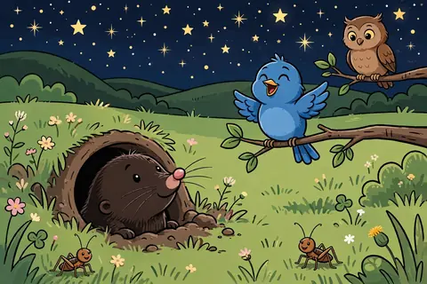
  </a>
  

    <h3><a href="stories/marnie-the-mole-hears-the-stars.html">शनाया छछूंदर ने तारों को सुना</a></h3>
    

      <a class="btn btn-read" href="stories/marnie-the-mole-hears-the-stars.html">📖 पढ़ें</a>
      <a class="btn btn-pdf" href="book/stories/marnie-the-mole-hears-the-stars.pdf">📕 PDF</a>
      <a class="btn btn-share" href="https://wa.me/?text=%E0%A4%B6%E0%A4%A8%E0%A4%BE%E0%A4%AF%E0%A4%BE%20%E0%A4%9B%E0%A4%9B%E0%A5%82%E0%A4%82%E0%A4%A6%E0%A4%B0%20%E0%A4%A8%E0%A5%87%20%E0%A4%A4%E0%A4%BE%E0%A4%B0%E0%A5%8B%E0%A4%82%20%E0%A4%95%E0%A5%8B%20%E0%A4%B8%E0%A5%81%E0%A4%A8%E0%A4%BE%20%E2%80%94%20%E0%A4%AE%E0%A5%80%E0%A4%A0%E0%A5%87%20%E0%A4%B8%E0%A4%AA%E0%A4%A8%E0%A5%8B%E0%A4%82%20%E0%A4%95%E0%A5%80%20%E0%A4%95%E0%A4%B9%E0%A4%BE%E0%A4%A8%E0%A4%BF%E0%A4%AF%E0%A4%BE%E0%A4%81%0Ahttps%3A%2F%2Fniteshlhsnda-droid.github.io%2Fkids-book-videos-hindi%2Fstories%2Fmarnie-the-mole-hears-the-stars.html" target="_blank" rel="noopener" title="WhatsApp पर भेजें" aria-label="WhatsApp पर भेजें">📲</a>
    

  

</article>
<article class="story-card" data-search="शुभ-रात्रि वाला चिड़ियाघर the-goodnight-zoo">
  <a class="card-art" href="stories/the-goodnight-zoo.html" aria-label="शुभ-रात्रि वाला चिड़ियाघर">
    🦁
    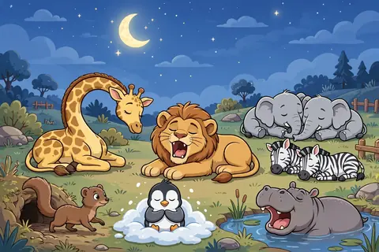
  </a>
  

    <h3><a href="stories/the-goodnight-zoo.html">शुभ-रात्रि वाला चिड़ियाघर</a></h3>
    

      <a class="btn btn-read" href="stories/the-goodnight-zoo.html">📖 पढ़ें</a>
      <a class="btn btn-pdf" href="book/stories/the-goodnight-zoo.pdf">📕 PDF</a>
      <a class="btn btn-share" href="https://wa.me/?text=%E0%A4%B6%E0%A5%81%E0%A4%AD-%E0%A4%B0%E0%A4%BE%E0%A4%A4%E0%A5%8D%E0%A4%B0%E0%A4%BF%20%E0%A4%B5%E0%A4%BE%E0%A4%B2%E0%A4%BE%20%E0%A4%9A%E0%A4%BF%E0%A4%A1%E0%A4%BC%E0%A4%BF%E0%A4%AF%E0%A4%BE%E0%A4%98%E0%A4%B0%20%E2%80%94%20%E0%A4%AE%E0%A5%80%E0%A4%A0%E0%A5%87%20%E0%A4%B8%E0%A4%AA%E0%A4%A8%E0%A5%8B%E0%A4%82%20%E0%A4%95%E0%A5%80%20%E0%A4%95%E0%A4%B9%E0%A4%BE%E0%A4%A8%E0%A4%BF%E0%A4%AF%E0%A4%BE%E0%A4%81%0Ahttps%3A%2F%2Fniteshlhsnda-droid.github.io%2Fkids-book-videos-hindi%2Fstories%2Fthe-goodnight-zoo.html" target="_blank" rel="noopener" title="WhatsApp पर भेजें" aria-label="WhatsApp पर भेजें">📲</a>
    

  

</article>
<article class="story-card" data-search="सपने बटोरने वाला तकिया the-dream-collectors-pillow">
  <a class="card-art" href="stories/the-dream-collectors-pillow.html" aria-label="सपने बटोरने वाला तकिया">
    💭
    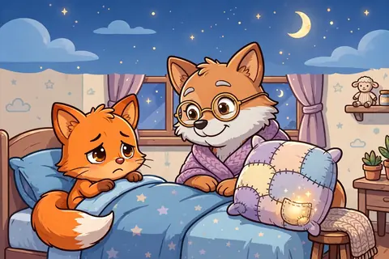
  </a>
  

    <h3><a href="stories/the-dream-collectors-pillow.html">सपने बटोरने वाला तकिया</a></h3>
    

      <a class="btn btn-read" href="stories/the-dream-collectors-pillow.html">📖 पढ़ें</a>
      <a class="btn btn-pdf" href="book/stories/the-dream-collectors-pillow.pdf">📕 PDF</a>
      <a class="btn btn-share" href="https://wa.me/?text=%E0%A4%B8%E0%A4%AA%E0%A4%A8%E0%A5%87%20%E0%A4%AC%E0%A4%9F%E0%A5%8B%E0%A4%B0%E0%A4%A8%E0%A5%87%20%E0%A4%B5%E0%A4%BE%E0%A4%B2%E0%A4%BE%20%E0%A4%A4%E0%A4%95%E0%A4%BF%E0%A4%AF%E0%A4%BE%20%E2%80%94%20%E0%A4%AE%E0%A5%80%E0%A4%A0%E0%A5%87%20%E0%A4%B8%E0%A4%AA%E0%A4%A8%E0%A5%8B%E0%A4%82%20%E0%A4%95%E0%A5%80%20%E0%A4%95%E0%A4%B9%E0%A4%BE%E0%A4%A8%E0%A4%BF%E0%A4%AF%E0%A4%BE%E0%A4%81%0Ahttps%3A%2F%2Fniteshlhsnda-droid.github.io%2Fkids-book-videos-hindi%2Fstories%2Fthe-dream-collectors-pillow.html" target="_blank" rel="noopener" title="WhatsApp पर भेजें" aria-label="WhatsApp पर भेजें">📲</a>
    

  

</article>
<article class="story-card" data-search="सपनों का बगीचा the-dream-garden">
  <a class="card-art" href="stories/the-dream-garden.html" aria-label="सपनों का बगीचा">
    🌸
    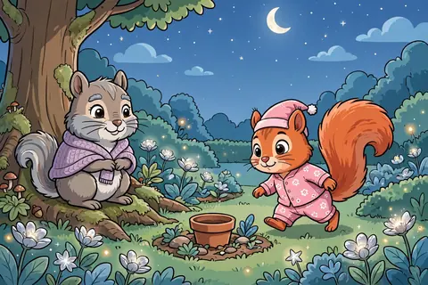
  </a>
  

    <h3><a href="stories/the-dream-garden.html">सपनों का बगीचा</a></h3>
    

      <a class="btn btn-read" href="stories/the-dream-garden.html">📖 पढ़ें</a>
      <a class="btn btn-pdf" href="book/stories/the-dream-garden.pdf">📕 PDF</a>
      <a class="btn btn-share" href="https://wa.me/?text=%E0%A4%B8%E0%A4%AA%E0%A4%A8%E0%A5%8B%E0%A4%82%20%E0%A4%95%E0%A4%BE%20%E0%A4%AC%E0%A4%97%E0%A5%80%E0%A4%9A%E0%A4%BE%20%E2%80%94%20%E0%A4%AE%E0%A5%80%E0%A4%A0%E0%A5%87%20%E0%A4%B8%E0%A4%AA%E0%A4%A8%E0%A5%8B%E0%A4%82%20%E0%A4%95%E0%A5%80%20%E0%A4%95%E0%A4%B9%E0%A4%BE%E0%A4%A8%E0%A4%BF%E0%A4%AF%E0%A4%BE%E0%A4%81%0Ahttps%3A%2F%2Fniteshlhsnda-droid.github.io%2Fkids-book-videos-hindi%2Fstories%2Fthe-dream-garden.html" target="_blank" rel="noopener" title="WhatsApp पर भेजें" aria-label="WhatsApp पर भेजें">📲</a>
    

  

</article>
<article class="story-card" data-search="सपनों की नाव the-dream-boat">
  <a class="card-art" href="stories/the-dream-boat.html" aria-label="सपनों की नाव">
    ⛵
    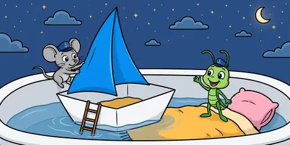
  </a>
  

    <h3><a href="stories/the-dream-boat.html">सपनों की नाव</a></h3>
    

      <a class="btn btn-read" href="stories/the-dream-boat.html">📖 पढ़ें</a>
      <a class="btn btn-pdf" href="book/stories/the-dream-boat.pdf">📕 PDF</a>
      <a class="btn btn-share" href="https://wa.me/?text=%E0%A4%B8%E0%A4%AA%E0%A4%A8%E0%A5%8B%E0%A4%82%20%E0%A4%95%E0%A5%80%20%E0%A4%A8%E0%A4%BE%E0%A4%B5%20%E2%80%94%20%E0%A4%AE%E0%A5%80%E0%A4%A0%E0%A5%87%20%E0%A4%B8%E0%A4%AA%E0%A4%A8%E0%A5%8B%E0%A4%82%20%E0%A4%95%E0%A5%80%20%E0%A4%95%E0%A4%B9%E0%A4%BE%E0%A4%A8%E0%A4%BF%E0%A4%AF%E0%A4%BE%E0%A4%81%0Ahttps%3A%2F%2Fniteshlhsnda-droid.github.io%2Fkids-book-videos-hindi%2Fstories%2Fthe-dream-boat.html" target="_blank" rel="noopener" title="WhatsApp पर भेजें" aria-label="WhatsApp पर भेजें">📲</a>
    

  

</article>
<article class="story-card" data-search="सूरज और चाँद की बारी-बारी sun-and-moon-take-turns">
  <a class="card-art" href="stories/sun-and-moon-take-turns.html" aria-label="सूरज और चाँद की बारी-बारी">
    🌙
    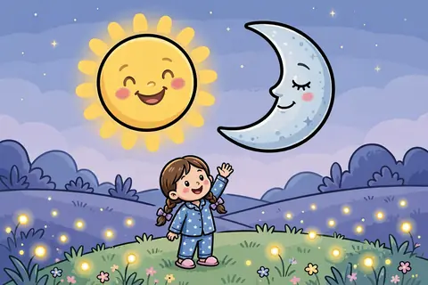
  </a>
  

    <h3><a href="stories/sun-and-moon-take-turns.html">सूरज और चाँद की बारी-बारी</a></h3>
    

      <a class="btn btn-read" href="stories/sun-and-moon-take-turns.html">📖 पढ़ें</a>
      <a class="btn btn-pdf" href="book/stories/sun-and-moon-take-turns.pdf">📕 PDF</a>
      <a class="btn btn-share" href="https://wa.me/?text=%E0%A4%B8%E0%A5%82%E0%A4%B0%E0%A4%9C%20%E0%A4%94%E0%A4%B0%20%E0%A4%9A%E0%A4%BE%E0%A4%81%E0%A4%A6%20%E0%A4%95%E0%A5%80%20%E0%A4%AC%E0%A4%BE%E0%A4%B0%E0%A5%80-%E0%A4%AC%E0%A4%BE%E0%A4%B0%E0%A5%80%20%E2%80%94%20%E0%A4%AE%E0%A5%80%E0%A4%A0%E0%A5%87%20%E0%A4%B8%E0%A4%AA%E0%A4%A8%E0%A5%8B%E0%A4%82%20%E0%A4%95%E0%A5%80%20%E0%A4%95%E0%A4%B9%E0%A4%BE%E0%A4%A8%E0%A4%BF%E0%A4%AF%E0%A4%BE%E0%A4%81%0Ahttps%3A%2F%2Fniteshlhsnda-droid.github.io%2Fkids-book-videos-hindi%2Fstories%2Fsun-and-moon-take-turns.html" target="_blank" rel="noopener" title="WhatsApp पर भेजें" aria-label="WhatsApp पर भेजें">📲</a>
    

  

</article>
<article class="story-card" data-search="सोने के लिए तारे गिनना counting-stars-to-sleep">
  <a class="card-art" href="stories/counting-stars-to-sleep.html" aria-label="सोने के लिए तारे गिनना">
    ⭐
    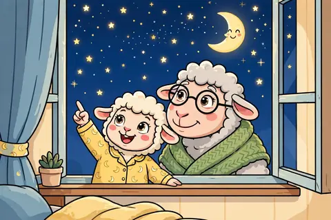
  </a>
  

    <h3><a href="stories/counting-stars-to-sleep.html">सोने के लिए तारे गिनना</a></h3>
    

      <a class="btn btn-read" href="stories/counting-stars-to-sleep.html">📖 पढ़ें</a>
      <a class="btn btn-pdf" href="book/stories/counting-stars-to-sleep.pdf">📕 PDF</a>
      <a class="btn btn-share" href="https://wa.me/?text=%E0%A4%B8%E0%A5%8B%E0%A4%A8%E0%A5%87%20%E0%A4%95%E0%A5%87%20%E0%A4%B2%E0%A4%BF%E0%A4%8F%20%E0%A4%A4%E0%A4%BE%E0%A4%B0%E0%A5%87%20%E0%A4%97%E0%A4%BF%E0%A4%A8%E0%A4%A8%E0%A4%BE%20%E2%80%94%20%E0%A4%AE%E0%A5%80%E0%A4%A0%E0%A5%87%20%E0%A4%B8%E0%A4%AA%E0%A4%A8%E0%A5%8B%E0%A4%82%20%E0%A4%95%E0%A5%80%20%E0%A4%95%E0%A4%B9%E0%A4%BE%E0%A4%A8%E0%A4%BF%E0%A4%AF%E0%A4%BE%E0%A4%81%0Ahttps%3A%2F%2Fniteshlhsnda-droid.github.io%2Fkids-book-videos-hindi%2Fstories%2Fcounting-stars-to-sleep.html" target="_blank" rel="noopener" title="WhatsApp पर भेजें" aria-label="WhatsApp पर भेजें">📲</a>
    

  

</article>
<article class="story-card" data-search="हवा की लोरी the-winds-bedtime-song">
  <a class="card-art" href="stories/the-winds-bedtime-song.html" aria-label="हवा की लोरी">
    🍃
    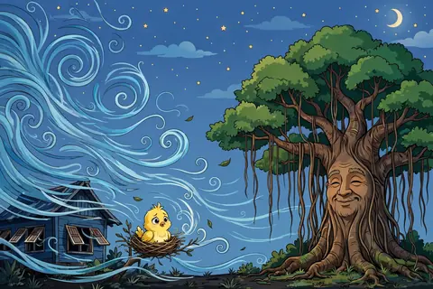
  </a>
  

    <h3><a href="stories/the-winds-bedtime-song.html">हवा की लोरी</a></h3>
    

      <a class="btn btn-read" href="stories/the-winds-bedtime-song.html">📖 पढ़ें</a>
      <a class="btn btn-pdf" href="book/stories/the-winds-bedtime-song.pdf">📕 PDF</a>
      <a class="btn btn-share" href="https://wa.me/?text=%E0%A4%B9%E0%A4%B5%E0%A4%BE%20%E0%A4%95%E0%A5%80%20%E0%A4%B2%E0%A5%8B%E0%A4%B0%E0%A5%80%20%E2%80%94%20%E0%A4%AE%E0%A5%80%E0%A4%A0%E0%A5%87%20%E0%A4%B8%E0%A4%AA%E0%A4%A8%E0%A5%8B%E0%A4%82%20%E0%A4%95%E0%A5%80%20%E0%A4%95%E0%A4%B9%E0%A4%BE%E0%A4%A8%E0%A4%BF%E0%A4%AF%E0%A4%BE%E0%A4%81%0Ahttps%3A%2F%2Fniteshlhsnda-droid.github.io%2Fkids-book-videos-hindi%2Fstories%2Fthe-winds-bedtime-song.html" target="_blank" rel="noopener" title="WhatsApp पर भेजें" aria-label="WhatsApp पर भेजें">📲</a>
    

  

</article>
<article class="story-card" data-search="ह्यूगो और चाँद का कंबल mossys-moon-blanket">
  <a class="card-art" href="stories/mossys-moon-blanket.html" aria-label="ह्यूगो और चाँद का कंबल">
    🌙
    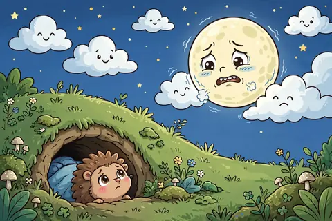
  </a>
  

    <h3><a href="stories/mossys-moon-blanket.html">ह्यूगो और चाँद का कंबल</a></h3>
    

      <a class="btn btn-read" href="stories/mossys-moon-blanket.html">📖 पढ़ें</a>
      <a class="btn btn-pdf" href="book/stories/mossys-moon-blanket.pdf">📕 PDF</a>
      <a class="btn btn-share" href="https://wa.me/?text=%E0%A4%B9%E0%A5%8D%E0%A4%AF%E0%A5%82%E0%A4%97%E0%A5%8B%20%E0%A4%94%E0%A4%B0%20%E0%A4%9A%E0%A4%BE%E0%A4%81%E0%A4%A6%20%E0%A4%95%E0%A4%BE%20%E0%A4%95%E0%A4%82%E0%A4%AC%E0%A4%B2%20%E2%80%94%20%E0%A4%AE%E0%A5%80%E0%A4%A0%E0%A5%87%20%E0%A4%B8%E0%A4%AA%E0%A4%A8%E0%A5%8B%E0%A4%82%20%E0%A4%95%E0%A5%80%20%E0%A4%95%E0%A4%B9%E0%A4%BE%E0%A4%A8%E0%A4%BF%E0%A4%AF%E0%A4%BE%E0%A4%81%0Ahttps%3A%2F%2Fniteshlhsnda-droid.github.io%2Fkids-book-videos-hindi%2Fstories%2Fmossys-moon-blanket.html" target="_blank" rel="noopener" title="WhatsApp पर भेजें" aria-label="WhatsApp पर भेजें">📲</a>
    

  

</article>
  

</section>

<section class="category cat-bedtime" id="cat-bedtime">
  <h2>📚 सोने की कहानियाँ</h2>
  
4–7 साल के बच्चों के लिए मूल प्यारी कहानियाँ।

  

<article class="story-card" data-search="अनाया चूज़ा और घर का रास्ता chira-the-chick-and-the-way-home">
  <a class="card-art" href="stories/chira-the-chick-and-the-way-home.html" aria-label="अनाया चूज़ा और घर का रास्ता">
    🌙
    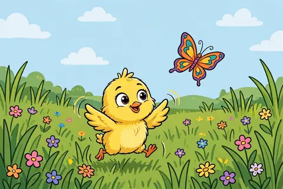
  </a>
  

    <h3><a href="stories/chira-the-chick-and-the-way-home.html">अनाया चूज़ा और घर का रास्ता</a></h3>
    

      <a class="btn btn-read" href="stories/chira-the-chick-and-the-way-home.html">📖 पढ़ें</a>
      <a class="btn btn-pdf" href="book/stories/chira-the-chick-and-the-way-home.pdf">📕 PDF</a>
      <a class="btn btn-share" href="https://wa.me/?text=%E0%A4%85%E0%A4%A8%E0%A4%BE%E0%A4%AF%E0%A4%BE%20%E0%A4%9A%E0%A5%82%E0%A4%9C%E0%A4%BC%E0%A4%BE%20%E0%A4%94%E0%A4%B0%20%E0%A4%98%E0%A4%B0%20%E0%A4%95%E0%A4%BE%20%E0%A4%B0%E0%A4%BE%E0%A4%B8%E0%A5%8D%E0%A4%A4%E0%A4%BE%20%E2%80%94%20%E0%A4%AE%E0%A5%80%E0%A4%A0%E0%A5%87%20%E0%A4%B8%E0%A4%AA%E0%A4%A8%E0%A5%8B%E0%A4%82%20%E0%A4%95%E0%A5%80%20%E0%A4%95%E0%A4%B9%E0%A4%BE%E0%A4%A8%E0%A4%BF%E0%A4%AF%E0%A4%BE%E0%A4%81%0Ahttps%3A%2F%2Fniteshlhsnda-droid.github.io%2Fkids-book-videos-hindi%2Fstories%2Fchira-the-chick-and-the-way-home.html" target="_blank" rel="noopener" title="WhatsApp पर भेजें" aria-label="WhatsApp पर भेजें">📲</a>
    

  

</article>
<article class="story-card" data-search="आसमान क्यों शर्माता है why-the-sky-blushes">
  <a class="card-art" href="stories/why-the-sky-blushes.html" aria-label="आसमान क्यों शर्माता है">
    🌙
    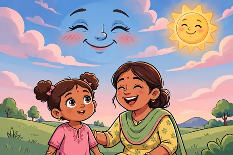
  </a>
  

    <h3><a href="stories/why-the-sky-blushes.html">आसमान क्यों शर्माता है</a></h3>
    

      <a class="btn btn-read" href="stories/why-the-sky-blushes.html">📖 पढ़ें</a>
      <a class="btn btn-pdf" href="book/stories/why-the-sky-blushes.pdf">📕 PDF</a>
      <a class="btn btn-share" href="https://wa.me/?text=%E0%A4%86%E0%A4%B8%E0%A4%AE%E0%A4%BE%E0%A4%A8%20%E0%A4%95%E0%A5%8D%E0%A4%AF%E0%A5%8B%E0%A4%82%20%E0%A4%B6%E0%A4%B0%E0%A5%8D%E0%A4%AE%E0%A4%BE%E0%A4%A4%E0%A4%BE%20%E0%A4%B9%E0%A5%88%20%E2%80%94%20%E0%A4%AE%E0%A5%80%E0%A4%A0%E0%A5%87%20%E0%A4%B8%E0%A4%AA%E0%A4%A8%E0%A5%8B%E0%A4%82%20%E0%A4%95%E0%A5%80%20%E0%A4%95%E0%A4%B9%E0%A4%BE%E0%A4%A8%E0%A4%BF%E0%A4%AF%E0%A4%BE%E0%A4%81%0Ahttps%3A%2F%2Fniteshlhsnda-droid.github.io%2Fkids-book-videos-hindi%2Fstories%2Fwhy-the-sky-blushes.html" target="_blank" rel="noopener" title="WhatsApp पर भेजें" aria-label="WhatsApp पर भेजें">📲</a>
    

  

</article>
<article class="story-card" data-search="इंद्रधनुष का वादा the-rainbows-promise">
  <a class="card-art" href="stories/the-rainbows-promise.html" aria-label="इंद्रधनुष का वादा">
    🌧️
    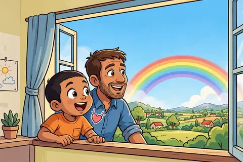
  </a>
  

    <h3><a href="stories/the-rainbows-promise.html">इंद्रधनुष का वादा</a></h3>
    

      <a class="btn btn-read" href="stories/the-rainbows-promise.html">📖 पढ़ें</a>
      <a class="btn btn-pdf" href="book/stories/the-rainbows-promise.pdf">📕 PDF</a>
      <a class="btn btn-share" href="https://wa.me/?text=%E0%A4%87%E0%A4%82%E0%A4%A6%E0%A5%8D%E0%A4%B0%E0%A4%A7%E0%A4%A8%E0%A5%81%E0%A4%B7%20%E0%A4%95%E0%A4%BE%20%E0%A4%B5%E0%A4%BE%E0%A4%A6%E0%A4%BE%20%E2%80%94%20%E0%A4%AE%E0%A5%80%E0%A4%A0%E0%A5%87%20%E0%A4%B8%E0%A4%AA%E0%A4%A8%E0%A5%8B%E0%A4%82%20%E0%A4%95%E0%A5%80%20%E0%A4%95%E0%A4%B9%E0%A4%BE%E0%A4%A8%E0%A4%BF%E0%A4%AF%E0%A4%BE%E0%A4%81%0Ahttps%3A%2F%2Fniteshlhsnda-droid.github.io%2Fkids-book-videos-hindi%2Fstories%2Fthe-rainbows-promise.html" target="_blank" rel="noopener" title="WhatsApp पर भेजें" aria-label="WhatsApp पर भेजें">📲</a>
    

  

</article>
<article class="story-card" data-search="उड़ना चाहने वाला पत्ता the-leaf-who-wanted-to-fly">
  <a class="card-art" href="stories/the-leaf-who-wanted-to-fly.html" aria-label="उड़ना चाहने वाला पत्ता">
    🐜
    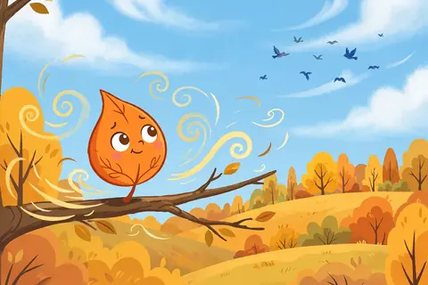
  </a>
  

    <h3><a href="stories/the-leaf-who-wanted-to-fly.html">उड़ना चाहने वाला पत्ता</a></h3>
    

      <a class="btn btn-read" href="stories/the-leaf-who-wanted-to-fly.html">📖 पढ़ें</a>
      <a class="btn btn-pdf" href="book/stories/the-leaf-who-wanted-to-fly.pdf">📕 PDF</a>
      <a class="btn btn-share" href="https://wa.me/?text=%E0%A4%89%E0%A4%A1%E0%A4%BC%E0%A4%A8%E0%A4%BE%20%E0%A4%9A%E0%A4%BE%E0%A4%B9%E0%A4%A8%E0%A5%87%20%E0%A4%B5%E0%A4%BE%E0%A4%B2%E0%A4%BE%20%E0%A4%AA%E0%A4%A4%E0%A5%8D%E0%A4%A4%E0%A4%BE%20%E2%80%94%20%E0%A4%AE%E0%A5%80%E0%A4%A0%E0%A5%87%20%E0%A4%B8%E0%A4%AA%E0%A4%A8%E0%A5%8B%E0%A4%82%20%E0%A4%95%E0%A5%80%20%E0%A4%95%E0%A4%B9%E0%A4%BE%E0%A4%A8%E0%A4%BF%E0%A4%AF%E0%A4%BE%E0%A4%81%0Ahttps%3A%2F%2Fniteshlhsnda-droid.github.io%2Fkids-book-videos-hindi%2Fstories%2Fthe-leaf-who-wanted-to-fly.html" target="_blank" rel="noopener" title="WhatsApp पर भेजें" aria-label="WhatsApp पर भेजें">📲</a>
    

  

</article>
<article class="story-card" data-search="ऊँघता लाइटहाउस the-sleepy-lighthouse">
  <a class="card-art" href="stories/the-sleepy-lighthouse.html" aria-label="ऊँघता लाइटहाउस">
    😴
    
  </a>
  

    <h3><a href="stories/the-sleepy-lighthouse.html">ऊँघता लाइटहाउस</a></h3>
    

      <a class="btn btn-read" href="stories/the-sleepy-lighthouse.html">📖 पढ़ें</a>
      <a class="btn btn-pdf" href="book/stories/the-sleepy-lighthouse.pdf">📕 PDF</a>
      <a class="btn btn-share" href="https://wa.me/?text=%E0%A4%8A%E0%A4%81%E0%A4%98%E0%A4%A4%E0%A4%BE%20%E0%A4%B2%E0%A4%BE%E0%A4%87%E0%A4%9F%E0%A4%B9%E0%A4%BE%E0%A4%89%E0%A4%B8%20%E2%80%94%20%E0%A4%AE%E0%A5%80%E0%A4%A0%E0%A5%87%20%E0%A4%B8%E0%A4%AA%E0%A4%A8%E0%A5%8B%E0%A4%82%20%E0%A4%95%E0%A5%80%20%E0%A4%95%E0%A4%B9%E0%A4%BE%E0%A4%A8%E0%A4%BF%E0%A4%AF%E0%A4%BE%E0%A4%81%0Ahttps%3A%2F%2Fniteshlhsnda-droid.github.io%2Fkids-book-videos-hindi%2Fstories%2Fthe-sleepy-lighthouse.html" target="_blank" rel="noopener" title="WhatsApp पर भेजें" aria-label="WhatsApp पर भेजें">📲</a>
    

  

</article>
<article class="story-card" data-search="ओली ऊदबिलाव का खोया कंकड़ ozzie-the-otters-lost-pebble">
  <a class="card-art" href="stories/ozzie-the-otters-lost-pebble.html" aria-label="ओली ऊदबिलाव का खोया कंकड़">
    🦦
    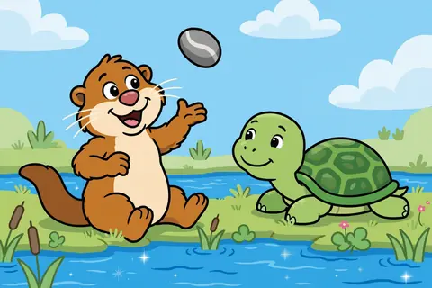
  </a>
  

    <h3><a href="stories/ozzie-the-otters-lost-pebble.html">ओली ऊदबिलाव का खोया कंकड़</a></h3>
    

      <a class="btn btn-read" href="stories/ozzie-the-otters-lost-pebble.html">📖 पढ़ें</a>
      <a class="btn btn-pdf" href="book/stories/ozzie-the-otters-lost-pebble.pdf">📕 PDF</a>
      <a class="btn btn-share" href="https://wa.me/?text=%E0%A4%93%E0%A4%B2%E0%A5%80%20%E0%A4%8A%E0%A4%A6%E0%A4%AC%E0%A4%BF%E0%A4%B2%E0%A4%BE%E0%A4%B5%20%E0%A4%95%E0%A4%BE%20%E0%A4%96%E0%A5%8B%E0%A4%AF%E0%A4%BE%20%E0%A4%95%E0%A4%82%E0%A4%95%E0%A4%A1%E0%A4%BC%20%E2%80%94%20%E0%A4%AE%E0%A5%80%E0%A4%A0%E0%A5%87%20%E0%A4%B8%E0%A4%AA%E0%A4%A8%E0%A5%8B%E0%A4%82%20%E0%A4%95%E0%A5%80%20%E0%A4%95%E0%A4%B9%E0%A4%BE%E0%A4%A8%E0%A4%BF%E0%A4%AF%E0%A4%BE%E0%A4%81%0Ahttps%3A%2F%2Fniteshlhsnda-droid.github.io%2Fkids-book-videos-hindi%2Fstories%2Fozzie-the-otters-lost-pebble.html" target="_blank" rel="noopener" title="WhatsApp पर भेजें" aria-label="WhatsApp पर भेजें">📲</a>
    

  

</article>
<article class="story-card" data-search="ओली ऊदबिलाव को आया गुस्सा ollie-the-otter-feels-angry">
  <a class="card-art" href="stories/ollie-the-otter-feels-angry.html" aria-label="ओली ऊदबिलाव को आया गुस्सा">
    🦦
    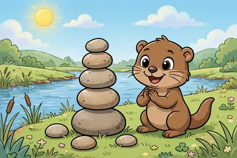
  </a>
  

    <h3><a href="stories/ollie-the-otter-feels-angry.html">ओली ऊदबिलाव को आया गुस्सा</a></h3>
    

      <a class="btn btn-read" href="stories/ollie-the-otter-feels-angry.html">📖 पढ़ें</a>
      <a class="btn btn-pdf" href="book/stories/ollie-the-otter-feels-angry.pdf">📕 PDF</a>
      <a class="btn btn-share" href="https://wa.me/?text=%E0%A4%93%E0%A4%B2%E0%A5%80%20%E0%A4%8A%E0%A4%A6%E0%A4%AC%E0%A4%BF%E0%A4%B2%E0%A4%BE%E0%A4%B5%20%E0%A4%95%E0%A5%8B%20%E0%A4%86%E0%A4%AF%E0%A4%BE%20%E0%A4%97%E0%A5%81%E0%A4%B8%E0%A5%8D%E0%A4%B8%E0%A4%BE%20%E2%80%94%20%E0%A4%AE%E0%A5%80%E0%A4%A0%E0%A5%87%20%E0%A4%B8%E0%A4%AA%E0%A4%A8%E0%A5%8B%E0%A4%82%20%E0%A4%95%E0%A5%80%20%E0%A4%95%E0%A4%B9%E0%A4%BE%E0%A4%A8%E0%A4%BF%E0%A4%AF%E0%A4%BE%E0%A4%81%0Ahttps%3A%2F%2Fniteshlhsnda-droid.github.io%2Fkids-book-videos-hindi%2Fstories%2Follie-the-otter-feels-angry.html" target="_blank" rel="noopener" title="WhatsApp पर भेजें" aria-label="WhatsApp पर भेजें">📲</a>
    

  

</article>
<article class="story-card" data-search="कबीर और दादी की याद kabir-misses-grandma">
  <a class="card-art" href="stories/kabir-misses-grandma.html" aria-label="कबीर और दादी की याद">
    🌙
    
  </a>
  

    <h3><a href="stories/kabir-misses-grandma.html">कबीर और दादी की याद</a></h3>
    

      <a class="btn btn-read" href="stories/kabir-misses-grandma.html">📖 पढ़ें</a>
      <a class="btn btn-pdf" href="book/stories/kabir-misses-grandma.pdf">📕 PDF</a>
      <a class="btn btn-share" href="https://wa.me/?text=%E0%A4%95%E0%A4%AC%E0%A5%80%E0%A4%B0%20%E0%A4%94%E0%A4%B0%20%E0%A4%A6%E0%A4%BE%E0%A4%A6%E0%A5%80%20%E0%A4%95%E0%A5%80%20%E0%A4%AF%E0%A4%BE%E0%A4%A6%20%E2%80%94%20%E0%A4%AE%E0%A5%80%E0%A4%A0%E0%A5%87%20%E0%A4%B8%E0%A4%AA%E0%A4%A8%E0%A5%8B%E0%A4%82%20%E0%A4%95%E0%A5%80%20%E0%A4%95%E0%A4%B9%E0%A4%BE%E0%A4%A8%E0%A4%BF%E0%A4%AF%E0%A4%BE%E0%A4%81%0Ahttps%3A%2F%2Fniteshlhsnda-droid.github.io%2Fkids-book-videos-hindi%2Fstories%2Fkabir-misses-grandma.html" target="_blank" rel="noopener" title="WhatsApp पर भेजें" aria-label="WhatsApp पर भेजें">📲</a>
    

  

</article>
<article class="story-card" data-search="कागज़ की नाव की यात्रा the-paper-boat-voyage">
  <a class="card-art" href="stories/the-paper-boat-voyage.html" aria-label="कागज़ की नाव की यात्रा">
    ⛵
    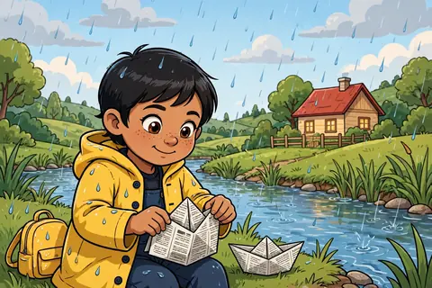
  </a>
  

    <h3><a href="stories/the-paper-boat-voyage.html">कागज़ की नाव की यात्रा</a></h3>
    

      <a class="btn btn-read" href="stories/the-paper-boat-voyage.html">📖 पढ़ें</a>
      <a class="btn btn-pdf" href="book/stories/the-paper-boat-voyage.pdf">📕 PDF</a>
      <a class="btn btn-share" href="https://wa.me/?text=%E0%A4%95%E0%A4%BE%E0%A4%97%E0%A4%9C%E0%A4%BC%20%E0%A4%95%E0%A5%80%20%E0%A4%A8%E0%A4%BE%E0%A4%B5%20%E0%A4%95%E0%A5%80%20%E0%A4%AF%E0%A4%BE%E0%A4%A4%E0%A5%8D%E0%A4%B0%E0%A4%BE%20%E2%80%94%20%E0%A4%AE%E0%A5%80%E0%A4%A0%E0%A5%87%20%E0%A4%B8%E0%A4%AA%E0%A4%A8%E0%A5%8B%E0%A4%82%20%E0%A4%95%E0%A5%80%20%E0%A4%95%E0%A4%B9%E0%A4%BE%E0%A4%A8%E0%A4%BF%E0%A4%AF%E0%A4%BE%E0%A4%81%0Ahttps%3A%2F%2Fniteshlhsnda-droid.github.io%2Fkids-book-videos-hindi%2Fstories%2Fthe-paper-boat-voyage.html" target="_blank" rel="noopener" title="WhatsApp पर भेजें" aria-label="WhatsApp पर भेजें">📲</a>
    

  

</article>
<article class="story-card" data-search="कानू ने सुनना सीखा bobo-learns-to-listen">
  <a class="card-art" href="stories/bobo-learns-to-listen.html" aria-label="कानू ने सुनना सीखा">
    🌙
    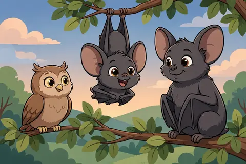
  </a>
  

    <h3><a href="stories/bobo-learns-to-listen.html">कानू ने सुनना सीखा</a></h3>
    

      <a class="btn btn-read" href="stories/bobo-learns-to-listen.html">📖 पढ़ें</a>
      <a class="btn btn-pdf" href="book/stories/bobo-learns-to-listen.pdf">📕 PDF</a>
      <a class="btn btn-share" href="https://wa.me/?text=%E0%A4%95%E0%A4%BE%E0%A4%A8%E0%A5%82%20%E0%A4%A8%E0%A5%87%20%E0%A4%B8%E0%A5%81%E0%A4%A8%E0%A4%A8%E0%A4%BE%20%E0%A4%B8%E0%A5%80%E0%A4%96%E0%A4%BE%20%E2%80%94%20%E0%A4%AE%E0%A5%80%E0%A4%A0%E0%A5%87%20%E0%A4%B8%E0%A4%AA%E0%A4%A8%E0%A5%8B%E0%A4%82%20%E0%A4%95%E0%A5%80%20%E0%A4%95%E0%A4%B9%E0%A4%BE%E0%A4%A8%E0%A4%BF%E0%A4%AF%E0%A4%BE%E0%A4%81%0Ahttps%3A%2F%2Fniteshlhsnda-droid.github.io%2Fkids-book-videos-hindi%2Fstories%2Fbobo-learns-to-listen.html" target="_blank" rel="noopener" title="WhatsApp पर भेजें" aria-label="WhatsApp पर भेजें">📲</a>
    

  

</article>
<article class="story-card" data-search="किटी बिल्ली का बच्चा और खोया बटन cleo-the-kitten-and-the-lost-button">
  <a class="card-art" href="stories/cleo-the-kitten-and-the-lost-button.html" aria-label="किटी बिल्ली का बच्चा और खोया बटन">
    🐱
    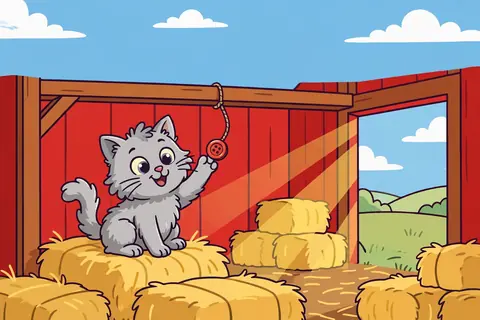
  </a>
  

    <h3><a href="stories/cleo-the-kitten-and-the-lost-button.html">किटी बिल्ली का बच्चा और खोया बटन</a></h3>
    

      <a class="btn btn-read" href="stories/cleo-the-kitten-and-the-lost-button.html">📖 पढ़ें</a>
      <a class="btn btn-pdf" href="book/stories/cleo-the-kitten-and-the-lost-button.pdf">📕 PDF</a>
      <a class="btn btn-share" href="https://wa.me/?text=%E0%A4%95%E0%A4%BF%E0%A4%9F%E0%A5%80%20%E0%A4%AC%E0%A4%BF%E0%A4%B2%E0%A5%8D%E0%A4%B2%E0%A5%80%20%E0%A4%95%E0%A4%BE%20%E0%A4%AC%E0%A4%9A%E0%A5%8D%E0%A4%9A%E0%A4%BE%20%E0%A4%94%E0%A4%B0%20%E0%A4%96%E0%A5%8B%E0%A4%AF%E0%A4%BE%20%E0%A4%AC%E0%A4%9F%E0%A4%A8%20%E2%80%94%20%E0%A4%AE%E0%A5%80%E0%A4%A0%E0%A5%87%20%E0%A4%B8%E0%A4%AA%E0%A4%A8%E0%A5%8B%E0%A4%82%20%E0%A4%95%E0%A5%80%20%E0%A4%95%E0%A4%B9%E0%A4%BE%E0%A4%A8%E0%A4%BF%E0%A4%AF%E0%A4%BE%E0%A4%81%0Ahttps%3A%2F%2Fniteshlhsnda-droid.github.io%2Fkids-book-videos-hindi%2Fstories%2Fcleo-the-kitten-and-the-lost-button.html" target="_blank" rel="noopener" title="WhatsApp पर भेजें" aria-label="WhatsApp पर भेजें">📲</a>
    

  

</article>
<article class="story-card" data-search="किरण की शुभ-रात्रि sunny-says-goodnight">
  <a class="card-art" href="stories/sunny-says-goodnight.html" aria-label="किरण की शुभ-रात्रि">
    🌙
    
  </a>
  

    <h3><a href="stories/sunny-says-goodnight.html">किरण की शुभ-रात्रि</a></h3>
    

      <a class="btn btn-read" href="stories/sunny-says-goodnight.html">📖 पढ़ें</a>
      <a class="btn btn-pdf" href="book/stories/sunny-says-goodnight.pdf">📕 PDF</a>
      <a class="btn btn-share" href="https://wa.me/?text=%E0%A4%95%E0%A4%BF%E0%A4%B0%E0%A4%A3%20%E0%A4%95%E0%A5%80%20%E0%A4%B6%E0%A5%81%E0%A4%AD-%E0%A4%B0%E0%A4%BE%E0%A4%A4%E0%A5%8D%E0%A4%B0%E0%A4%BF%20%E2%80%94%20%E0%A4%AE%E0%A5%80%E0%A4%A0%E0%A5%87%20%E0%A4%B8%E0%A4%AA%E0%A4%A8%E0%A5%8B%E0%A4%82%20%E0%A4%95%E0%A5%80%20%E0%A4%95%E0%A4%B9%E0%A4%BE%E0%A4%A8%E0%A4%BF%E0%A4%AF%E0%A4%BE%E0%A4%81%0Ahttps%3A%2F%2Fniteshlhsnda-droid.github.io%2Fkids-book-videos-hindi%2Fstories%2Fsunny-says-goodnight.html" target="_blank" rel="noopener" title="WhatsApp पर भेजें" aria-label="WhatsApp पर भेजें">📲</a>
    

  

</article>
<article class="story-card" data-search="खड़िया का बगीचा the-chalk-garden">
  <a class="card-art" href="stories/the-chalk-garden.html" aria-label="खड़िया का बगीचा">
    🌸
    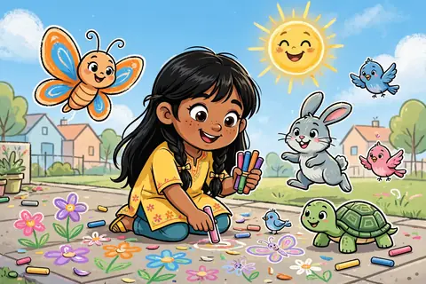
  </a>
  

    <h3><a href="stories/the-chalk-garden.html">खड़िया का बगीचा</a></h3>
    

      <a class="btn btn-read" href="stories/the-chalk-garden.html">📖 पढ़ें</a>
      <a class="btn btn-pdf" href="book/stories/the-chalk-garden.pdf">📕 PDF</a>
      <a class="btn btn-share" href="https://wa.me/?text=%E0%A4%96%E0%A4%A1%E0%A4%BC%E0%A4%BF%E0%A4%AF%E0%A4%BE%20%E0%A4%95%E0%A4%BE%20%E0%A4%AC%E0%A4%97%E0%A5%80%E0%A4%9A%E0%A4%BE%20%E2%80%94%20%E0%A4%AE%E0%A5%80%E0%A4%A0%E0%A5%87%20%E0%A4%B8%E0%A4%AA%E0%A4%A8%E0%A5%8B%E0%A4%82%20%E0%A4%95%E0%A5%80%20%E0%A4%95%E0%A4%B9%E0%A4%BE%E0%A4%A8%E0%A4%BF%E0%A4%AF%E0%A4%BE%E0%A4%81%0Ahttps%3A%2F%2Fniteshlhsnda-droid.github.io%2Fkids-book-videos-hindi%2Fstories%2Fthe-chalk-garden.html" target="_blank" rel="noopener" title="WhatsApp पर भेजें" aria-label="WhatsApp पर भेजें">📲</a>
    

  

</article>
<article class="story-card" data-search="खोदू छछूंदर ने सीखा सब्र milo-the-mole-learns-patience">
  <a class="card-art" href="stories/milo-the-mole-learns-patience.html" aria-label="खोदू छछूंदर ने सीखा सब्र">
    🦔
    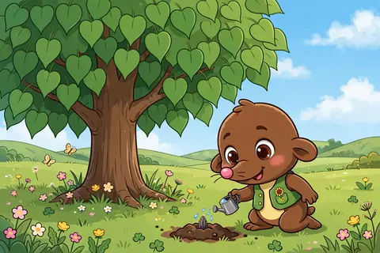
  </a>
  

    <h3><a href="stories/milo-the-mole-learns-patience.html">खोदू छछूंदर ने सीखा सब्र</a></h3>
    

      <a class="btn btn-read" href="stories/milo-the-mole-learns-patience.html">📖 पढ़ें</a>
      <a class="btn btn-pdf" href="book/stories/milo-the-mole-learns-patience.pdf">📕 PDF</a>
      <a class="btn btn-share" href="https://wa.me/?text=%E0%A4%96%E0%A5%8B%E0%A4%A6%E0%A5%82%20%E0%A4%9B%E0%A4%9B%E0%A5%82%E0%A4%82%E0%A4%A6%E0%A4%B0%20%E0%A4%A8%E0%A5%87%20%E0%A4%B8%E0%A5%80%E0%A4%96%E0%A4%BE%20%E0%A4%B8%E0%A4%AC%E0%A5%8D%E0%A4%B0%20%E2%80%94%20%E0%A4%AE%E0%A5%80%E0%A4%A0%E0%A5%87%20%E0%A4%B8%E0%A4%AA%E0%A4%A8%E0%A5%8B%E0%A4%82%20%E0%A4%95%E0%A5%80%20%E0%A4%95%E0%A4%B9%E0%A4%BE%E0%A4%A8%E0%A4%BF%E0%A4%AF%E0%A4%BE%E0%A4%81%0Ahttps%3A%2F%2Fniteshlhsnda-droid.github.io%2Fkids-book-videos-hindi%2Fstories%2Fmilo-the-mole-learns-patience.html" target="_blank" rel="noopener" title="WhatsApp पर भेजें" aria-label="WhatsApp पर भेजें">📲</a>
    

  

</article>
<article class="story-card" data-search="गब्बू उल्लू का रात का चक्कर hoots-sleepy-rounds">
  <a class="card-art" href="stories/hoots-sleepy-rounds.html" aria-label="गब्बू उल्लू का रात का चक्कर">
    🦉
    
  </a>
  

    <h3><a href="stories/hoots-sleepy-rounds.html">गब्बू उल्लू का रात का चक्कर</a></h3>
    

      <a class="btn btn-read" href="stories/hoots-sleepy-rounds.html">📖 पढ़ें</a>
      <a class="btn btn-pdf" href="book/stories/hoots-sleepy-rounds.pdf">📕 PDF</a>
      <a class="btn btn-share" href="https://wa.me/?text=%E0%A4%97%E0%A4%AC%E0%A5%8D%E0%A4%AC%E0%A5%82%20%E0%A4%89%E0%A4%B2%E0%A5%8D%E0%A4%B2%E0%A5%82%20%E0%A4%95%E0%A4%BE%20%E0%A4%B0%E0%A4%BE%E0%A4%A4%20%E0%A4%95%E0%A4%BE%20%E0%A4%9A%E0%A4%95%E0%A5%8D%E0%A4%95%E0%A4%B0%20%E2%80%94%20%E0%A4%AE%E0%A5%80%E0%A4%A0%E0%A5%87%20%E0%A4%B8%E0%A4%AA%E0%A4%A8%E0%A5%8B%E0%A4%82%20%E0%A4%95%E0%A5%80%20%E0%A4%95%E0%A4%B9%E0%A4%BE%E0%A4%A8%E0%A4%BF%E0%A4%AF%E0%A4%BE%E0%A4%81%0Ahttps%3A%2F%2Fniteshlhsnda-droid.github.io%2Fkids-book-videos-hindi%2Fstories%2Fhoots-sleepy-rounds.html" target="_blank" rel="noopener" title="WhatsApp पर भेजें" aria-label="WhatsApp पर भेजें">📲</a>
    

  

</article>
<article class="story-card" data-search="गाने वाली घड़ी the-clock-that-sings">
  <a class="card-art" href="stories/the-clock-that-sings.html" aria-label="गाने वाली घड़ी">
    🌙
    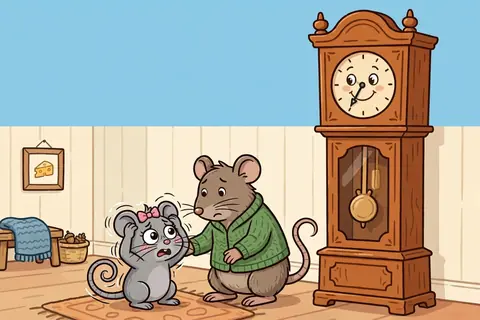
  </a>
  

    <h3><a href="stories/the-clock-that-sings.html">गाने वाली घड़ी</a></h3>
    

      <a class="btn btn-read" href="stories/the-clock-that-sings.html">📖 पढ़ें</a>
      <a class="btn btn-pdf" href="book/stories/the-clock-that-sings.pdf">📕 PDF</a>
      <a class="btn btn-share" href="https://wa.me/?text=%E0%A4%97%E0%A4%BE%E0%A4%A8%E0%A5%87%20%E0%A4%B5%E0%A4%BE%E0%A4%B2%E0%A5%80%20%E0%A4%98%E0%A4%A1%E0%A4%BC%E0%A5%80%20%E2%80%94%20%E0%A4%AE%E0%A5%80%E0%A4%A0%E0%A5%87%20%E0%A4%B8%E0%A4%AA%E0%A4%A8%E0%A5%8B%E0%A4%82%20%E0%A4%95%E0%A5%80%20%E0%A4%95%E0%A4%B9%E0%A4%BE%E0%A4%A8%E0%A4%BF%E0%A4%AF%E0%A4%BE%E0%A4%81%0Ahttps%3A%2F%2Fniteshlhsnda-droid.github.io%2Fkids-book-videos-hindi%2Fstories%2Fthe-clock-that-sings.html" target="_blank" rel="noopener" title="WhatsApp पर भेजें" aria-label="WhatsApp पर भेजें">📲</a>
    

  

</article>
<article class="story-card" data-search="गाने वाली बारिश the-rain-who-sang">
  <a class="card-art" href="stories/the-rain-who-sang.html" aria-label="गाने वाली बारिश">
    🌧️
    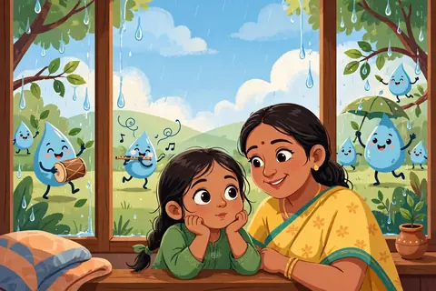
  </a>
  

    <h3><a href="stories/the-rain-who-sang.html">गाने वाली बारिश</a></h3>
    

      <a class="btn btn-read" href="stories/the-rain-who-sang.html">📖 पढ़ें</a>
      <a class="btn btn-pdf" href="book/stories/the-rain-who-sang.pdf">📕 PDF</a>
      <a class="btn btn-share" href="https://wa.me/?text=%E0%A4%97%E0%A4%BE%E0%A4%A8%E0%A5%87%20%E0%A4%B5%E0%A4%BE%E0%A4%B2%E0%A5%80%20%E0%A4%AC%E0%A4%BE%E0%A4%B0%E0%A4%BF%E0%A4%B6%20%E2%80%94%20%E0%A4%AE%E0%A5%80%E0%A4%A0%E0%A5%87%20%E0%A4%B8%E0%A4%AA%E0%A4%A8%E0%A5%8B%E0%A4%82%20%E0%A4%95%E0%A5%80%20%E0%A4%95%E0%A4%B9%E0%A4%BE%E0%A4%A8%E0%A4%BF%E0%A4%AF%E0%A4%BE%E0%A4%81%0Ahttps%3A%2F%2Fniteshlhsnda-droid.github.io%2Fkids-book-videos-hindi%2Fstories%2Fthe-rain-who-sang.html" target="_blank" rel="noopener" title="WhatsApp पर भेजें" aria-label="WhatsApp पर भेजें">📲</a>
    

  

</article>
<article class="story-card" data-search="गुड्डू की आधी रात की पिकनिक teddys-midnight-picnic">
  <a class="card-art" href="stories/teddys-midnight-picnic.html" aria-label="गुड्डू की आधी रात की पिकनिक">
    🧺
    
  </a>
  

    <h3><a href="stories/teddys-midnight-picnic.html">गुड्डू की आधी रात की पिकनिक</a></h3>
    

      <a class="btn btn-read" href="stories/teddys-midnight-picnic.html">📖 पढ़ें</a>
      <a class="btn btn-pdf" href="book/stories/teddys-midnight-picnic.pdf">📕 PDF</a>
      <a class="btn btn-share" href="https://wa.me/?text=%E0%A4%97%E0%A5%81%E0%A4%A1%E0%A5%8D%E0%A4%A1%E0%A5%82%20%E0%A4%95%E0%A5%80%20%E0%A4%86%E0%A4%A7%E0%A5%80%20%E0%A4%B0%E0%A4%BE%E0%A4%A4%20%E0%A4%95%E0%A5%80%20%E0%A4%AA%E0%A4%BF%E0%A4%95%E0%A4%A8%E0%A4%BF%E0%A4%95%20%E2%80%94%20%E0%A4%AE%E0%A5%80%E0%A4%A0%E0%A5%87%20%E0%A4%B8%E0%A4%AA%E0%A4%A8%E0%A5%8B%E0%A4%82%20%E0%A4%95%E0%A5%80%20%E0%A4%95%E0%A4%B9%E0%A4%BE%E0%A4%A8%E0%A4%BF%E0%A4%AF%E0%A4%BE%E0%A4%81%0Ahttps%3A%2F%2Fniteshlhsnda-droid.github.io%2Fkids-book-videos-hindi%2Fstories%2Fteddys-midnight-picnic.html" target="_blank" rel="noopener" title="WhatsApp पर भेजें" aria-label="WhatsApp पर भेजें">📲</a>
    

  

</article>
<article class="story-card" data-search="गुनगुनाता कछुआ सरपटू tiko-the-turtle-who-hummed">
  <a class="card-art" href="stories/tiko-the-turtle-who-hummed.html" aria-label="गुनगुनाता कछुआ सरपटू">
    🐢
    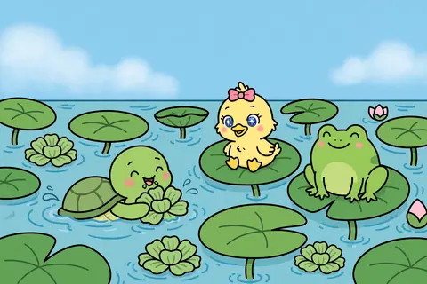
  </a>
  

    <h3><a href="stories/tiko-the-turtle-who-hummed.html">गुनगुनाता कछुआ सरपटू</a></h3>
    

      <a class="btn btn-read" href="stories/tiko-the-turtle-who-hummed.html">📖 पढ़ें</a>
      <a class="btn btn-pdf" href="book/stories/tiko-the-turtle-who-hummed.pdf">📕 PDF</a>
      <a class="btn btn-share" href="https://wa.me/?text=%E0%A4%97%E0%A5%81%E0%A4%A8%E0%A4%97%E0%A5%81%E0%A4%A8%E0%A4%BE%E0%A4%A4%E0%A4%BE%20%E0%A4%95%E0%A4%9B%E0%A5%81%E0%A4%86%20%E0%A4%B8%E0%A4%B0%E0%A4%AA%E0%A4%9F%E0%A5%82%20%E2%80%94%20%E0%A4%AE%E0%A5%80%E0%A4%A0%E0%A5%87%20%E0%A4%B8%E0%A4%AA%E0%A4%A8%E0%A5%8B%E0%A4%82%20%E0%A4%95%E0%A5%80%20%E0%A4%95%E0%A4%B9%E0%A4%BE%E0%A4%A8%E0%A4%BF%E0%A4%AF%E0%A4%BE%E0%A4%81%0Ahttps%3A%2F%2Fniteshlhsnda-droid.github.io%2Fkids-book-videos-hindi%2Fstories%2Ftiko-the-turtle-who-hummed.html" target="_blank" rel="noopener" title="WhatsApp पर भेजें" aria-label="WhatsApp पर भेजें">📲</a>
    

  

</article>
<article class="story-card" data-search="गुर्रू और गरजता आसमान bruno-and-the-rumbling-sky">
  <a class="card-art" href="stories/bruno-and-the-rumbling-sky.html" aria-label="गुर्रू और गरजता आसमान">
    🌙
    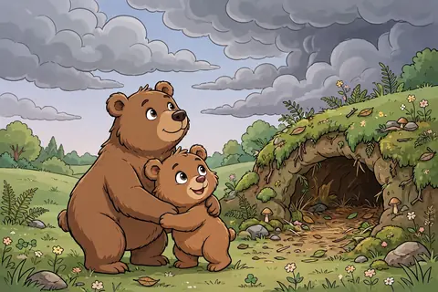
  </a>
  

    <h3><a href="stories/bruno-and-the-rumbling-sky.html">गुर्रू और गरजता आसमान</a></h3>
    

      <a class="btn btn-read" href="stories/bruno-and-the-rumbling-sky.html">📖 पढ़ें</a>
      <a class="btn btn-pdf" href="book/stories/bruno-and-the-rumbling-sky.pdf">📕 PDF</a>
      <a class="btn btn-share" href="https://wa.me/?text=%E0%A4%97%E0%A5%81%E0%A4%B0%E0%A5%8D%E0%A4%B0%E0%A5%82%20%E0%A4%94%E0%A4%B0%20%E0%A4%97%E0%A4%B0%E0%A4%9C%E0%A4%A4%E0%A4%BE%20%E0%A4%86%E0%A4%B8%E0%A4%AE%E0%A4%BE%E0%A4%A8%20%E2%80%94%20%E0%A4%AE%E0%A5%80%E0%A4%A0%E0%A5%87%20%E0%A4%B8%E0%A4%AA%E0%A4%A8%E0%A5%8B%E0%A4%82%20%E0%A4%95%E0%A5%80%20%E0%A4%95%E0%A4%B9%E0%A4%BE%E0%A4%A8%E0%A4%BF%E0%A4%AF%E0%A4%BE%E0%A4%81%0Ahttps%3A%2F%2Fniteshlhsnda-droid.github.io%2Fkids-book-videos-hindi%2Fstories%2Fbruno-and-the-rumbling-sky.html" target="_blank" rel="noopener" title="WhatsApp पर भेजें" aria-label="WhatsApp पर भेजें">📲</a>
    

  

</article>
<article class="story-card" data-search="चाँद ने बाँटी अपनी रोशनी the-moon-shares-its-light">
  <a class="card-art" href="stories/the-moon-shares-its-light.html" aria-label="चाँद ने बाँटी अपनी रोशनी">
    🌙
    
  </a>
  

    <h3><a href="stories/the-moon-shares-its-light.html">चाँद ने बाँटी अपनी रोशनी</a></h3>
    

      <a class="btn btn-read" href="stories/the-moon-shares-its-light.html">📖 पढ़ें</a>
      <a class="btn btn-pdf" href="book/stories/the-moon-shares-its-light.pdf">📕 PDF</a>
      <a class="btn btn-share" href="https://wa.me/?text=%E0%A4%9A%E0%A4%BE%E0%A4%81%E0%A4%A6%20%E0%A4%A8%E0%A5%87%20%E0%A4%AC%E0%A4%BE%E0%A4%81%E0%A4%9F%E0%A5%80%20%E0%A4%85%E0%A4%AA%E0%A4%A8%E0%A5%80%20%E0%A4%B0%E0%A5%8B%E0%A4%B6%E0%A4%A8%E0%A5%80%20%E2%80%94%20%E0%A4%AE%E0%A5%80%E0%A4%A0%E0%A5%87%20%E0%A4%B8%E0%A4%AA%E0%A4%A8%E0%A5%8B%E0%A4%82%20%E0%A4%95%E0%A5%80%20%E0%A4%95%E0%A4%B9%E0%A4%BE%E0%A4%A8%E0%A4%BF%E0%A4%AF%E0%A4%BE%E0%A4%81%0Ahttps%3A%2F%2Fniteshlhsnda-droid.github.io%2Fkids-book-videos-hindi%2Fstories%2Fthe-moon-shares-its-light.html" target="_blank" rel="noopener" title="WhatsApp पर भेजें" aria-label="WhatsApp पर भेजें">📲</a>
    

  

</article>
<article class="story-card" data-search="चाँदनी की चिट्ठी moonbeam-mail">
  <a class="card-art" href="stories/moonbeam-mail.html" aria-label="चाँदनी की चिट्ठी">
    🌙
    
  </a>
  

    <h3><a href="stories/moonbeam-mail.html">चाँदनी की चिट्ठी</a></h3>
    

      <a class="btn btn-read" href="stories/moonbeam-mail.html">📖 पढ़ें</a>
      <a class="btn btn-pdf" href="book/stories/moonbeam-mail.pdf">📕 PDF</a>
      <a class="btn btn-share" href="https://wa.me/?text=%E0%A4%9A%E0%A4%BE%E0%A4%81%E0%A4%A6%E0%A4%A8%E0%A5%80%20%E0%A4%95%E0%A5%80%20%E0%A4%9A%E0%A4%BF%E0%A4%9F%E0%A5%8D%E0%A4%A0%E0%A5%80%20%E2%80%94%20%E0%A4%AE%E0%A5%80%E0%A4%A0%E0%A5%87%20%E0%A4%B8%E0%A4%AA%E0%A4%A8%E0%A5%8B%E0%A4%82%20%E0%A4%95%E0%A5%80%20%E0%A4%95%E0%A4%B9%E0%A4%BE%E0%A4%A8%E0%A4%BF%E0%A4%AF%E0%A4%BE%E0%A4%81%0Ahttps%3A%2F%2Fniteshlhsnda-droid.github.io%2Fkids-book-videos-hindi%2Fstories%2Fmoonbeam-mail.html" target="_blank" rel="noopener" title="WhatsApp पर भेजें" aria-label="WhatsApp पर भेजें">📲</a>
    

  

</article>
<article class="story-card" data-search="चिंकी चींटी और बिखरे हुए टुकड़े andy-the-ant-and-the-fallen-crumbs">
  <a class="card-art" href="stories/andy-the-ant-and-the-fallen-crumbs.html" aria-label="चिंकी चींटी और बिखरे हुए टुकड़े">
    🐜
    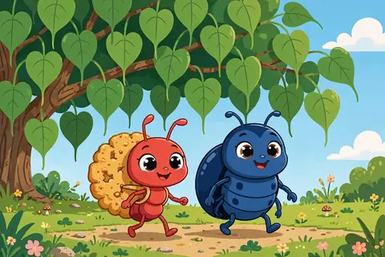
  </a>
  

    <h3><a href="stories/andy-the-ant-and-the-fallen-crumbs.html">चिंकी चींटी और बिखरे हुए टुकड़े</a></h3>
    

      <a class="btn btn-read" href="stories/andy-the-ant-and-the-fallen-crumbs.html">📖 पढ़ें</a>
      <a class="btn btn-pdf" href="book/stories/andy-the-ant-and-the-fallen-crumbs.pdf">📕 PDF</a>
      <a class="btn btn-share" href="https://wa.me/?text=%E0%A4%9A%E0%A4%BF%E0%A4%82%E0%A4%95%E0%A5%80%20%E0%A4%9A%E0%A5%80%E0%A4%82%E0%A4%9F%E0%A5%80%20%E0%A4%94%E0%A4%B0%20%E0%A4%AC%E0%A4%BF%E0%A4%96%E0%A4%B0%E0%A5%87%20%E0%A4%B9%E0%A5%81%E0%A4%8F%20%E0%A4%9F%E0%A5%81%E0%A4%95%E0%A4%A1%E0%A4%BC%E0%A5%87%20%E2%80%94%20%E0%A4%AE%E0%A5%80%E0%A4%A0%E0%A5%87%20%E0%A4%B8%E0%A4%AA%E0%A4%A8%E0%A5%8B%E0%A4%82%20%E0%A4%95%E0%A5%80%20%E0%A4%95%E0%A4%B9%E0%A4%BE%E0%A4%A8%E0%A4%BF%E0%A4%AF%E0%A4%BE%E0%A4%81%0Ahttps%3A%2F%2Fniteshlhsnda-droid.github.io%2Fkids-book-videos-hindi%2Fstories%2Fandy-the-ant-and-the-fallen-crumbs.html" target="_blank" rel="noopener" title="WhatsApp पर भेजें" aria-label="WhatsApp पर भेजें">📲</a>
    

  

</article>
<article class="story-card" data-search="चिंटू और उसका नया घर benny-moves-to-a-new-burrow">
  <a class="card-art" href="stories/benny-moves-to-a-new-burrow.html" aria-label="चिंटू और उसका नया घर">
    🌙
    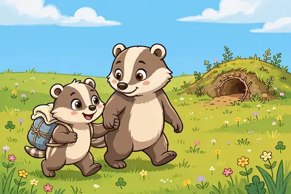
  </a>
  

    <h3><a href="stories/benny-moves-to-a-new-burrow.html">चिंटू और उसका नया घर</a></h3>
    

      <a class="btn btn-read" href="stories/benny-moves-to-a-new-burrow.html">📖 पढ़ें</a>
      <a class="btn btn-pdf" href="book/stories/benny-moves-to-a-new-burrow.pdf">📕 PDF</a>
      <a class="btn btn-share" href="https://wa.me/?text=%E0%A4%9A%E0%A4%BF%E0%A4%82%E0%A4%9F%E0%A5%82%20%E0%A4%94%E0%A4%B0%20%E0%A4%89%E0%A4%B8%E0%A4%95%E0%A4%BE%20%E0%A4%A8%E0%A4%AF%E0%A4%BE%20%E0%A4%98%E0%A4%B0%20%E2%80%94%20%E0%A4%AE%E0%A5%80%E0%A4%A0%E0%A5%87%20%E0%A4%B8%E0%A4%AA%E0%A4%A8%E0%A5%8B%E0%A4%82%20%E0%A4%95%E0%A5%80%20%E0%A4%95%E0%A4%B9%E0%A4%BE%E0%A4%A8%E0%A4%BF%E0%A4%AF%E0%A4%BE%E0%A4%81%0Ahttps%3A%2F%2Fniteshlhsnda-droid.github.io%2Fkids-book-videos-hindi%2Fstories%2Fbenny-moves-to-a-new-burrow.html" target="_blank" rel="noopener" title="WhatsApp पर भेजें" aria-label="WhatsApp पर भेजें">📲</a>
    

  

</article>
<article class="story-card" data-search="चिकू ने बाँटे अपने फल chiku-shares-his-acorns">
  <a class="card-art" href="stories/chiku-shares-his-acorns.html" aria-label="चिकू ने बाँटे अपने फल">
    🐇
    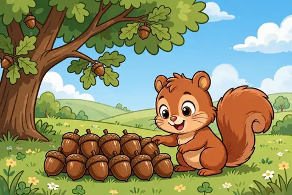
  </a>
  

    <h3><a href="stories/chiku-shares-his-acorns.html">चिकू ने बाँटे अपने फल</a></h3>
    

      <a class="btn btn-read" href="stories/chiku-shares-his-acorns.html">📖 पढ़ें</a>
      <a class="btn btn-pdf" href="book/stories/chiku-shares-his-acorns.pdf">📕 PDF</a>
      <a class="btn btn-share" href="https://wa.me/?text=%E0%A4%9A%E0%A4%BF%E0%A4%95%E0%A5%82%20%E0%A4%A8%E0%A5%87%20%E0%A4%AC%E0%A4%BE%E0%A4%81%E0%A4%9F%E0%A5%87%20%E0%A4%85%E0%A4%AA%E0%A4%A8%E0%A5%87%20%E0%A4%AB%E0%A4%B2%20%E2%80%94%20%E0%A4%AE%E0%A5%80%E0%A4%A0%E0%A5%87%20%E0%A4%B8%E0%A4%AA%E0%A4%A8%E0%A5%8B%E0%A4%82%20%E0%A4%95%E0%A5%80%20%E0%A4%95%E0%A4%B9%E0%A4%BE%E0%A4%A8%E0%A4%BF%E0%A4%AF%E0%A4%BE%E0%A4%81%0Ahttps%3A%2F%2Fniteshlhsnda-droid.github.io%2Fkids-book-videos-hindi%2Fstories%2Fchiku-shares-his-acorns.html" target="_blank" rel="noopener" title="WhatsApp पर भेजें" aria-label="WhatsApp पर भेजें">📲</a>
    

  

</article>
<article class="story-card" data-search="चिड़ियाँ कहाँ सोती हैं? where-do-birds-sleep">
  <a class="card-art" href="stories/where-do-birds-sleep.html" aria-label="चिड़ियाँ कहाँ सोती हैं?">
    🐦
    
  </a>
  

    <h3><a href="stories/where-do-birds-sleep.html">चिड़ियाँ कहाँ सोती हैं?</a></h3>
    

      <a class="btn btn-read" href="stories/where-do-birds-sleep.html">📖 पढ़ें</a>
      <a class="btn btn-pdf" href="book/stories/where-do-birds-sleep.pdf">📕 PDF</a>
      <a class="btn btn-share" href="https://wa.me/?text=%E0%A4%9A%E0%A4%BF%E0%A4%A1%E0%A4%BC%E0%A4%BF%E0%A4%AF%E0%A4%BE%E0%A4%81%20%E0%A4%95%E0%A4%B9%E0%A4%BE%E0%A4%81%20%E0%A4%B8%E0%A5%8B%E0%A4%A4%E0%A5%80%20%E0%A4%B9%E0%A5%88%E0%A4%82%3F%20%E2%80%94%20%E0%A4%AE%E0%A5%80%E0%A4%A0%E0%A5%87%20%E0%A4%B8%E0%A4%AA%E0%A4%A8%E0%A5%8B%E0%A4%82%20%E0%A4%95%E0%A5%80%20%E0%A4%95%E0%A4%B9%E0%A4%BE%E0%A4%A8%E0%A4%BF%E0%A4%AF%E0%A4%BE%E0%A4%81%0Ahttps%3A%2F%2Fniteshlhsnda-droid.github.io%2Fkids-book-videos-hindi%2Fstories%2Fwhere-do-birds-sleep.html" target="_blank" rel="noopener" title="WhatsApp पर भेजें" aria-label="WhatsApp पर भेजें">📲</a>
    

  

</article>
<article class="story-card" data-search="चित्ती लेडीबग का गुम हुआ धब्बा lulu-the-ladybugs-missing-spot">
  <a class="card-art" href="stories/lulu-the-ladybugs-missing-spot.html" aria-label="चित्ती लेडीबग का गुम हुआ धब्बा">
    🌙
    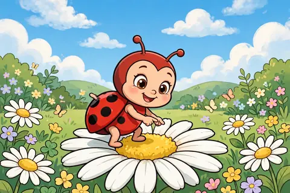
  </a>
  

    <h3><a href="stories/lulu-the-ladybugs-missing-spot.html">चित्ती लेडीबग का गुम हुआ धब्बा</a></h3>
    

      <a class="btn btn-read" href="stories/lulu-the-ladybugs-missing-spot.html">📖 पढ़ें</a>
      <a class="btn btn-pdf" href="book/stories/lulu-the-ladybugs-missing-spot.pdf">📕 PDF</a>
      <a class="btn btn-share" href="https://wa.me/?text=%E0%A4%9A%E0%A4%BF%E0%A4%A4%E0%A5%8D%E0%A4%A4%E0%A5%80%20%E0%A4%B2%E0%A5%87%E0%A4%A1%E0%A5%80%E0%A4%AC%E0%A4%97%20%E0%A4%95%E0%A4%BE%20%E0%A4%97%E0%A5%81%E0%A4%AE%20%E0%A4%B9%E0%A5%81%E0%A4%86%20%E0%A4%A7%E0%A4%AC%E0%A5%8D%E0%A4%AC%E0%A4%BE%20%E2%80%94%20%E0%A4%AE%E0%A5%80%E0%A4%A0%E0%A5%87%20%E0%A4%B8%E0%A4%AA%E0%A4%A8%E0%A5%8B%E0%A4%82%20%E0%A4%95%E0%A5%80%20%E0%A4%95%E0%A4%B9%E0%A4%BE%E0%A4%A8%E0%A4%BF%E0%A4%AF%E0%A4%BE%E0%A4%81%0Ahttps%3A%2F%2Fniteshlhsnda-droid.github.io%2Fkids-book-videos-hindi%2Fstories%2Flulu-the-ladybugs-missing-spot.html" target="_blank" rel="noopener" title="WhatsApp पर भेजें" aria-label="WhatsApp पर भेजें">📲</a>
    

  

</article>
<article class="story-card" data-search="चिमटी केकड़ा और टेढ़ी पकड़म-पकड़ाई sandy-the-crabs-sideways-tag">
  <a class="card-art" href="stories/sandy-the-crabs-sideways-tag.html" aria-label="चिमटी केकड़ा और टेढ़ी पकड़म-पकड़ाई">
    🦀
    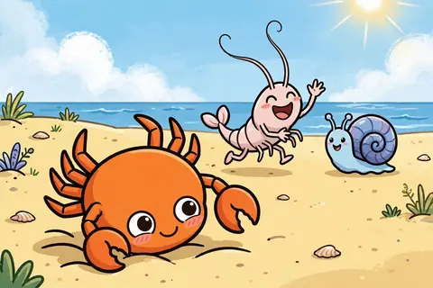
  </a>
  

    <h3><a href="stories/sandy-the-crabs-sideways-tag.html">चिमटी केकड़ा और टेढ़ी पकड़म-पकड़ाई</a></h3>
    

      <a class="btn btn-read" href="stories/sandy-the-crabs-sideways-tag.html">📖 पढ़ें</a>
      <a class="btn btn-pdf" href="book/stories/sandy-the-crabs-sideways-tag.pdf">📕 PDF</a>
      <a class="btn btn-share" href="https://wa.me/?text=%E0%A4%9A%E0%A4%BF%E0%A4%AE%E0%A4%9F%E0%A5%80%20%E0%A4%95%E0%A5%87%E0%A4%95%E0%A4%A1%E0%A4%BC%E0%A4%BE%20%E0%A4%94%E0%A4%B0%20%E0%A4%9F%E0%A5%87%E0%A4%A2%E0%A4%BC%E0%A5%80%20%E0%A4%AA%E0%A4%95%E0%A4%A1%E0%A4%BC%E0%A4%AE-%E0%A4%AA%E0%A4%95%E0%A4%A1%E0%A4%BC%E0%A4%BE%E0%A4%88%20%E2%80%94%20%E0%A4%AE%E0%A5%80%E0%A4%A0%E0%A5%87%20%E0%A4%B8%E0%A4%AA%E0%A4%A8%E0%A5%8B%E0%A4%82%20%E0%A4%95%E0%A5%80%20%E0%A4%95%E0%A4%B9%E0%A4%BE%E0%A4%A8%E0%A4%BF%E0%A4%AF%E0%A4%BE%E0%A4%81%0Ahttps%3A%2F%2Fniteshlhsnda-droid.github.io%2Fkids-book-videos-hindi%2Fstories%2Fsandy-the-crabs-sideways-tag.html" target="_blank" rel="noopener" title="WhatsApp पर भेजें" aria-label="WhatsApp पर भेजें">📲</a>
    

  

</article>
<article class="story-card" data-search="चींटियों की पिकनिक the-ant-picnic">
  <a class="card-art" href="stories/the-ant-picnic.html" aria-label="चींटियों की पिकनिक">
    🐜
    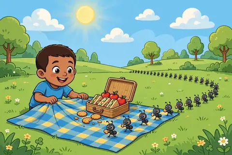
  </a>
  

    <h3><a href="stories/the-ant-picnic.html">चींटियों की पिकनिक</a></h3>
    

      <a class="btn btn-read" href="stories/the-ant-picnic.html">📖 पढ़ें</a>
      <a class="btn btn-pdf" href="book/stories/the-ant-picnic.pdf">📕 PDF</a>
      <a class="btn btn-share" href="https://wa.me/?text=%E0%A4%9A%E0%A5%80%E0%A4%82%E0%A4%9F%E0%A4%BF%E0%A4%AF%E0%A5%8B%E0%A4%82%20%E0%A4%95%E0%A5%80%20%E0%A4%AA%E0%A4%BF%E0%A4%95%E0%A4%A8%E0%A4%BF%E0%A4%95%20%E2%80%94%20%E0%A4%AE%E0%A5%80%E0%A4%A0%E0%A5%87%20%E0%A4%B8%E0%A4%AA%E0%A4%A8%E0%A5%8B%E0%A4%82%20%E0%A4%95%E0%A5%80%20%E0%A4%95%E0%A4%B9%E0%A4%BE%E0%A4%A8%E0%A4%BF%E0%A4%AF%E0%A4%BE%E0%A4%81%0Ahttps%3A%2F%2Fniteshlhsnda-droid.github.io%2Fkids-book-videos-hindi%2Fstories%2Fthe-ant-picnic.html" target="_blank" rel="noopener" title="WhatsApp पर भेजें" aria-label="WhatsApp पर भेजें">📲</a>
    

  

</article>
<article class="story-card" data-search="छलकी और नन्ही लहर tide-and-the-little-wave">
  <a class="card-art" href="stories/tide-and-the-little-wave.html" aria-label="छलकी और नन्ही लहर">
    🌊
    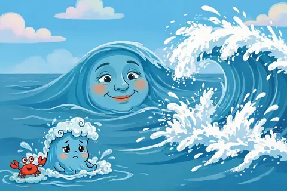
  </a>
  

    <h3><a href="stories/tide-and-the-little-wave.html">छलकी और नन्ही लहर</a></h3>
    

      <a class="btn btn-read" href="stories/tide-and-the-little-wave.html">📖 पढ़ें</a>
      <a class="btn btn-pdf" href="book/stories/tide-and-the-little-wave.pdf">📕 PDF</a>
      <a class="btn btn-share" href="https://wa.me/?text=%E0%A4%9B%E0%A4%B2%E0%A4%95%E0%A5%80%20%E0%A4%94%E0%A4%B0%20%E0%A4%A8%E0%A4%A8%E0%A5%8D%E0%A4%B9%E0%A5%80%20%E0%A4%B2%E0%A4%B9%E0%A4%B0%20%E2%80%94%20%E0%A4%AE%E0%A5%80%E0%A4%A0%E0%A5%87%20%E0%A4%B8%E0%A4%AA%E0%A4%A8%E0%A5%8B%E0%A4%82%20%E0%A4%95%E0%A5%80%20%E0%A4%95%E0%A4%B9%E0%A4%BE%E0%A4%A8%E0%A4%BF%E0%A4%AF%E0%A4%BE%E0%A4%81%0Ahttps%3A%2F%2Fniteshlhsnda-droid.github.io%2Fkids-book-videos-hindi%2Fstories%2Ftide-and-the-little-wave.html" target="_blank" rel="noopener" title="WhatsApp पर भेजें" aria-label="WhatsApp पर भेजें">📲</a>
    

  

</article>
<article class="story-card" data-search="छोटा बीज जो बड़ा हुआ the-tiny-seed-that-grew">
  <a class="card-art" href="stories/the-tiny-seed-that-grew.html" aria-label="छोटा बीज जो बड़ा हुआ">
    🌙
    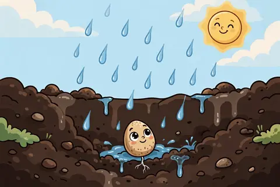
  </a>
  

    <h3><a href="stories/the-tiny-seed-that-grew.html">छोटा बीज जो बड़ा हुआ</a></h3>
    

      <a class="btn btn-read" href="stories/the-tiny-seed-that-grew.html">📖 पढ़ें</a>
      <a class="btn btn-pdf" href="book/stories/the-tiny-seed-that-grew.pdf">📕 PDF</a>
      <a class="btn btn-share" href="https://wa.me/?text=%E0%A4%9B%E0%A5%8B%E0%A4%9F%E0%A4%BE%20%E0%A4%AC%E0%A5%80%E0%A4%9C%20%E0%A4%9C%E0%A5%8B%20%E0%A4%AC%E0%A4%A1%E0%A4%BC%E0%A4%BE%20%E0%A4%B9%E0%A5%81%E0%A4%86%20%E2%80%94%20%E0%A4%AE%E0%A5%80%E0%A4%A0%E0%A5%87%20%E0%A4%B8%E0%A4%AA%E0%A4%A8%E0%A5%8B%E0%A4%82%20%E0%A4%95%E0%A5%80%20%E0%A4%95%E0%A4%B9%E0%A4%BE%E0%A4%A8%E0%A4%BF%E0%A4%AF%E0%A4%BE%E0%A4%81%0Ahttps%3A%2F%2Fniteshlhsnda-droid.github.io%2Fkids-book-videos-hindi%2Fstories%2Fthe-tiny-seed-that-grew.html" target="_blank" rel="noopener" title="WhatsApp पर भेजें" aria-label="WhatsApp पर भेजें">📲</a>
    

  

</article>
<article class="story-card" data-search="छोटी नीली रेलगाड़ी the-little-blue-train">
  <a class="card-art" href="stories/the-little-blue-train.html" aria-label="छोटी नीली रेलगाड़ी">
    🚂
    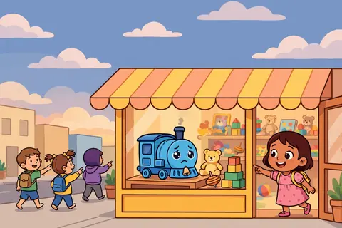
  </a>
  

    <h3><a href="stories/the-little-blue-train.html">छोटी नीली रेलगाड़ी</a></h3>
    

      <a class="btn btn-read" href="stories/the-little-blue-train.html">📖 पढ़ें</a>
      <a class="btn btn-pdf" href="book/stories/the-little-blue-train.pdf">📕 PDF</a>
      <a class="btn btn-share" href="https://wa.me/?text=%E0%A4%9B%E0%A5%8B%E0%A4%9F%E0%A5%80%20%E0%A4%A8%E0%A5%80%E0%A4%B2%E0%A5%80%20%E0%A4%B0%E0%A5%87%E0%A4%B2%E0%A4%97%E0%A4%BE%E0%A4%A1%E0%A4%BC%E0%A5%80%20%E2%80%94%20%E0%A4%AE%E0%A5%80%E0%A4%A0%E0%A5%87%20%E0%A4%B8%E0%A4%AA%E0%A4%A8%E0%A5%8B%E0%A4%82%20%E0%A4%95%E0%A5%80%20%E0%A4%95%E0%A4%B9%E0%A4%BE%E0%A4%A8%E0%A4%BF%E0%A4%AF%E0%A4%BE%E0%A4%81%0Ahttps%3A%2F%2Fniteshlhsnda-droid.github.io%2Fkids-book-videos-hindi%2Fstories%2Fthe-little-blue-train.html" target="_blank" rel="noopener" title="WhatsApp पर भेजें" aria-label="WhatsApp पर भेजें">📲</a>
    

  

</article>
<article class="story-card" data-search="ज़ोया और उसकी मीठी हाँक greta-the-gooses-soft-honk">
  <a class="card-art" href="stories/greta-the-gooses-soft-honk.html" aria-label="ज़ोया और उसकी मीठी हाँक">
    🌙
    
  </a>
  

    <h3><a href="stories/greta-the-gooses-soft-honk.html">ज़ोया और उसकी मीठी हाँक</a></h3>
    

      <a class="btn btn-read" href="stories/greta-the-gooses-soft-honk.html">📖 पढ़ें</a>
      <a class="btn btn-pdf" href="book/stories/greta-the-gooses-soft-honk.pdf">📕 PDF</a>
      <a class="btn btn-share" href="https://wa.me/?text=%E0%A4%9C%E0%A4%BC%E0%A5%8B%E0%A4%AF%E0%A4%BE%20%E0%A4%94%E0%A4%B0%20%E0%A4%89%E0%A4%B8%E0%A4%95%E0%A5%80%20%E0%A4%AE%E0%A5%80%E0%A4%A0%E0%A5%80%20%E0%A4%B9%E0%A4%BE%E0%A4%81%E0%A4%95%20%E2%80%94%20%E0%A4%AE%E0%A5%80%E0%A4%A0%E0%A5%87%20%E0%A4%B8%E0%A4%AA%E0%A4%A8%E0%A5%8B%E0%A4%82%20%E0%A4%95%E0%A5%80%20%E0%A4%95%E0%A4%B9%E0%A4%BE%E0%A4%A8%E0%A4%BF%E0%A4%AF%E0%A4%BE%E0%A4%81%0Ahttps%3A%2F%2Fniteshlhsnda-droid.github.io%2Fkids-book-videos-hindi%2Fstories%2Fgreta-the-gooses-soft-honk.html" target="_blank" rel="noopener" title="WhatsApp पर भेजें" aria-label="WhatsApp पर भेजें">📲</a>
    

  

</article>
<article class="story-card" data-search="जादुई गत्ते का डिब्बा the-magic-cardboard-box">
  <a class="card-art" href="stories/the-magic-cardboard-box.html" aria-label="जादुई गत्ते का डिब्बा">
    🌙
    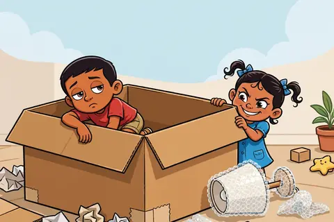
  </a>
  

    <h3><a href="stories/the-magic-cardboard-box.html">जादुई गत्ते का डिब्बा</a></h3>
    

      <a class="btn btn-read" href="stories/the-magic-cardboard-box.html">📖 पढ़ें</a>
      <a class="btn btn-pdf" href="book/stories/the-magic-cardboard-box.pdf">📕 PDF</a>
      <a class="btn btn-share" href="https://wa.me/?text=%E0%A4%9C%E0%A4%BE%E0%A4%A6%E0%A5%81%E0%A4%88%20%E0%A4%97%E0%A4%A4%E0%A5%8D%E0%A4%A4%E0%A5%87%20%E0%A4%95%E0%A4%BE%20%E0%A4%A1%E0%A4%BF%E0%A4%AC%E0%A5%8D%E0%A4%AC%E0%A4%BE%20%E2%80%94%20%E0%A4%AE%E0%A5%80%E0%A4%A0%E0%A5%87%20%E0%A4%B8%E0%A4%AA%E0%A4%A8%E0%A5%8B%E0%A4%82%20%E0%A4%95%E0%A5%80%20%E0%A4%95%E0%A4%B9%E0%A4%BE%E0%A4%A8%E0%A4%BF%E0%A4%AF%E0%A4%BE%E0%A4%81%0Ahttps%3A%2F%2Fniteshlhsnda-droid.github.io%2Fkids-book-videos-hindi%2Fstories%2Fthe-magic-cardboard-box.html" target="_blank" rel="noopener" title="WhatsApp पर भेजें" aria-label="WhatsApp पर भेजें">📲</a>
    

  

</article>
<article class="story-card" data-search="जुगनुओं का नाच the-firefly-dance">
  <a class="card-art" href="stories/the-firefly-dance.html" aria-label="जुगनुओं का नाच">
    ✨
    
  </a>
  

    <h3><a href="stories/the-firefly-dance.html">जुगनुओं का नाच</a></h3>
    

      <a class="btn btn-read" href="stories/the-firefly-dance.html">📖 पढ़ें</a>
      <a class="btn btn-pdf" href="book/stories/the-firefly-dance.pdf">📕 PDF</a>
      <a class="btn btn-share" href="https://wa.me/?text=%E0%A4%9C%E0%A5%81%E0%A4%97%E0%A4%A8%E0%A5%81%E0%A4%93%E0%A4%82%20%E0%A4%95%E0%A4%BE%20%E0%A4%A8%E0%A4%BE%E0%A4%9A%20%E2%80%94%20%E0%A4%AE%E0%A5%80%E0%A4%A0%E0%A5%87%20%E0%A4%B8%E0%A4%AA%E0%A4%A8%E0%A5%8B%E0%A4%82%20%E0%A4%95%E0%A5%80%20%E0%A4%95%E0%A4%B9%E0%A4%BE%E0%A4%A8%E0%A4%BF%E0%A4%AF%E0%A4%BE%E0%A4%81%0Ahttps%3A%2F%2Fniteshlhsnda-droid.github.io%2Fkids-book-videos-hindi%2Fstories%2Fthe-firefly-dance.html" target="_blank" rel="noopener" title="WhatsApp पर भेजें" aria-label="WhatsApp पर भेजें">📲</a>
    

  

</article>
<article class="story-card" data-search="जुगनुओं के साथ नाच dancing-with-fireflies">
  <a class="card-art" href="stories/dancing-with-fireflies.html" aria-label="जुगनुओं के साथ नाच">
    🌙
    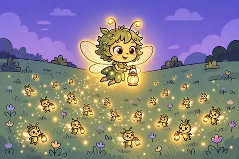
  </a>
  

    <h3><a href="stories/dancing-with-fireflies.html">जुगनुओं के साथ नाच</a></h3>
    

      <a class="btn btn-read" href="stories/dancing-with-fireflies.html">📖 पढ़ें</a>
      <a class="btn btn-pdf" href="book/stories/dancing-with-fireflies.pdf">📕 PDF</a>
      <a class="btn btn-share" href="https://wa.me/?text=%E0%A4%9C%E0%A5%81%E0%A4%97%E0%A4%A8%E0%A5%81%E0%A4%93%E0%A4%82%20%E0%A4%95%E0%A5%87%20%E0%A4%B8%E0%A4%BE%E0%A4%A5%20%E0%A4%A8%E0%A4%BE%E0%A4%9A%20%E2%80%94%20%E0%A4%AE%E0%A5%80%E0%A4%A0%E0%A5%87%20%E0%A4%B8%E0%A4%AA%E0%A4%A8%E0%A5%8B%E0%A4%82%20%E0%A4%95%E0%A5%80%20%E0%A4%95%E0%A4%B9%E0%A4%BE%E0%A4%A8%E0%A4%BF%E0%A4%AF%E0%A4%BE%E0%A4%81%0Ahttps%3A%2F%2Fniteshlhsnda-droid.github.io%2Fkids-book-videos-hindi%2Fstories%2Fdancing-with-fireflies.html" target="_blank" rel="noopener" title="WhatsApp पर भेजें" aria-label="WhatsApp पर भेजें">📲</a>
    

  

</article>
<article class="story-card" data-search="टोनी के नर्म पंजे bounce-the-puppys-gentle-paws">
  <a class="card-art" href="stories/bounce-the-puppys-gentle-paws.html" aria-label="टोनी के नर्म पंजे">
    🐶
    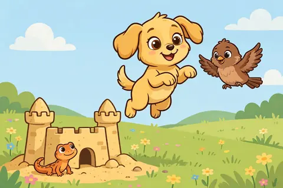
  </a>
  

    <h3><a href="stories/bounce-the-puppys-gentle-paws.html">टोनी के नर्म पंजे</a></h3>
    

      <a class="btn btn-read" href="stories/bounce-the-puppys-gentle-paws.html">📖 पढ़ें</a>
      <a class="btn btn-pdf" href="book/stories/bounce-the-puppys-gentle-paws.pdf">📕 PDF</a>
      <a class="btn btn-share" href="https://wa.me/?text=%E0%A4%9F%E0%A5%8B%E0%A4%A8%E0%A5%80%20%E0%A4%95%E0%A5%87%20%E0%A4%A8%E0%A4%B0%E0%A5%8D%E0%A4%AE%20%E0%A4%AA%E0%A4%82%E0%A4%9C%E0%A5%87%20%E2%80%94%20%E0%A4%AE%E0%A5%80%E0%A4%A0%E0%A5%87%20%E0%A4%B8%E0%A4%AA%E0%A4%A8%E0%A5%8B%E0%A4%82%20%E0%A4%95%E0%A5%80%20%E0%A4%95%E0%A4%B9%E0%A4%BE%E0%A4%A8%E0%A4%BF%E0%A4%AF%E0%A4%BE%E0%A4%81%0Ahttps%3A%2F%2Fniteshlhsnda-droid.github.io%2Fkids-book-videos-hindi%2Fstories%2Fbounce-the-puppys-gentle-paws.html" target="_blank" rel="noopener" title="WhatsApp पर भेजें" aria-label="WhatsApp पर भेजें">📲</a>
    

  

</article>
<article class="story-card" data-search="डेज़ी और उसकी नन्ही क्वैक dilly-the-ducklings-soft-quack">
  <a class="card-art" href="stories/dilly-the-ducklings-soft-quack.html" aria-label="डेज़ी और उसकी नन्ही क्वैक">
    🦆
    
  </a>
  

    <h3><a href="stories/dilly-the-ducklings-soft-quack.html">डेज़ी और उसकी नन्ही क्वैक</a></h3>
    

      <a class="btn btn-read" href="stories/dilly-the-ducklings-soft-quack.html">📖 पढ़ें</a>
      <a class="btn btn-pdf" href="book/stories/dilly-the-ducklings-soft-quack.pdf">📕 PDF</a>
      <a class="btn btn-share" href="https://wa.me/?text=%E0%A4%A1%E0%A5%87%E0%A4%9C%E0%A4%BC%E0%A5%80%20%E0%A4%94%E0%A4%B0%20%E0%A4%89%E0%A4%B8%E0%A4%95%E0%A5%80%20%E0%A4%A8%E0%A4%A8%E0%A5%8D%E0%A4%B9%E0%A5%80%20%E0%A4%95%E0%A5%8D%E0%A4%B5%E0%A5%88%E0%A4%95%20%E2%80%94%20%E0%A4%AE%E0%A5%80%E0%A4%A0%E0%A5%87%20%E0%A4%B8%E0%A4%AA%E0%A4%A8%E0%A5%8B%E0%A4%82%20%E0%A4%95%E0%A5%80%20%E0%A4%95%E0%A4%B9%E0%A4%BE%E0%A4%A8%E0%A4%BF%E0%A4%AF%E0%A4%BE%E0%A4%81%0Ahttps%3A%2F%2Fniteshlhsnda-droid.github.io%2Fkids-book-videos-hindi%2Fstories%2Fdilly-the-ducklings-soft-quack.html" target="_blank" rel="noopener" title="WhatsApp पर भेजें" aria-label="WhatsApp पर भेजें">📲</a>
    

  

</article>
<article class="story-card" data-search="डॉक्टर के पास बहादुर पिकू piku-is-brave-at-the-doctor">
  <a class="card-art" href="stories/piku-is-brave-at-the-doctor.html" aria-label="डॉक्टर के पास बहादुर पिकू">
    🌙
    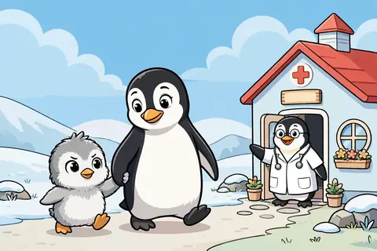
  </a>
  

    <h3><a href="stories/piku-is-brave-at-the-doctor.html">डॉक्टर के पास बहादुर पिकू</a></h3>
    

      <a class="btn btn-read" href="stories/piku-is-brave-at-the-doctor.html">📖 पढ़ें</a>
      <a class="btn btn-pdf" href="book/stories/piku-is-brave-at-the-doctor.pdf">📕 PDF</a>
      <a class="btn btn-share" href="https://wa.me/?text=%E0%A4%A1%E0%A5%89%E0%A4%95%E0%A5%8D%E0%A4%9F%E0%A4%B0%20%E0%A4%95%E0%A5%87%20%E0%A4%AA%E0%A4%BE%E0%A4%B8%20%E0%A4%AC%E0%A4%B9%E0%A4%BE%E0%A4%A6%E0%A5%81%E0%A4%B0%20%E0%A4%AA%E0%A4%BF%E0%A4%95%E0%A5%82%20%E2%80%94%20%E0%A4%AE%E0%A5%80%E0%A4%A0%E0%A5%87%20%E0%A4%B8%E0%A4%AA%E0%A4%A8%E0%A5%8B%E0%A4%82%20%E0%A4%95%E0%A5%80%20%E0%A4%95%E0%A4%B9%E0%A4%BE%E0%A4%A8%E0%A4%BF%E0%A4%AF%E0%A4%BE%E0%A4%81%0Ahttps%3A%2F%2Fniteshlhsnda-droid.github.io%2Fkids-book-videos-hindi%2Fstories%2Fpiku-is-brave-at-the-doctor.html" target="_blank" rel="noopener" title="WhatsApp पर भेजें" aria-label="WhatsApp पर भेजें">📲</a>
    

  

</article>
<article class="story-card" data-search="तारा को लगा कि उसे भुला दिया गया tara-feels-left-out">
  <a class="card-art" href="stories/tara-feels-left-out.html" aria-label="तारा को लगा कि उसे भुला दिया गया">
    🌙
    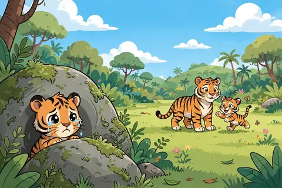
  </a>
  

    <h3><a href="stories/tara-feels-left-out.html">तारा को लगा कि उसे भुला दिया गया</a></h3>
    

      <a class="btn btn-read" href="stories/tara-feels-left-out.html">📖 पढ़ें</a>
      <a class="btn btn-pdf" href="book/stories/tara-feels-left-out.pdf">📕 PDF</a>
      <a class="btn btn-share" href="https://wa.me/?text=%E0%A4%A4%E0%A4%BE%E0%A4%B0%E0%A4%BE%20%E0%A4%95%E0%A5%8B%20%E0%A4%B2%E0%A4%97%E0%A4%BE%20%E0%A4%95%E0%A4%BF%20%E0%A4%89%E0%A4%B8%E0%A5%87%20%E0%A4%AD%E0%A5%81%E0%A4%B2%E0%A4%BE%20%E0%A4%A6%E0%A4%BF%E0%A4%AF%E0%A4%BE%20%E0%A4%97%E0%A4%AF%E0%A4%BE%20%E2%80%94%20%E0%A4%AE%E0%A5%80%E0%A4%A0%E0%A5%87%20%E0%A4%B8%E0%A4%AA%E0%A4%A8%E0%A5%8B%E0%A4%82%20%E0%A4%95%E0%A5%80%20%E0%A4%95%E0%A4%B9%E0%A4%BE%E0%A4%A8%E0%A4%BF%E0%A4%AF%E0%A4%BE%E0%A4%81%0Ahttps%3A%2F%2Fniteshlhsnda-droid.github.io%2Fkids-book-videos-hindi%2Fstories%2Ftara-feels-left-out.html" target="_blank" rel="noopener" title="WhatsApp पर भेजें" aria-label="WhatsApp पर भेजें">📲</a>
    

  

</article>
<article class="story-card" data-search="तारों की रज़ाई a-blanket-of-stars">
  <a class="card-art" href="stories/a-blanket-of-stars.html" aria-label="तारों की रज़ाई">
    ⭐
    
  </a>
  

    <h3><a href="stories/a-blanket-of-stars.html">तारों की रज़ाई</a></h3>
    

      <a class="btn btn-read" href="stories/a-blanket-of-stars.html">📖 पढ़ें</a>
      <a class="btn btn-pdf" href="book/stories/a-blanket-of-stars.pdf">📕 PDF</a>
      <a class="btn btn-share" href="https://wa.me/?text=%E0%A4%A4%E0%A4%BE%E0%A4%B0%E0%A5%8B%E0%A4%82%20%E0%A4%95%E0%A5%80%20%E0%A4%B0%E0%A4%9C%E0%A4%BC%E0%A4%BE%E0%A4%88%20%E2%80%94%20%E0%A4%AE%E0%A5%80%E0%A4%A0%E0%A5%87%20%E0%A4%B8%E0%A4%AA%E0%A4%A8%E0%A5%8B%E0%A4%82%20%E0%A4%95%E0%A5%80%20%E0%A4%95%E0%A4%B9%E0%A4%BE%E0%A4%A8%E0%A4%BF%E0%A4%AF%E0%A4%BE%E0%A4%81%0Ahttps%3A%2F%2Fniteshlhsnda-droid.github.io%2Fkids-book-videos-hindi%2Fstories%2Fa-blanket-of-stars.html" target="_blank" rel="noopener" title="WhatsApp पर भेजें" aria-label="WhatsApp पर भेजें">📲</a>
    

  

</article>
<article class="story-card" data-search="तोतू का बड़ा बरसाती दिन pippas-big-rainy-day">
  <a class="card-art" href="stories/pippas-big-rainy-day.html" aria-label="तोतू का बड़ा बरसाती दिन">
    🌧️
    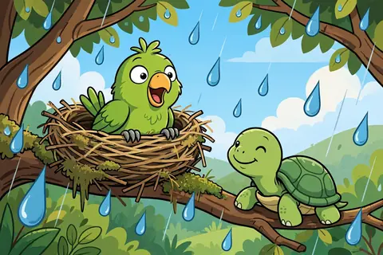
  </a>
  

    <h3><a href="stories/pippas-big-rainy-day.html">तोतू का बड़ा बरसाती दिन</a></h3>
    

      <a class="btn btn-read" href="stories/pippas-big-rainy-day.html">📖 पढ़ें</a>
      <a class="btn btn-pdf" href="book/stories/pippas-big-rainy-day.pdf">📕 PDF</a>
      <a class="btn btn-share" href="https://wa.me/?text=%E0%A4%A4%E0%A5%8B%E0%A4%A4%E0%A5%82%20%E0%A4%95%E0%A4%BE%20%E0%A4%AC%E0%A4%A1%E0%A4%BC%E0%A4%BE%20%E0%A4%AC%E0%A4%B0%E0%A4%B8%E0%A4%BE%E0%A4%A4%E0%A5%80%20%E0%A4%A6%E0%A4%BF%E0%A4%A8%20%E2%80%94%20%E0%A4%AE%E0%A5%80%E0%A4%A0%E0%A5%87%20%E0%A4%B8%E0%A4%AA%E0%A4%A8%E0%A5%8B%E0%A4%82%20%E0%A4%95%E0%A5%80%20%E0%A4%95%E0%A4%B9%E0%A4%BE%E0%A4%A8%E0%A4%BF%E0%A4%AF%E0%A4%BE%E0%A4%81%0Ahttps%3A%2F%2Fniteshlhsnda-droid.github.io%2Fkids-book-videos-hindi%2Fstories%2Fpippas-big-rainy-day.html" target="_blank" rel="noopener" title="WhatsApp पर भेजें" aria-label="WhatsApp पर भेजें">📲</a>
    

  

</article>
<article class="story-card" data-search="देव का स्कूल का पहला दिन devs-first-day-of-school">
  <a class="card-art" href="stories/devs-first-day-of-school.html" aria-label="देव का स्कूल का पहला दिन">
    🌙
    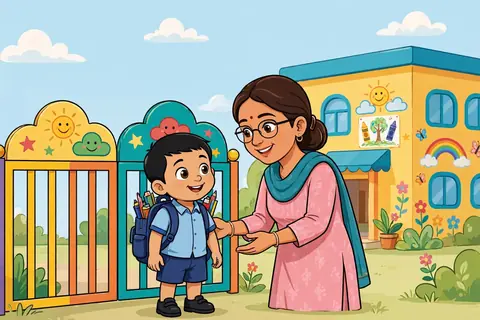
  </a>
  

    <h3><a href="stories/devs-first-day-of-school.html">देव का स्कूल का पहला दिन</a></h3>
    

      <a class="btn btn-read" href="stories/devs-first-day-of-school.html">📖 पढ़ें</a>
      <a class="btn btn-pdf" href="book/stories/devs-first-day-of-school.pdf">📕 PDF</a>
      <a class="btn btn-share" href="https://wa.me/?text=%E0%A4%A6%E0%A5%87%E0%A4%B5%20%E0%A4%95%E0%A4%BE%20%E0%A4%B8%E0%A5%8D%E0%A4%95%E0%A5%82%E0%A4%B2%20%E0%A4%95%E0%A4%BE%20%E0%A4%AA%E0%A4%B9%E0%A4%B2%E0%A4%BE%20%E0%A4%A6%E0%A4%BF%E0%A4%A8%20%E2%80%94%20%E0%A4%AE%E0%A5%80%E0%A4%A0%E0%A5%87%20%E0%A4%B8%E0%A4%AA%E0%A4%A8%E0%A5%8B%E0%A4%82%20%E0%A4%95%E0%A5%80%20%E0%A4%95%E0%A4%B9%E0%A4%BE%E0%A4%A8%E0%A4%BF%E0%A4%AF%E0%A4%BE%E0%A4%81%0Ahttps%3A%2F%2Fniteshlhsnda-droid.github.io%2Fkids-book-videos-hindi%2Fstories%2Fdevs-first-day-of-school.html" target="_blank" rel="noopener" title="WhatsApp पर भेजें" aria-label="WhatsApp पर भेजें">📲</a>
    

  

</article>
<article class="story-card" data-search="धोलू गधे के लंबे कान dusty-the-donkeys-long-ears">
  <a class="card-art" href="stories/dusty-the-donkeys-long-ears.html" aria-label="धोलू गधे के लंबे कान">
    🌙
    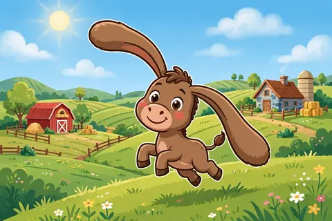
  </a>
  

    <h3><a href="stories/dusty-the-donkeys-long-ears.html">धोलू गधे के लंबे कान</a></h3>
    

      <a class="btn btn-read" href="stories/dusty-the-donkeys-long-ears.html">📖 पढ़ें</a>
      <a class="btn btn-pdf" href="book/stories/dusty-the-donkeys-long-ears.pdf">📕 PDF</a>
      <a class="btn btn-share" href="https://wa.me/?text=%E0%A4%A7%E0%A5%8B%E0%A4%B2%E0%A5%82%20%E0%A4%97%E0%A4%A7%E0%A5%87%20%E0%A4%95%E0%A5%87%20%E0%A4%B2%E0%A4%82%E0%A4%AC%E0%A5%87%20%E0%A4%95%E0%A4%BE%E0%A4%A8%20%E2%80%94%20%E0%A4%AE%E0%A5%80%E0%A4%A0%E0%A5%87%20%E0%A4%B8%E0%A4%AA%E0%A4%A8%E0%A5%8B%E0%A4%82%20%E0%A4%95%E0%A5%80%20%E0%A4%95%E0%A4%B9%E0%A4%BE%E0%A4%A8%E0%A4%BF%E0%A4%AF%E0%A4%BE%E0%A4%81%0Ahttps%3A%2F%2Fniteshlhsnda-droid.github.io%2Fkids-book-videos-hindi%2Fstories%2Fdusty-the-donkeys-long-ears.html" target="_blank" rel="noopener" title="WhatsApp पर भेजें" aria-label="WhatsApp पर भेजें">📲</a>
    

  

</article>
<article class="story-card" data-search="नाचती पतंग the-kite-that-danced">
  <a class="card-art" href="stories/the-kite-that-danced.html" aria-label="नाचती पतंग">
    🪁
    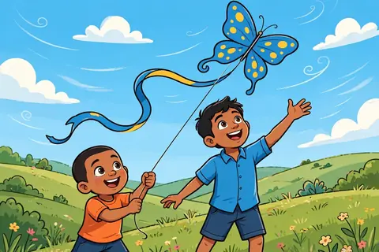
  </a>
  

    <h3><a href="stories/the-kite-that-danced.html">नाचती पतंग</a></h3>
    

      <a class="btn btn-read" href="stories/the-kite-that-danced.html">📖 पढ़ें</a>
      <a class="btn btn-pdf" href="book/stories/the-kite-that-danced.pdf">📕 PDF</a>
      <a class="btn btn-share" href="https://wa.me/?text=%E0%A4%A8%E0%A4%BE%E0%A4%9A%E0%A4%A4%E0%A5%80%20%E0%A4%AA%E0%A4%A4%E0%A4%82%E0%A4%97%20%E2%80%94%20%E0%A4%AE%E0%A5%80%E0%A4%A0%E0%A5%87%20%E0%A4%B8%E0%A4%AA%E0%A4%A8%E0%A5%8B%E0%A4%82%20%E0%A4%95%E0%A5%80%20%E0%A4%95%E0%A4%B9%E0%A4%BE%E0%A4%A8%E0%A4%BF%E0%A4%AF%E0%A4%BE%E0%A4%81%0Ahttps%3A%2F%2Fniteshlhsnda-droid.github.io%2Fkids-book-videos-hindi%2Fstories%2Fthe-kite-that-danced.html" target="_blank" rel="noopener" title="WhatsApp पर भेजें" aria-label="WhatsApp पर भेजें">📲</a>
    

  

</article>
<article class="story-card" data-search="नायरा और जुगनुओं का नाच faye-the-deer-fawns-firefly-dance">
  <a class="card-art" href="stories/faye-the-deer-fawns-firefly-dance.html" aria-label="नायरा और जुगनुओं का नाच">
    ✨
    
  </a>
  

    <h3><a href="stories/faye-the-deer-fawns-firefly-dance.html">नायरा और जुगनुओं का नाच</a></h3>
    

      <a class="btn btn-read" href="stories/faye-the-deer-fawns-firefly-dance.html">📖 पढ़ें</a>
      <a class="btn btn-pdf" href="book/stories/faye-the-deer-fawns-firefly-dance.pdf">📕 PDF</a>
      <a class="btn btn-share" href="https://wa.me/?text=%E0%A4%A8%E0%A4%BE%E0%A4%AF%E0%A4%B0%E0%A4%BE%20%E0%A4%94%E0%A4%B0%20%E0%A4%9C%E0%A5%81%E0%A4%97%E0%A4%A8%E0%A5%81%E0%A4%93%E0%A4%82%20%E0%A4%95%E0%A4%BE%20%E0%A4%A8%E0%A4%BE%E0%A4%9A%20%E2%80%94%20%E0%A4%AE%E0%A5%80%E0%A4%A0%E0%A5%87%20%E0%A4%B8%E0%A4%AA%E0%A4%A8%E0%A5%8B%E0%A4%82%20%E0%A4%95%E0%A5%80%20%E0%A4%95%E0%A4%B9%E0%A4%BE%E0%A4%A8%E0%A4%BF%E0%A4%AF%E0%A4%BE%E0%A4%81%0Ahttps%3A%2F%2Fniteshlhsnda-droid.github.io%2Fkids-book-videos-hindi%2Fstories%2Ffaye-the-deer-fawns-firefly-dance.html" target="_blank" rel="noopener" title="WhatsApp पर भेजें" aria-label="WhatsApp पर भेजें">📲</a>
    

  

</article>
<article class="story-card" data-search="नींद-नगर जाने वाली रात की रेलगाड़ी the-night-train">
  <a class="card-art" href="stories/the-night-train.html" aria-label="नींद-नगर जाने वाली रात की रेलगाड़ी">
    🚂
    
  </a>
  

    <h3><a href="stories/the-night-train.html">नींद-नगर जाने वाली रात की रेलगाड़ी</a></h3>
    

      <a class="btn btn-read" href="stories/the-night-train.html">📖 पढ़ें</a>
      <a class="btn btn-pdf" href="book/stories/the-night-train.pdf">📕 PDF</a>
      <a class="btn btn-share" href="https://wa.me/?text=%E0%A4%A8%E0%A5%80%E0%A4%82%E0%A4%A6-%E0%A4%A8%E0%A4%97%E0%A4%B0%20%E0%A4%9C%E0%A4%BE%E0%A4%A8%E0%A5%87%20%E0%A4%B5%E0%A4%BE%E0%A4%B2%E0%A5%80%20%E0%A4%B0%E0%A4%BE%E0%A4%A4%20%E0%A4%95%E0%A5%80%20%E0%A4%B0%E0%A5%87%E0%A4%B2%E0%A4%97%E0%A4%BE%E0%A4%A1%E0%A4%BC%E0%A5%80%20%E2%80%94%20%E0%A4%AE%E0%A5%80%E0%A4%A0%E0%A5%87%20%E0%A4%B8%E0%A4%AA%E0%A4%A8%E0%A5%8B%E0%A4%82%20%E0%A4%95%E0%A5%80%20%E0%A4%95%E0%A4%B9%E0%A4%BE%E0%A4%A8%E0%A4%BF%E0%A4%AF%E0%A4%BE%E0%A4%81%0Ahttps%3A%2F%2Fniteshlhsnda-droid.github.io%2Fkids-book-videos-hindi%2Fstories%2Fthe-night-train.html" target="_blank" rel="noopener" title="WhatsApp पर भेजें" aria-label="WhatsApp पर भेजें">📲</a>
    

  

</article>
<article class="story-card" data-search="पग्गू घोंघे ने न्योता पहुँचाया suki-the-snail-delivers-the-invitation">
  <a class="card-art" href="stories/suki-the-snail-delivers-the-invitation.html" aria-label="पग्गू घोंघे ने न्योता पहुँचाया">
    🐌
    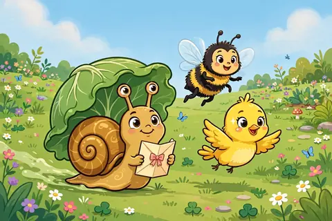
  </a>
  

    <h3><a href="stories/suki-the-snail-delivers-the-invitation.html">पग्गू घोंघे ने न्योता पहुँचाया</a></h3>
    

      <a class="btn btn-read" href="stories/suki-the-snail-delivers-the-invitation.html">📖 पढ़ें</a>
      <a class="btn btn-pdf" href="book/stories/suki-the-snail-delivers-the-invitation.pdf">📕 PDF</a>
      <a class="btn btn-share" href="https://wa.me/?text=%E0%A4%AA%E0%A4%97%E0%A5%8D%E0%A4%97%E0%A5%82%20%E0%A4%98%E0%A5%8B%E0%A4%82%E0%A4%98%E0%A5%87%20%E0%A4%A8%E0%A5%87%20%E0%A4%A8%E0%A5%8D%E0%A4%AF%E0%A5%8B%E0%A4%A4%E0%A4%BE%20%E0%A4%AA%E0%A4%B9%E0%A5%81%E0%A4%81%E0%A4%9A%E0%A4%BE%E0%A4%AF%E0%A4%BE%20%E2%80%94%20%E0%A4%AE%E0%A5%80%E0%A4%A0%E0%A5%87%20%E0%A4%B8%E0%A4%AA%E0%A4%A8%E0%A5%8B%E0%A4%82%20%E0%A4%95%E0%A5%80%20%E0%A4%95%E0%A4%B9%E0%A4%BE%E0%A4%A8%E0%A4%BF%E0%A4%AF%E0%A4%BE%E0%A4%81%0Ahttps%3A%2F%2Fniteshlhsnda-droid.github.io%2Fkids-book-videos-hindi%2Fstories%2Fsuki-the-snail-delivers-the-invitation.html" target="_blank" rel="noopener" title="WhatsApp पर भेजें" aria-label="WhatsApp पर भेजें">📲</a>
    

  

</article>
<article class="story-card" data-search="पप्पू मेंढक को मिली उसकी टर्र-टर्र fergus-the-frog-finds-his-croak">
  <a class="card-art" href="stories/fergus-the-frog-finds-his-croak.html" aria-label="पप्पू मेंढक को मिली उसकी टर्र-टर्र">
    🐸
    
  </a>
  

    <h3><a href="stories/fergus-the-frog-finds-his-croak.html">पप्पू मेंढक को मिली उसकी टर्र-टर्र</a></h3>
    

      <a class="btn btn-read" href="stories/fergus-the-frog-finds-his-croak.html">📖 पढ़ें</a>
      <a class="btn btn-pdf" href="book/stories/fergus-the-frog-finds-his-croak.pdf">📕 PDF</a>
      <a class="btn btn-share" href="https://wa.me/?text=%E0%A4%AA%E0%A4%AA%E0%A5%8D%E0%A4%AA%E0%A5%82%20%E0%A4%AE%E0%A5%87%E0%A4%82%E0%A4%A2%E0%A4%95%20%E0%A4%95%E0%A5%8B%20%E0%A4%AE%E0%A4%BF%E0%A4%B2%E0%A5%80%20%E0%A4%89%E0%A4%B8%E0%A4%95%E0%A5%80%20%E0%A4%9F%E0%A4%B0%E0%A5%8D%E0%A4%B0-%E0%A4%9F%E0%A4%B0%E0%A5%8D%E0%A4%B0%20%E2%80%94%20%E0%A4%AE%E0%A5%80%E0%A4%A0%E0%A5%87%20%E0%A4%B8%E0%A4%AA%E0%A4%A8%E0%A5%8B%E0%A4%82%20%E0%A4%95%E0%A5%80%20%E0%A4%95%E0%A4%B9%E0%A4%BE%E0%A4%A8%E0%A4%BF%E0%A4%AF%E0%A4%BE%E0%A4%81%0Ahttps%3A%2F%2Fniteshlhsnda-droid.github.io%2Fkids-book-videos-hindi%2Fstories%2Ffergus-the-frog-finds-his-croak.html" target="_blank" rel="noopener" title="WhatsApp पर भेजें" aria-label="WhatsApp पर भेजें">📲</a>
    

  

</article>
<article class="story-card" data-search="परछाईं के साथ खेल shadow-tag">
  <a class="card-art" href="stories/shadow-tag.html" aria-label="परछाईं के साथ खेल">
    🌙
    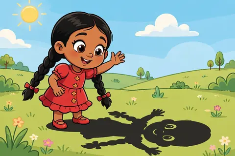
  </a>
  

    <h3><a href="stories/shadow-tag.html">परछाईं के साथ खेल</a></h3>
    

      <a class="btn btn-read" href="stories/shadow-tag.html">📖 पढ़ें</a>
      <a class="btn btn-pdf" href="book/stories/shadow-tag.pdf">📕 PDF</a>
      <a class="btn btn-share" href="https://wa.me/?text=%E0%A4%AA%E0%A4%B0%E0%A4%9B%E0%A4%BE%E0%A4%88%E0%A4%82%20%E0%A4%95%E0%A5%87%20%E0%A4%B8%E0%A4%BE%E0%A4%A5%20%E0%A4%96%E0%A5%87%E0%A4%B2%20%E2%80%94%20%E0%A4%AE%E0%A5%80%E0%A4%A0%E0%A5%87%20%E0%A4%B8%E0%A4%AA%E0%A4%A8%E0%A5%8B%E0%A4%82%20%E0%A4%95%E0%A5%80%20%E0%A4%95%E0%A4%B9%E0%A4%BE%E0%A4%A8%E0%A4%BF%E0%A4%AF%E0%A4%BE%E0%A4%81%0Ahttps%3A%2F%2Fniteshlhsnda-droid.github.io%2Fkids-book-videos-hindi%2Fstories%2Fshadow-tag.html" target="_blank" rel="noopener" title="WhatsApp पर भेजें" aria-label="WhatsApp पर भेजें">📲</a>
    

  

</article>
<article class="story-card" data-search="परी तितली की पहली उड़ान petal-the-butterflys-first-flight">
  <a class="card-art" href="stories/petal-the-butterflys-first-flight.html" aria-label="परी तितली की पहली उड़ान">
    🦋
    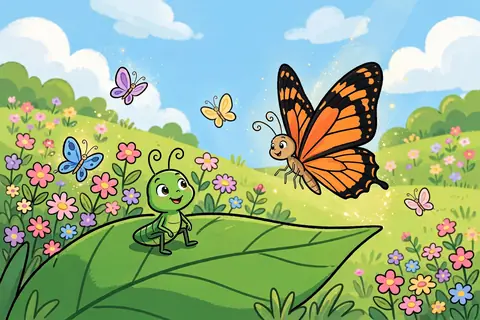
  </a>
  

    <h3><a href="stories/petal-the-butterflys-first-flight.html">परी तितली की पहली उड़ान</a></h3>
    

      <a class="btn btn-read" href="stories/petal-the-butterflys-first-flight.html">📖 पढ़ें</a>
      <a class="btn btn-pdf" href="book/stories/petal-the-butterflys-first-flight.pdf">📕 PDF</a>
      <a class="btn btn-share" href="https://wa.me/?text=%E0%A4%AA%E0%A4%B0%E0%A5%80%20%E0%A4%A4%E0%A4%BF%E0%A4%A4%E0%A4%B2%E0%A5%80%20%E0%A4%95%E0%A5%80%20%E0%A4%AA%E0%A4%B9%E0%A4%B2%E0%A5%80%20%E0%A4%89%E0%A4%A1%E0%A4%BC%E0%A4%BE%E0%A4%A8%20%E2%80%94%20%E0%A4%AE%E0%A5%80%E0%A4%A0%E0%A5%87%20%E0%A4%B8%E0%A4%AA%E0%A4%A8%E0%A5%8B%E0%A4%82%20%E0%A4%95%E0%A5%80%20%E0%A4%95%E0%A4%B9%E0%A4%BE%E0%A4%A8%E0%A4%BF%E0%A4%AF%E0%A4%BE%E0%A4%81%0Ahttps%3A%2F%2Fniteshlhsnda-droid.github.io%2Fkids-book-videos-hindi%2Fstories%2Fpetal-the-butterflys-first-flight.html" target="_blank" rel="noopener" title="WhatsApp पर भेजें" aria-label="WhatsApp पर भेजें">📲</a>
    

  

</article>
<article class="story-card" data-search="पाजामा परेड the-pajama-parade">
  <a class="card-art" href="stories/the-pajama-parade.html" aria-label="पाजामा परेड">
    🎉
    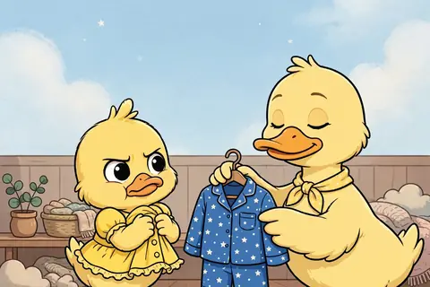
  </a>
  

    <h3><a href="stories/the-pajama-parade.html">पाजामा परेड</a></h3>
    

      <a class="btn btn-read" href="stories/the-pajama-parade.html">📖 पढ़ें</a>
      <a class="btn btn-pdf" href="book/stories/the-pajama-parade.pdf">📕 PDF</a>
      <a class="btn btn-share" href="https://wa.me/?text=%E0%A4%AA%E0%A4%BE%E0%A4%9C%E0%A4%BE%E0%A4%AE%E0%A4%BE%20%E0%A4%AA%E0%A4%B0%E0%A5%87%E0%A4%A1%20%E2%80%94%20%E0%A4%AE%E0%A5%80%E0%A4%A0%E0%A5%87%20%E0%A4%B8%E0%A4%AA%E0%A4%A8%E0%A5%8B%E0%A4%82%20%E0%A4%95%E0%A5%80%20%E0%A4%95%E0%A4%B9%E0%A4%BE%E0%A4%A8%E0%A4%BF%E0%A4%AF%E0%A4%BE%E0%A4%81%0Ahttps%3A%2F%2Fniteshlhsnda-droid.github.io%2Fkids-book-videos-hindi%2Fstories%2Fthe-pajama-parade.html" target="_blank" rel="noopener" title="WhatsApp पर भेजें" aria-label="WhatsApp पर भेजें">📲</a>
    

  

</article>
<article class="story-card" data-search="पिंकी और नन्हा लेडीबग zara-and-the-tiny-ladybird">
  <a class="card-art" href="stories/zara-and-the-tiny-ladybird.html" aria-label="पिंकी और नन्हा लेडीबग">
    🐦
    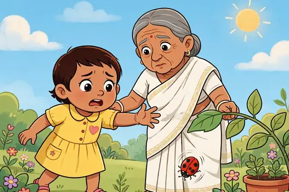
  </a>
  

    <h3><a href="stories/zara-and-the-tiny-ladybird.html">पिंकी और नन्हा लेडीबग</a></h3>
    

      <a class="btn btn-read" href="stories/zara-and-the-tiny-ladybird.html">📖 पढ़ें</a>
      <a class="btn btn-pdf" href="book/stories/zara-and-the-tiny-ladybird.pdf">📕 PDF</a>
      <a class="btn btn-share" href="https://wa.me/?text=%E0%A4%AA%E0%A4%BF%E0%A4%82%E0%A4%95%E0%A5%80%20%E0%A4%94%E0%A4%B0%20%E0%A4%A8%E0%A4%A8%E0%A5%8D%E0%A4%B9%E0%A4%BE%20%E0%A4%B2%E0%A5%87%E0%A4%A1%E0%A5%80%E0%A4%AC%E0%A4%97%20%E2%80%94%20%E0%A4%AE%E0%A5%80%E0%A4%A0%E0%A5%87%20%E0%A4%B8%E0%A4%AA%E0%A4%A8%E0%A5%8B%E0%A4%82%20%E0%A4%95%E0%A5%80%20%E0%A4%95%E0%A4%B9%E0%A4%BE%E0%A4%A8%E0%A4%BF%E0%A4%AF%E0%A4%BE%E0%A4%81%0Ahttps%3A%2F%2Fniteshlhsnda-droid.github.io%2Fkids-book-videos-hindi%2Fstories%2Fzara-and-the-tiny-ladybird.html" target="_blank" rel="noopener" title="WhatsApp पर भेजें" aria-label="WhatsApp पर भेजें">📲</a>
    

  

</article>
<article class="story-card" data-search="पुच्ची ने बाँटकर खाया hazel-the-hamster-shares-a-nibble">
  <a class="card-art" href="stories/hazel-the-hamster-shares-a-nibble.html" aria-label="पुच्ची ने बाँटकर खाया">
    🐇
    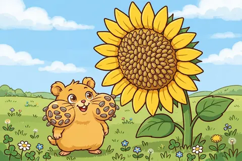
  </a>
  

    <h3><a href="stories/hazel-the-hamster-shares-a-nibble.html">पुच्ची ने बाँटकर खाया</a></h3>
    

      <a class="btn btn-read" href="stories/hazel-the-hamster-shares-a-nibble.html">📖 पढ़ें</a>
      <a class="btn btn-pdf" href="book/stories/hazel-the-hamster-shares-a-nibble.pdf">📕 PDF</a>
      <a class="btn btn-share" href="https://wa.me/?text=%E0%A4%AA%E0%A5%81%E0%A4%9A%E0%A5%8D%E0%A4%9A%E0%A5%80%20%E0%A4%A8%E0%A5%87%20%E0%A4%AC%E0%A4%BE%E0%A4%81%E0%A4%9F%E0%A4%95%E0%A4%B0%20%E0%A4%96%E0%A4%BE%E0%A4%AF%E0%A4%BE%20%E2%80%94%20%E0%A4%AE%E0%A5%80%E0%A4%A0%E0%A5%87%20%E0%A4%B8%E0%A4%AA%E0%A4%A8%E0%A5%8B%E0%A4%82%20%E0%A4%95%E0%A5%80%20%E0%A4%95%E0%A4%B9%E0%A4%BE%E0%A4%A8%E0%A4%BF%E0%A4%AF%E0%A4%BE%E0%A4%81%0Ahttps%3A%2F%2Fniteshlhsnda-droid.github.io%2Fkids-book-videos-hindi%2Fstories%2Fhazel-the-hamster-shares-a-nibble.html" target="_blank" rel="noopener" title="WhatsApp पर भेजें" aria-label="WhatsApp पर भेजें">📲</a>
    

  

</article>
<article class="story-card" data-search="पोखर का आईना the-puddle-mirror">
  <a class="card-art" href="stories/the-puddle-mirror.html" aria-label="पोखर का आईना">
    💧
    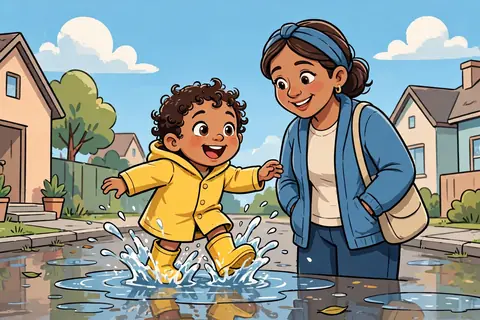
  </a>
  

    <h3><a href="stories/the-puddle-mirror.html">पोखर का आईना</a></h3>
    

      <a class="btn btn-read" href="stories/the-puddle-mirror.html">📖 पढ़ें</a>
      <a class="btn btn-pdf" href="book/stories/the-puddle-mirror.pdf">📕 PDF</a>
      <a class="btn btn-share" href="https://wa.me/?text=%E0%A4%AA%E0%A5%8B%E0%A4%96%E0%A4%B0%20%E0%A4%95%E0%A4%BE%20%E0%A4%86%E0%A4%88%E0%A4%A8%E0%A4%BE%20%E2%80%94%20%E0%A4%AE%E0%A5%80%E0%A4%A0%E0%A5%87%20%E0%A4%B8%E0%A4%AA%E0%A4%A8%E0%A5%8B%E0%A4%82%20%E0%A4%95%E0%A5%80%20%E0%A4%95%E0%A4%B9%E0%A4%BE%E0%A4%A8%E0%A4%BF%E0%A4%AF%E0%A4%BE%E0%A4%81%0Ahttps%3A%2F%2Fniteshlhsnda-droid.github.io%2Fkids-book-videos-hindi%2Fstories%2Fthe-puddle-mirror.html" target="_blank" rel="noopener" title="WhatsApp पर भेजें" aria-label="WhatsApp पर भेजें">📲</a>
    

  

</article>
<article class="story-card" data-search="फसलू, दोस्त बिजूका sam-the-friendly-scarecrow">
  <a class="card-art" href="stories/sam-the-friendly-scarecrow.html" aria-label="फसलू, दोस्त बिजूका">
    🐦
    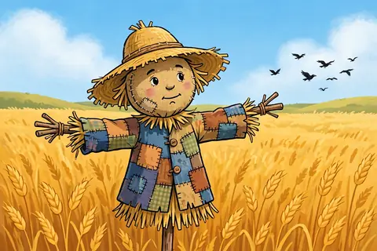
  </a>
  

    <h3><a href="stories/sam-the-friendly-scarecrow.html">फसलू, दोस्त बिजूका</a></h3>
    

      <a class="btn btn-read" href="stories/sam-the-friendly-scarecrow.html">📖 पढ़ें</a>
      <a class="btn btn-pdf" href="book/stories/sam-the-friendly-scarecrow.pdf">📕 PDF</a>
      <a class="btn btn-share" href="https://wa.me/?text=%E0%A4%AB%E0%A4%B8%E0%A4%B2%E0%A5%82%2C%20%E0%A4%A6%E0%A5%8B%E0%A4%B8%E0%A5%8D%E0%A4%A4%20%E0%A4%AC%E0%A4%BF%E0%A4%9C%E0%A5%82%E0%A4%95%E0%A4%BE%20%E2%80%94%20%E0%A4%AE%E0%A5%80%E0%A4%A0%E0%A5%87%20%E0%A4%B8%E0%A4%AA%E0%A4%A8%E0%A5%8B%E0%A4%82%20%E0%A4%95%E0%A5%80%20%E0%A4%95%E0%A4%B9%E0%A4%BE%E0%A4%A8%E0%A4%BF%E0%A4%AF%E0%A4%BE%E0%A4%81%0Ahttps%3A%2F%2Fniteshlhsnda-droid.github.io%2Fkids-book-videos-hindi%2Fstories%2Fsam-the-friendly-scarecrow.html" target="_blank" rel="noopener" title="WhatsApp पर भेजें" aria-label="WhatsApp पर भेजें">📲</a>
    

  

</article>
<article class="story-card" data-search="फुसफुसाते पेड़ the-whispering-trees">
  <a class="card-art" href="stories/the-whispering-trees.html" aria-label="फुसफुसाते पेड़">
    🌳
    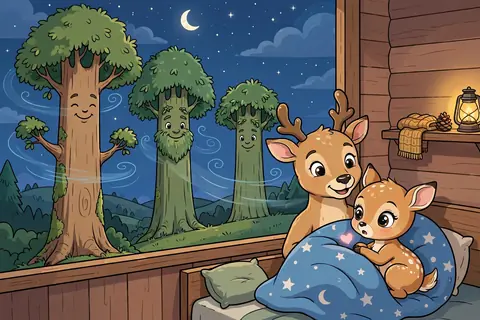
  </a>
  

    <h3><a href="stories/the-whispering-trees.html">फुसफुसाते पेड़</a></h3>
    

      <a class="btn btn-read" href="stories/the-whispering-trees.html">📖 पढ़ें</a>
      <a class="btn btn-pdf" href="book/stories/the-whispering-trees.pdf">📕 PDF</a>
      <a class="btn btn-share" href="https://wa.me/?text=%E0%A4%AB%E0%A5%81%E0%A4%B8%E0%A4%AB%E0%A5%81%E0%A4%B8%E0%A4%BE%E0%A4%A4%E0%A5%87%20%E0%A4%AA%E0%A5%87%E0%A4%A1%E0%A4%BC%20%E2%80%94%20%E0%A4%AE%E0%A5%80%E0%A4%A0%E0%A5%87%20%E0%A4%B8%E0%A4%AA%E0%A4%A8%E0%A5%8B%E0%A4%82%20%E0%A4%95%E0%A5%80%20%E0%A4%95%E0%A4%B9%E0%A4%BE%E0%A4%A8%E0%A4%BF%E0%A4%AF%E0%A4%BE%E0%A4%81%0Ahttps%3A%2F%2Fniteshlhsnda-droid.github.io%2Fkids-book-videos-hindi%2Fstories%2Fthe-whispering-trees.html" target="_blank" rel="noopener" title="WhatsApp पर भेजें" aria-label="WhatsApp पर भेजें">📲</a>
    

  

</article>
<article class="story-card" data-search="फुसफुसाहटों वाला कंबल-किला the-blanket-fort">
  <a class="card-art" href="stories/the-blanket-fort.html" aria-label="फुसफुसाहटों वाला कंबल-किला">
    🌙
    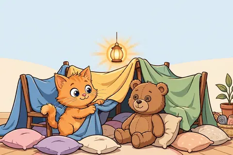
  </a>
  

    <h3><a href="stories/the-blanket-fort.html">फुसफुसाहटों वाला कंबल-किला</a></h3>
    

      <a class="btn btn-read" href="stories/the-blanket-fort.html">📖 पढ़ें</a>
      <a class="btn btn-pdf" href="book/stories/the-blanket-fort.pdf">📕 PDF</a>
      <a class="btn btn-share" href="https://wa.me/?text=%E0%A4%AB%E0%A5%81%E0%A4%B8%E0%A4%AB%E0%A5%81%E0%A4%B8%E0%A4%BE%E0%A4%B9%E0%A4%9F%E0%A5%8B%E0%A4%82%20%E0%A4%B5%E0%A4%BE%E0%A4%B2%E0%A4%BE%20%E0%A4%95%E0%A4%82%E0%A4%AC%E0%A4%B2-%E0%A4%95%E0%A4%BF%E0%A4%B2%E0%A4%BE%20%E2%80%94%20%E0%A4%AE%E0%A5%80%E0%A4%A0%E0%A5%87%20%E0%A4%B8%E0%A4%AA%E0%A4%A8%E0%A5%8B%E0%A4%82%20%E0%A4%95%E0%A5%80%20%E0%A4%95%E0%A4%B9%E0%A4%BE%E0%A4%A8%E0%A4%BF%E0%A4%AF%E0%A4%BE%E0%A4%81%0Ahttps%3A%2F%2Fniteshlhsnda-droid.github.io%2Fkids-book-videos-hindi%2Fstories%2Fthe-blanket-fort.html" target="_blank" rel="noopener" title="WhatsApp पर भेजें" aria-label="WhatsApp पर भेजें">📲</a>
    

  

</article>
<article class="story-card" data-search="बंटी कोआला और नींद वाली पत्ती koda-the-koala-and-the-sleepy-leaf">
  <a class="card-art" href="stories/koda-the-koala-and-the-sleepy-leaf.html" aria-label="बंटी कोआला और नींद वाली पत्ती">
    🐨
    
  </a>
  

    <h3><a href="stories/koda-the-koala-and-the-sleepy-leaf.html">बंटी कोआला और नींद वाली पत्ती</a></h3>
    

      <a class="btn btn-read" href="stories/koda-the-koala-and-the-sleepy-leaf.html">📖 पढ़ें</a>
      <a class="btn btn-pdf" href="book/stories/koda-the-koala-and-the-sleepy-leaf.pdf">📕 PDF</a>
      <a class="btn btn-share" href="https://wa.me/?text=%E0%A4%AC%E0%A4%82%E0%A4%9F%E0%A5%80%20%E0%A4%95%E0%A5%8B%E0%A4%86%E0%A4%B2%E0%A4%BE%20%E0%A4%94%E0%A4%B0%20%E0%A4%A8%E0%A5%80%E0%A4%82%E0%A4%A6%20%E0%A4%B5%E0%A4%BE%E0%A4%B2%E0%A5%80%20%E0%A4%AA%E0%A4%A4%E0%A5%8D%E0%A4%A4%E0%A5%80%20%E2%80%94%20%E0%A4%AE%E0%A5%80%E0%A4%A0%E0%A5%87%20%E0%A4%B8%E0%A4%AA%E0%A4%A8%E0%A5%8B%E0%A4%82%20%E0%A4%95%E0%A5%80%20%E0%A4%95%E0%A4%B9%E0%A4%BE%E0%A4%A8%E0%A4%BF%E0%A4%AF%E0%A4%BE%E0%A4%81%0Ahttps%3A%2F%2Fniteshlhsnda-droid.github.io%2Fkids-book-videos-hindi%2Fstories%2Fkoda-the-koala-and-the-sleepy-leaf.html" target="_blank" rel="noopener" title="WhatsApp पर भेजें" aria-label="WhatsApp पर भेजें">📲</a>
    

  

</article>
<article class="story-card" data-search="बटन वाले गुब्बारे की सैर the-button-balloon-ride">
  <a class="card-art" href="stories/the-button-balloon-ride.html" aria-label="बटन वाले गुब्बारे की सैर">
    🎈
    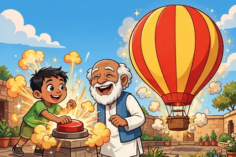
  </a>
  

    <h3><a href="stories/the-button-balloon-ride.html">बटन वाले गुब्बारे की सैर</a></h3>
    

      <a class="btn btn-read" href="stories/the-button-balloon-ride.html">📖 पढ़ें</a>
      <a class="btn btn-pdf" href="book/stories/the-button-balloon-ride.pdf">📕 PDF</a>
      <a class="btn btn-share" href="https://wa.me/?text=%E0%A4%AC%E0%A4%9F%E0%A4%A8%20%E0%A4%B5%E0%A4%BE%E0%A4%B2%E0%A5%87%20%E0%A4%97%E0%A5%81%E0%A4%AC%E0%A5%8D%E0%A4%AC%E0%A4%BE%E0%A4%B0%E0%A5%87%20%E0%A4%95%E0%A5%80%20%E0%A4%B8%E0%A5%88%E0%A4%B0%20%E2%80%94%20%E0%A4%AE%E0%A5%80%E0%A4%A0%E0%A5%87%20%E0%A4%B8%E0%A4%AA%E0%A4%A8%E0%A5%8B%E0%A4%82%20%E0%A4%95%E0%A5%80%20%E0%A4%95%E0%A4%B9%E0%A4%BE%E0%A4%A8%E0%A4%BF%E0%A4%AF%E0%A4%BE%E0%A4%81%0Ahttps%3A%2F%2Fniteshlhsnda-droid.github.io%2Fkids-book-videos-hindi%2Fstories%2Fthe-button-balloon-ride.html" target="_blank" rel="noopener" title="WhatsApp पर भेजें" aria-label="WhatsApp पर भेजें">📲</a>
    

  

</article>
<article class="story-card" data-search="बब्बू पेंगुइन और फिसलन भरी पहाड़ी pip-the-penguin-and-the-slippery-hill">
  <a class="card-art" href="stories/pip-the-penguin-and-the-slippery-hill.html" aria-label="बब्बू पेंगुइन और फिसलन भरी पहाड़ी">
    🐧
    
  </a>
  

    <h3><a href="stories/pip-the-penguin-and-the-slippery-hill.html">बब्बू पेंगुइन और फिसलन भरी पहाड़ी</a></h3>
    

      <a class="btn btn-read" href="stories/pip-the-penguin-and-the-slippery-hill.html">📖 पढ़ें</a>
      <a class="btn btn-pdf" href="book/stories/pip-the-penguin-and-the-slippery-hill.pdf">📕 PDF</a>
      <a class="btn btn-share" href="https://wa.me/?text=%E0%A4%AC%E0%A4%AC%E0%A5%8D%E0%A4%AC%E0%A5%82%20%E0%A4%AA%E0%A5%87%E0%A4%82%E0%A4%97%E0%A5%81%E0%A4%87%E0%A4%A8%20%E0%A4%94%E0%A4%B0%20%E0%A4%AB%E0%A4%BF%E0%A4%B8%E0%A4%B2%E0%A4%A8%20%E0%A4%AD%E0%A4%B0%E0%A5%80%20%E0%A4%AA%E0%A4%B9%E0%A4%BE%E0%A4%A1%E0%A4%BC%E0%A5%80%20%E2%80%94%20%E0%A4%AE%E0%A5%80%E0%A4%A0%E0%A5%87%20%E0%A4%B8%E0%A4%AA%E0%A4%A8%E0%A5%8B%E0%A4%82%20%E0%A4%95%E0%A5%80%20%E0%A4%95%E0%A4%B9%E0%A4%BE%E0%A4%A8%E0%A4%BF%E0%A4%AF%E0%A4%BE%E0%A4%81%0Ahttps%3A%2F%2Fniteshlhsnda-droid.github.io%2Fkids-book-videos-hindi%2Fstories%2Fpip-the-penguin-and-the-slippery-hill.html" target="_blank" rel="noopener" title="WhatsApp पर भेजें" aria-label="WhatsApp पर भेजें">📲</a>
    

  

</article>
<article class="story-card" data-search="बर्फ़ का पहला फूल the-first-snowflake">
  <a class="card-art" href="stories/the-first-snowflake.html" aria-label="बर्फ़ का पहला फूल">
    ❄️
    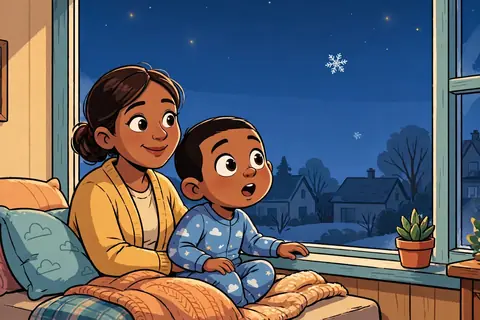
  </a>
  

    <h3><a href="stories/the-first-snowflake.html">बर्फ़ का पहला फूल</a></h3>
    

      <a class="btn btn-read" href="stories/the-first-snowflake.html">📖 पढ़ें</a>
      <a class="btn btn-pdf" href="book/stories/the-first-snowflake.pdf">📕 PDF</a>
      <a class="btn btn-share" href="https://wa.me/?text=%E0%A4%AC%E0%A4%B0%E0%A5%8D%E0%A4%AB%E0%A4%BC%20%E0%A4%95%E0%A4%BE%20%E0%A4%AA%E0%A4%B9%E0%A4%B2%E0%A4%BE%20%E0%A4%AB%E0%A5%82%E0%A4%B2%20%E2%80%94%20%E0%A4%AE%E0%A5%80%E0%A4%A0%E0%A5%87%20%E0%A4%B8%E0%A4%AA%E0%A4%A8%E0%A5%8B%E0%A4%82%20%E0%A4%95%E0%A5%80%20%E0%A4%95%E0%A4%B9%E0%A4%BE%E0%A4%A8%E0%A4%BF%E0%A4%AF%E0%A4%BE%E0%A4%81%0Ahttps%3A%2F%2Fniteshlhsnda-droid.github.io%2Fkids-book-videos-hindi%2Fstories%2Fthe-first-snowflake.html" target="_blank" rel="noopener" title="WhatsApp पर भेजें" aria-label="WhatsApp पर भेजें">📲</a>
    

  

</article>
<article class="story-card" data-search="बसंत के फूलों की परेड the-spring-flower-parade">
  <a class="card-art" href="stories/the-spring-flower-parade.html" aria-label="बसंत के फूलों की परेड">
    🌸
    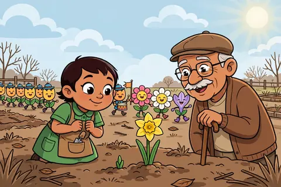
  </a>
  

    <h3><a href="stories/the-spring-flower-parade.html">बसंत के फूलों की परेड</a></h3>
    

      <a class="btn btn-read" href="stories/the-spring-flower-parade.html">📖 पढ़ें</a>
      <a class="btn btn-pdf" href="book/stories/the-spring-flower-parade.pdf">📕 PDF</a>
      <a class="btn btn-share" href="https://wa.me/?text=%E0%A4%AC%E0%A4%B8%E0%A4%82%E0%A4%A4%20%E0%A4%95%E0%A5%87%20%E0%A4%AB%E0%A5%82%E0%A4%B2%E0%A5%8B%E0%A4%82%20%E0%A4%95%E0%A5%80%20%E0%A4%AA%E0%A4%B0%E0%A5%87%E0%A4%A1%20%E2%80%94%20%E0%A4%AE%E0%A5%80%E0%A4%A0%E0%A5%87%20%E0%A4%B8%E0%A4%AA%E0%A4%A8%E0%A5%8B%E0%A4%82%20%E0%A4%95%E0%A5%80%20%E0%A4%95%E0%A4%B9%E0%A4%BE%E0%A4%A8%E0%A4%BF%E0%A4%AF%E0%A4%BE%E0%A4%81%0Ahttps%3A%2F%2Fniteshlhsnda-droid.github.io%2Fkids-book-videos-hindi%2Fstories%2Fthe-spring-flower-parade.html" target="_blank" rel="noopener" title="WhatsApp पर भेजें" aria-label="WhatsApp पर भेजें">📲</a>
    

  

</article>
<article class="story-card" data-search="बहादुर छोटा जुगनू the-brave-little-firefly">
  <a class="card-art" href="stories/the-brave-little-firefly.html" aria-label="बहादुर छोटा जुगनू">
    ✨
    
  </a>
  

    <h3><a href="stories/the-brave-little-firefly.html">बहादुर छोटा जुगनू</a></h3>
    

      <a class="btn btn-read" href="stories/the-brave-little-firefly.html">📖 पढ़ें</a>
      <a class="btn btn-pdf" href="book/stories/the-brave-little-firefly.pdf">📕 PDF</a>
      <a class="btn btn-share" href="https://wa.me/?text=%E0%A4%AC%E0%A4%B9%E0%A4%BE%E0%A4%A6%E0%A5%81%E0%A4%B0%20%E0%A4%9B%E0%A5%8B%E0%A4%9F%E0%A4%BE%20%E0%A4%9C%E0%A5%81%E0%A4%97%E0%A4%A8%E0%A5%82%20%E2%80%94%20%E0%A4%AE%E0%A5%80%E0%A4%A0%E0%A5%87%20%E0%A4%B8%E0%A4%AA%E0%A4%A8%E0%A5%8B%E0%A4%82%20%E0%A4%95%E0%A5%80%20%E0%A4%95%E0%A4%B9%E0%A4%BE%E0%A4%A8%E0%A4%BF%E0%A4%AF%E0%A4%BE%E0%A4%81%0Ahttps%3A%2F%2Fniteshlhsnda-droid.github.io%2Fkids-book-videos-hindi%2Fstories%2Fthe-brave-little-firefly.html" target="_blank" rel="noopener" title="WhatsApp पर भेजें" aria-label="WhatsApp पर भेजें">📲</a>
    

  

</article>
<article class="story-card" data-search="बादलों का चरवाहा the-cloud-shepherd">
  <a class="card-art" href="stories/the-cloud-shepherd.html" aria-label="बादलों का चरवाहा">
    ☁️
    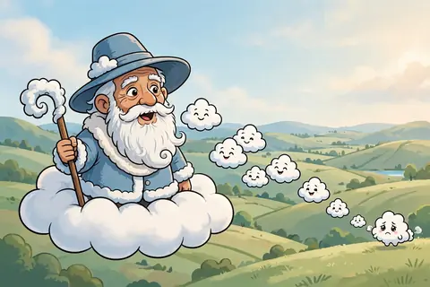
  </a>
  

    <h3><a href="stories/the-cloud-shepherd.html">बादलों का चरवाहा</a></h3>
    

      <a class="btn btn-read" href="stories/the-cloud-shepherd.html">📖 पढ़ें</a>
      <a class="btn btn-pdf" href="book/stories/the-cloud-shepherd.pdf">📕 PDF</a>
      <a class="btn btn-share" href="https://wa.me/?text=%E0%A4%AC%E0%A4%BE%E0%A4%A6%E0%A4%B2%E0%A5%8B%E0%A4%82%20%E0%A4%95%E0%A4%BE%20%E0%A4%9A%E0%A4%B0%E0%A4%B5%E0%A4%BE%E0%A4%B9%E0%A4%BE%20%E2%80%94%20%E0%A4%AE%E0%A5%80%E0%A4%A0%E0%A5%87%20%E0%A4%B8%E0%A4%AA%E0%A4%A8%E0%A5%8B%E0%A4%82%20%E0%A4%95%E0%A5%80%20%E0%A4%95%E0%A4%B9%E0%A4%BE%E0%A4%A8%E0%A4%BF%E0%A4%AF%E0%A4%BE%E0%A4%81%0Ahttps%3A%2F%2Fniteshlhsnda-droid.github.io%2Fkids-book-videos-hindi%2Fstories%2Fthe-cloud-shepherd.html" target="_blank" rel="noopener" title="WhatsApp पर भेजें" aria-label="WhatsApp पर भेजें">📲</a>
    

  

</article>
<article class="story-card" data-search="बॉबी और बबल बे bobbys-bubble-bay">
  <a class="card-art" href="stories/bobbys-bubble-bay.html" aria-label="बॉबी और बबल बे">
    🌙
    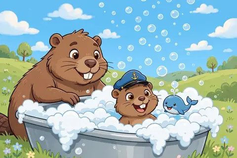
  </a>
  

    <h3><a href="stories/bobbys-bubble-bay.html">बॉबी और बबल बे</a></h3>
    

      <a class="btn btn-read" href="stories/bobbys-bubble-bay.html">📖 पढ़ें</a>
      <a class="btn btn-pdf" href="book/stories/bobbys-bubble-bay.pdf">📕 PDF</a>
      <a class="btn btn-share" href="https://wa.me/?text=%E0%A4%AC%E0%A5%89%E0%A4%AC%E0%A5%80%20%E0%A4%94%E0%A4%B0%20%E0%A4%AC%E0%A4%AC%E0%A4%B2%20%E0%A4%AC%E0%A5%87%20%E2%80%94%20%E0%A4%AE%E0%A5%80%E0%A4%A0%E0%A5%87%20%E0%A4%B8%E0%A4%AA%E0%A4%A8%E0%A5%8B%E0%A4%82%20%E0%A4%95%E0%A5%80%20%E0%A4%95%E0%A4%B9%E0%A4%BE%E0%A4%A8%E0%A4%BF%E0%A4%AF%E0%A4%BE%E0%A4%81%0Ahttps%3A%2F%2Fniteshlhsnda-droid.github.io%2Fkids-book-videos-hindi%2Fstories%2Fbobbys-bubble-bay.html" target="_blank" rel="noopener" title="WhatsApp पर भेजें" aria-label="WhatsApp पर भेजें">📲</a>
    

  

</article>
<article class="story-card" data-search="बॉबी बीवर की सफ़ाई biscuit-the-beaver-cleans-up">
  <a class="card-art" href="stories/biscuit-the-beaver-cleans-up.html" aria-label="बॉबी बीवर की सफ़ाई">
    🌙
    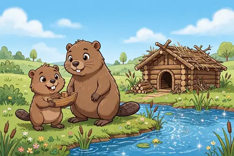
  </a>
  

    <h3><a href="stories/biscuit-the-beaver-cleans-up.html">बॉबी बीवर की सफ़ाई</a></h3>
    

      <a class="btn btn-read" href="stories/biscuit-the-beaver-cleans-up.html">📖 पढ़ें</a>
      <a class="btn btn-pdf" href="book/stories/biscuit-the-beaver-cleans-up.pdf">📕 PDF</a>
      <a class="btn btn-share" href="https://wa.me/?text=%E0%A4%AC%E0%A5%89%E0%A4%AC%E0%A5%80%20%E0%A4%AC%E0%A5%80%E0%A4%B5%E0%A4%B0%20%E0%A4%95%E0%A5%80%20%E0%A4%B8%E0%A4%AB%E0%A4%BC%E0%A4%BE%E0%A4%88%20%E2%80%94%20%E0%A4%AE%E0%A5%80%E0%A4%A0%E0%A5%87%20%E0%A4%B8%E0%A4%AA%E0%A4%A8%E0%A5%8B%E0%A4%82%20%E0%A4%95%E0%A5%80%20%E0%A4%95%E0%A4%B9%E0%A4%BE%E0%A4%A8%E0%A4%BF%E0%A4%AF%E0%A4%BE%E0%A4%81%0Ahttps%3A%2F%2Fniteshlhsnda-droid.github.io%2Fkids-book-videos-hindi%2Fstories%2Fbiscuit-the-beaver-cleans-up.html" target="_blank" rel="noopener" title="WhatsApp पर भेजें" aria-label="WhatsApp पर भेजें">📲</a>
    

  

</article>
<article class="story-card" data-search="ब्रश वाली नाव the-toothbrush-boat">
  <a class="card-art" href="stories/the-toothbrush-boat.html" aria-label="ब्रश वाली नाव">
    ⛵
    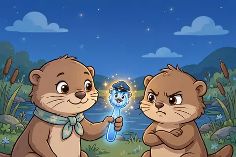
  </a>
  

    <h3><a href="stories/the-toothbrush-boat.html">ब्रश वाली नाव</a></h3>
    

      <a class="btn btn-read" href="stories/the-toothbrush-boat.html">📖 पढ़ें</a>
      <a class="btn btn-pdf" href="book/stories/the-toothbrush-boat.pdf">📕 PDF</a>
      <a class="btn btn-share" href="https://wa.me/?text=%E0%A4%AC%E0%A5%8D%E0%A4%B0%E0%A4%B6%20%E0%A4%B5%E0%A4%BE%E0%A4%B2%E0%A5%80%20%E0%A4%A8%E0%A4%BE%E0%A4%B5%20%E2%80%94%20%E0%A4%AE%E0%A5%80%E0%A4%A0%E0%A5%87%20%E0%A4%B8%E0%A4%AA%E0%A4%A8%E0%A5%8B%E0%A4%82%20%E0%A4%95%E0%A5%80%20%E0%A4%95%E0%A4%B9%E0%A4%BE%E0%A4%A8%E0%A4%BF%E0%A4%AF%E0%A4%BE%E0%A4%81%0Ahttps%3A%2F%2Fniteshlhsnda-droid.github.io%2Fkids-book-videos-hindi%2Fstories%2Fthe-toothbrush-boat.html" target="_blank" rel="noopener" title="WhatsApp पर भेजें" aria-label="WhatsApp पर भेजें">📲</a>
    

  

</article>
<article class="story-card" data-search="भिनभिनी को मिली उसकी भिनभिन buzzy-the-bee-finds-her-buzz">
  <a class="card-art" href="stories/buzzy-the-bee-finds-her-buzz.html" aria-label="भिनभिनी को मिली उसकी भिनभिन">
    🐝
    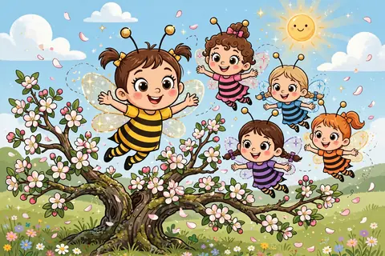
  </a>
  

    <h3><a href="stories/buzzy-the-bee-finds-her-buzz.html">भिनभिनी को मिली उसकी भिनभिन</a></h3>
    

      <a class="btn btn-read" href="stories/buzzy-the-bee-finds-her-buzz.html">📖 पढ़ें</a>
      <a class="btn btn-pdf" href="book/stories/buzzy-the-bee-finds-her-buzz.pdf">📕 PDF</a>
      <a class="btn btn-share" href="https://wa.me/?text=%E0%A4%AD%E0%A4%BF%E0%A4%A8%E0%A4%AD%E0%A4%BF%E0%A4%A8%E0%A5%80%20%E0%A4%95%E0%A5%8B%20%E0%A4%AE%E0%A4%BF%E0%A4%B2%E0%A5%80%20%E0%A4%89%E0%A4%B8%E0%A4%95%E0%A5%80%20%E0%A4%AD%E0%A4%BF%E0%A4%A8%E0%A4%AD%E0%A4%BF%E0%A4%A8%20%E2%80%94%20%E0%A4%AE%E0%A5%80%E0%A4%A0%E0%A5%87%20%E0%A4%B8%E0%A4%AA%E0%A4%A8%E0%A5%8B%E0%A4%82%20%E0%A4%95%E0%A5%80%20%E0%A4%95%E0%A4%B9%E0%A4%BE%E0%A4%A8%E0%A4%BF%E0%A4%AF%E0%A4%BE%E0%A4%81%0Ahttps%3A%2F%2Fniteshlhsnda-droid.github.io%2Fkids-book-videos-hindi%2Fstories%2Fbuzzy-the-bee-finds-her-buzz.html" target="_blank" rel="noopener" title="WhatsApp पर भेजें" aria-label="WhatsApp पर भेजें">📲</a>
    

  

</article>
<article class="story-card" data-search="भूरू भालू और ऊँचा शहद bramble-the-bear-cub-and-the-high-honey">
  <a class="card-art" href="stories/bramble-the-bear-cub-and-the-high-honey.html" aria-label="भूरू भालू और ऊँचा शहद">
    🐻
    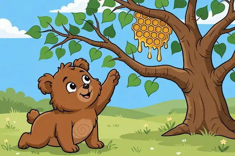
  </a>
  

    <h3><a href="stories/bramble-the-bear-cub-and-the-high-honey.html">भूरू भालू और ऊँचा शहद</a></h3>
    

      <a class="btn btn-read" href="stories/bramble-the-bear-cub-and-the-high-honey.html">📖 पढ़ें</a>
      <a class="btn btn-pdf" href="book/stories/bramble-the-bear-cub-and-the-high-honey.pdf">📕 PDF</a>
      <a class="btn btn-share" href="https://wa.me/?text=%E0%A4%AD%E0%A5%82%E0%A4%B0%E0%A5%82%20%E0%A4%AD%E0%A4%BE%E0%A4%B2%E0%A5%82%20%E0%A4%94%E0%A4%B0%20%E0%A4%8A%E0%A4%81%E0%A4%9A%E0%A4%BE%20%E0%A4%B6%E0%A4%B9%E0%A4%A6%20%E2%80%94%20%E0%A4%AE%E0%A5%80%E0%A4%A0%E0%A5%87%20%E0%A4%B8%E0%A4%AA%E0%A4%A8%E0%A5%8B%E0%A4%82%20%E0%A4%95%E0%A5%80%20%E0%A4%95%E0%A4%B9%E0%A4%BE%E0%A4%A8%E0%A4%BF%E0%A4%AF%E0%A4%BE%E0%A4%81%0Ahttps%3A%2F%2Fniteshlhsnda-droid.github.io%2Fkids-book-videos-hindi%2Fstories%2Fbramble-the-bear-cub-and-the-high-honey.html" target="_blank" rel="noopener" title="WhatsApp पर भेजें" aria-label="WhatsApp पर भेजें">📲</a>
    

  

</article>
<article class="story-card" data-search="मायरा की नए दोस्त से दोस्ती ella-is-kind-to-someone-new">
  <a class="card-art" href="stories/ella-is-kind-to-someone-new.html" aria-label="मायरा की नए दोस्त से दोस्ती">
    🌙
    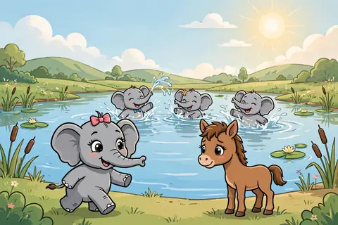
  </a>
  

    <h3><a href="stories/ella-is-kind-to-someone-new.html">मायरा की नए दोस्त से दोस्ती</a></h3>
    

      <a class="btn btn-read" href="stories/ella-is-kind-to-someone-new.html">📖 पढ़ें</a>
      <a class="btn btn-pdf" href="book/stories/ella-is-kind-to-someone-new.pdf">📕 PDF</a>
      <a class="btn btn-share" href="https://wa.me/?text=%E0%A4%AE%E0%A4%BE%E0%A4%AF%E0%A4%B0%E0%A4%BE%20%E0%A4%95%E0%A5%80%20%E0%A4%A8%E0%A4%8F%20%E0%A4%A6%E0%A5%8B%E0%A4%B8%E0%A5%8D%E0%A4%A4%20%E0%A4%B8%E0%A5%87%20%E0%A4%A6%E0%A5%8B%E0%A4%B8%E0%A5%8D%E0%A4%A4%E0%A5%80%20%E2%80%94%20%E0%A4%AE%E0%A5%80%E0%A4%A0%E0%A5%87%20%E0%A4%B8%E0%A4%AA%E0%A4%A8%E0%A5%8B%E0%A4%82%20%E0%A4%95%E0%A5%80%20%E0%A4%95%E0%A4%B9%E0%A4%BE%E0%A4%A8%E0%A4%BF%E0%A4%AF%E0%A4%BE%E0%A4%81%0Ahttps%3A%2F%2Fniteshlhsnda-droid.github.io%2Fkids-book-videos-hindi%2Fstories%2Fella-is-kind-to-someone-new.html" target="_blank" rel="noopener" title="WhatsApp पर भेजें" aria-label="WhatsApp पर भेजें">📲</a>
    

  

</article>
<article class="story-card" data-search="मिट्ठी तोती ने सुनना सीखा koko-the-parrot-learns-to-listen">
  <a class="card-art" href="stories/koko-the-parrot-learns-to-listen.html" aria-label="मिट्ठी तोती ने सुनना सीखा">
    🌙
    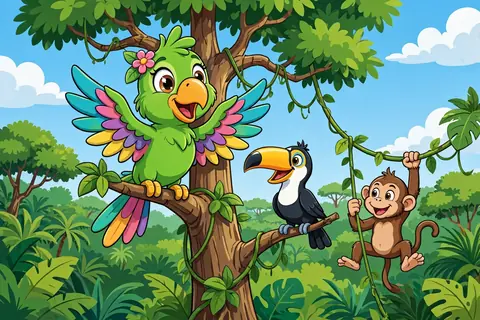
  </a>
  

    <h3><a href="stories/koko-the-parrot-learns-to-listen.html">मिट्ठी तोती ने सुनना सीखा</a></h3>
    

      <a class="btn btn-read" href="stories/koko-the-parrot-learns-to-listen.html">📖 पढ़ें</a>
      <a class="btn btn-pdf" href="book/stories/koko-the-parrot-learns-to-listen.pdf">📕 PDF</a>
      <a class="btn btn-share" href="https://wa.me/?text=%E0%A4%AE%E0%A4%BF%E0%A4%9F%E0%A5%8D%E0%A4%A0%E0%A5%80%20%E0%A4%A4%E0%A5%8B%E0%A4%A4%E0%A5%80%20%E0%A4%A8%E0%A5%87%20%E0%A4%B8%E0%A5%81%E0%A4%A8%E0%A4%A8%E0%A4%BE%20%E0%A4%B8%E0%A5%80%E0%A4%96%E0%A4%BE%20%E2%80%94%20%E0%A4%AE%E0%A5%80%E0%A4%A0%E0%A5%87%20%E0%A4%B8%E0%A4%AA%E0%A4%A8%E0%A5%8B%E0%A4%82%20%E0%A4%95%E0%A5%80%20%E0%A4%95%E0%A4%B9%E0%A4%BE%E0%A4%A8%E0%A4%BF%E0%A4%AF%E0%A4%BE%E0%A4%81%0Ahttps%3A%2F%2Fniteshlhsnda-droid.github.io%2Fkids-book-videos-hindi%2Fstories%2Fkoko-the-parrot-learns-to-listen.html" target="_blank" rel="noopener" title="WhatsApp पर भेजें" aria-label="WhatsApp पर भेजें">📲</a>
    

  

</article>
<article class="story-card" data-search="मिन्नी ने माफ़ी माँगी kiki-says-sorry">
  <a class="card-art" href="stories/kiki-says-sorry.html" aria-label="मिन्नी ने माफ़ी माँगी">
    🌙
    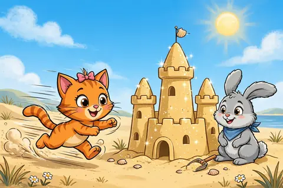
  </a>
  

    <h3><a href="stories/kiki-says-sorry.html">मिन्नी ने माफ़ी माँगी</a></h3>
    

      <a class="btn btn-read" href="stories/kiki-says-sorry.html">📖 पढ़ें</a>
      <a class="btn btn-pdf" href="book/stories/kiki-says-sorry.pdf">📕 PDF</a>
      <a class="btn btn-share" href="https://wa.me/?text=%E0%A4%AE%E0%A4%BF%E0%A4%A8%E0%A5%8D%E0%A4%A8%E0%A5%80%20%E0%A4%A8%E0%A5%87%20%E0%A4%AE%E0%A4%BE%E0%A4%AB%E0%A4%BC%E0%A5%80%20%E0%A4%AE%E0%A4%BE%E0%A4%81%E0%A4%97%E0%A5%80%20%E2%80%94%20%E0%A4%AE%E0%A5%80%E0%A4%A0%E0%A5%87%20%E0%A4%B8%E0%A4%AA%E0%A4%A8%E0%A5%8B%E0%A4%82%20%E0%A4%95%E0%A5%80%20%E0%A4%95%E0%A4%B9%E0%A4%BE%E0%A4%A8%E0%A4%BF%E0%A4%AF%E0%A4%BE%E0%A4%81%0Ahttps%3A%2F%2Fniteshlhsnda-droid.github.io%2Fkids-book-videos-hindi%2Fstories%2Fkiki-says-sorry.html" target="_blank" rel="noopener" title="WhatsApp पर भेजें" aria-label="WhatsApp पर भेजें">📲</a>
    

  

</article>
<article class="story-card" data-search="मिमी और टूटी नाव moss-and-the-broken-boat">
  <a class="card-art" href="stories/moss-and-the-broken-boat.html" aria-label="मिमी और टूटी नाव">
    ⛵
    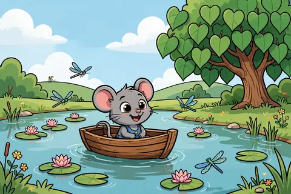
  </a>
  

    <h3><a href="stories/moss-and-the-broken-boat.html">मिमी और टूटी नाव</a></h3>
    

      <a class="btn btn-read" href="stories/moss-and-the-broken-boat.html">📖 पढ़ें</a>
      <a class="btn btn-pdf" href="book/stories/moss-and-the-broken-boat.pdf">📕 PDF</a>
      <a class="btn btn-share" href="https://wa.me/?text=%E0%A4%AE%E0%A4%BF%E0%A4%AE%E0%A5%80%20%E0%A4%94%E0%A4%B0%20%E0%A4%9F%E0%A5%82%E0%A4%9F%E0%A5%80%20%E0%A4%A8%E0%A4%BE%E0%A4%B5%20%E2%80%94%20%E0%A4%AE%E0%A5%80%E0%A4%A0%E0%A5%87%20%E0%A4%B8%E0%A4%AA%E0%A4%A8%E0%A5%8B%E0%A4%82%20%E0%A4%95%E0%A5%80%20%E0%A4%95%E0%A4%B9%E0%A4%BE%E0%A4%A8%E0%A4%BF%E0%A4%AF%E0%A4%BE%E0%A4%81%0Ahttps%3A%2F%2Fniteshlhsnda-droid.github.io%2Fkids-book-videos-hindi%2Fstories%2Fmoss-and-the-broken-boat.html" target="_blank" rel="noopener" title="WhatsApp पर भेजें" aria-label="WhatsApp पर भेजें">📲</a>
    

  

</article>
<article class="story-card" data-search="मीनू के जादुई शब्द juju-says-please-and-thank-you">
  <a class="card-art" href="stories/juju-says-please-and-thank-you.html" aria-label="मीनू के जादुई शब्द">
    🌙
    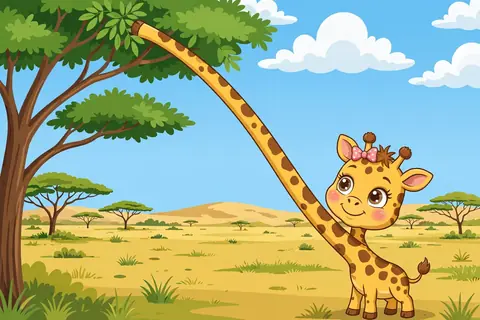
  </a>
  

    <h3><a href="stories/juju-says-please-and-thank-you.html">मीनू के जादुई शब्द</a></h3>
    

      <a class="btn btn-read" href="stories/juju-says-please-and-thank-you.html">📖 पढ़ें</a>
      <a class="btn btn-pdf" href="book/stories/juju-says-please-and-thank-you.pdf">📕 PDF</a>
      <a class="btn btn-share" href="https://wa.me/?text=%E0%A4%AE%E0%A5%80%E0%A4%A8%E0%A5%82%20%E0%A4%95%E0%A5%87%20%E0%A4%9C%E0%A4%BE%E0%A4%A6%E0%A5%81%E0%A4%88%20%E0%A4%B6%E0%A4%AC%E0%A5%8D%E0%A4%A6%20%E2%80%94%20%E0%A4%AE%E0%A5%80%E0%A4%A0%E0%A5%87%20%E0%A4%B8%E0%A4%AA%E0%A4%A8%E0%A5%8B%E0%A4%82%20%E0%A4%95%E0%A5%80%20%E0%A4%95%E0%A4%B9%E0%A4%BE%E0%A4%A8%E0%A4%BF%E0%A4%AF%E0%A4%BE%E0%A4%81%0Ahttps%3A%2F%2Fniteshlhsnda-droid.github.io%2Fkids-book-videos-hindi%2Fstories%2Fjuju-says-please-and-thank-you.html" target="_blank" rel="noopener" title="WhatsApp पर भेजें" aria-label="WhatsApp पर भेजें">📲</a>
    

  

</article>
<article class="story-card" data-search="रवि ने की दादाजी की मदद ravi-helps-grandpa">
  <a class="card-art" href="stories/ravi-helps-grandpa.html" aria-label="रवि ने की दादाजी की मदद">
    🌙
    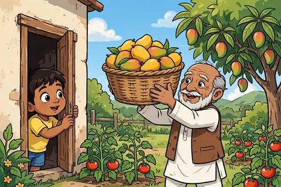
  </a>
  

    <h3><a href="stories/ravi-helps-grandpa.html">रवि ने की दादाजी की मदद</a></h3>
    

      <a class="btn btn-read" href="stories/ravi-helps-grandpa.html">📖 पढ़ें</a>
      <a class="btn btn-pdf" href="book/stories/ravi-helps-grandpa.pdf">📕 PDF</a>
      <a class="btn btn-share" href="https://wa.me/?text=%E0%A4%B0%E0%A4%B5%E0%A4%BF%20%E0%A4%A8%E0%A5%87%20%E0%A4%95%E0%A5%80%20%E0%A4%A6%E0%A4%BE%E0%A4%A6%E0%A4%BE%E0%A4%9C%E0%A5%80%20%E0%A4%95%E0%A5%80%20%E0%A4%AE%E0%A4%A6%E0%A4%A6%20%E2%80%94%20%E0%A4%AE%E0%A5%80%E0%A4%A0%E0%A5%87%20%E0%A4%B8%E0%A4%AA%E0%A4%A8%E0%A5%8B%E0%A4%82%20%E0%A4%95%E0%A5%80%20%E0%A4%95%E0%A4%B9%E0%A4%BE%E0%A4%A8%E0%A4%BF%E0%A4%AF%E0%A4%BE%E0%A4%81%0Ahttps%3A%2F%2Fniteshlhsnda-droid.github.io%2Fkids-book-videos-hindi%2Fstories%2Fravi-helps-grandpa.html" target="_blank" rel="noopener" title="WhatsApp पर भेजें" aria-label="WhatsApp पर भेजें">📲</a>
    

  

</article>
<article class="story-card" data-search="रात की आवाज़ों की लोरी night-sounds-lullaby">
  <a class="card-art" href="stories/night-sounds-lullaby.html" aria-label="रात की आवाज़ों की लोरी">
    🎵
    
  </a>
  

    <h3><a href="stories/night-sounds-lullaby.html">रात की आवाज़ों की लोरी</a></h3>
    

      <a class="btn btn-read" href="stories/night-sounds-lullaby.html">📖 पढ़ें</a>
      <a class="btn btn-pdf" href="book/stories/night-sounds-lullaby.pdf">📕 PDF</a>
      <a class="btn btn-share" href="https://wa.me/?text=%E0%A4%B0%E0%A4%BE%E0%A4%A4%20%E0%A4%95%E0%A5%80%20%E0%A4%86%E0%A4%B5%E0%A4%BE%E0%A4%9C%E0%A4%BC%E0%A5%8B%E0%A4%82%20%E0%A4%95%E0%A5%80%20%E0%A4%B2%E0%A5%8B%E0%A4%B0%E0%A5%80%20%E2%80%94%20%E0%A4%AE%E0%A5%80%E0%A4%A0%E0%A5%87%20%E0%A4%B8%E0%A4%AA%E0%A4%A8%E0%A5%8B%E0%A4%82%20%E0%A4%95%E0%A5%80%20%E0%A4%95%E0%A4%B9%E0%A4%BE%E0%A4%A8%E0%A4%BF%E0%A4%AF%E0%A4%BE%E0%A4%81%0Ahttps%3A%2F%2Fniteshlhsnda-droid.github.io%2Fkids-book-videos-hindi%2Fstories%2Fnight-sounds-lullaby.html" target="_blank" rel="noopener" title="WhatsApp पर भेजें" aria-label="WhatsApp पर भेजें">📲</a>
    

  

</article>
<article class="story-card" data-search="रात की बेकरी the-night-bakery">
  <a class="card-art" href="stories/the-night-bakery.html" aria-label="रात की बेकरी">
    🍞
    
  </a>
  

    <h3><a href="stories/the-night-bakery.html">रात की बेकरी</a></h3>
    

      <a class="btn btn-read" href="stories/the-night-bakery.html">📖 पढ़ें</a>
      <a class="btn btn-pdf" href="book/stories/the-night-bakery.pdf">📕 PDF</a>
      <a class="btn btn-share" href="https://wa.me/?text=%E0%A4%B0%E0%A4%BE%E0%A4%A4%20%E0%A4%95%E0%A5%80%20%E0%A4%AC%E0%A5%87%E0%A4%95%E0%A4%B0%E0%A5%80%20%E2%80%94%20%E0%A4%AE%E0%A5%80%E0%A4%A0%E0%A5%87%20%E0%A4%B8%E0%A4%AA%E0%A4%A8%E0%A5%8B%E0%A4%82%20%E0%A4%95%E0%A5%80%20%E0%A4%95%E0%A4%B9%E0%A4%BE%E0%A4%A8%E0%A4%BF%E0%A4%AF%E0%A4%BE%E0%A4%81%0Ahttps%3A%2F%2Fniteshlhsnda-droid.github.io%2Fkids-book-videos-hindi%2Fstories%2Fthe-night-bakery.html" target="_blank" rel="noopener" title="WhatsApp पर भेजें" aria-label="WhatsApp पर भेजें">📲</a>
    

  

</article>
<article class="story-card" data-search="रुन्नी खरगोश और चाँदनी का फूल 2026-09-21-willa-the-bunny-and-the-moonflower">
  <a class="card-art" href="stories/2026-09-21-willa-the-bunny-and-the-moonflower.html" aria-label="रुन्नी खरगोश और चाँदनी का फूल">
    🌙
    
  </a>
  

    <h3><a href="stories/2026-09-21-willa-the-bunny-and-the-moonflower.html">रुन्नी खरगोश और चाँदनी का फूल</a></h3>
    

      <a class="btn btn-read" href="stories/2026-09-21-willa-the-bunny-and-the-moonflower.html">📖 पढ़ें</a>
      <a class="btn btn-pdf" href="book/stories/2026-09-21-willa-the-bunny-and-the-moonflower.pdf">📕 PDF</a>
      <a class="btn btn-share" href="https://wa.me/?text=%E0%A4%B0%E0%A5%81%E0%A4%A8%E0%A5%8D%E0%A4%A8%E0%A5%80%20%E0%A4%96%E0%A4%B0%E0%A4%97%E0%A5%8B%E0%A4%B6%20%E0%A4%94%E0%A4%B0%20%E0%A4%9A%E0%A4%BE%E0%A4%81%E0%A4%A6%E0%A4%A8%E0%A5%80%20%E0%A4%95%E0%A4%BE%20%E0%A4%AB%E0%A5%82%E0%A4%B2%20%E2%80%94%20%E0%A4%AE%E0%A5%80%E0%A4%A0%E0%A5%87%20%E0%A4%B8%E0%A4%AA%E0%A4%A8%E0%A5%8B%E0%A4%82%20%E0%A4%95%E0%A5%80%20%E0%A4%95%E0%A4%B9%E0%A4%BE%E0%A4%A8%E0%A4%BF%E0%A4%AF%E0%A4%BE%E0%A4%81%0Ahttps%3A%2F%2Fniteshlhsnda-droid.github.io%2Fkids-book-videos-hindi%2Fstories%2F2026-09-21-willa-the-bunny-and-the-moonflower.html" target="_blank" rel="noopener" title="WhatsApp पर भेजें" aria-label="WhatsApp पर भेजें">📲</a>
    

  

</article>
<article class="story-card" data-search="रॉरी की जलन rory-the-jealous-raccoon">
  <a class="card-art" href="stories/rory-the-jealous-raccoon.html" aria-label="रॉरी की जलन">
    🌙
    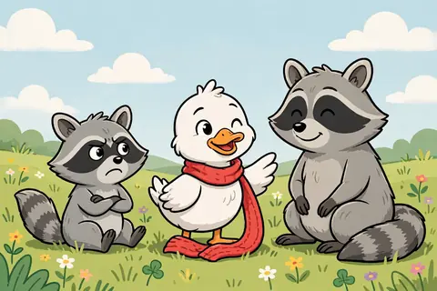
  </a>
  

    <h3><a href="stories/rory-the-jealous-raccoon.html">रॉरी की जलन</a></h3>
    

      <a class="btn btn-read" href="stories/rory-the-jealous-raccoon.html">📖 पढ़ें</a>
      <a class="btn btn-pdf" href="book/stories/rory-the-jealous-raccoon.pdf">📕 PDF</a>
      <a class="btn btn-share" href="https://wa.me/?text=%E0%A4%B0%E0%A5%89%E0%A4%B0%E0%A5%80%20%E0%A4%95%E0%A5%80%20%E0%A4%9C%E0%A4%B2%E0%A4%A8%20%E2%80%94%20%E0%A4%AE%E0%A5%80%E0%A4%A0%E0%A5%87%20%E0%A4%B8%E0%A4%AA%E0%A4%A8%E0%A5%8B%E0%A4%82%20%E0%A4%95%E0%A5%80%20%E0%A4%95%E0%A4%B9%E0%A4%BE%E0%A4%A8%E0%A4%BF%E0%A4%AF%E0%A4%BE%E0%A4%81%0Ahttps%3A%2F%2Fniteshlhsnda-droid.github.io%2Fkids-book-videos-hindi%2Fstories%2Frory-the-jealous-raccoon.html" target="_blank" rel="noopener" title="WhatsApp पर भेजें" aria-label="WhatsApp पर भेजें">📲</a>
    

  

</article>
<article class="story-card" data-search="लोरी गाती नदी the-lullaby-river">
  <a class="card-art" href="stories/the-lullaby-river.html" aria-label="लोरी गाती नदी">
    🎵
    
  </a>
  

    <h3><a href="stories/the-lullaby-river.html">लोरी गाती नदी</a></h3>
    

      <a class="btn btn-read" href="stories/the-lullaby-river.html">📖 पढ़ें</a>
      <a class="btn btn-pdf" href="book/stories/the-lullaby-river.pdf">📕 PDF</a>
      <a class="btn btn-share" href="https://wa.me/?text=%E0%A4%B2%E0%A5%8B%E0%A4%B0%E0%A5%80%20%E0%A4%97%E0%A4%BE%E0%A4%A4%E0%A5%80%20%E0%A4%A8%E0%A4%A6%E0%A5%80%20%E2%80%94%20%E0%A4%AE%E0%A5%80%E0%A4%A0%E0%A5%87%20%E0%A4%B8%E0%A4%AA%E0%A4%A8%E0%A5%8B%E0%A4%82%20%E0%A4%95%E0%A5%80%20%E0%A4%95%E0%A4%B9%E0%A4%BE%E0%A4%A8%E0%A4%BF%E0%A4%AF%E0%A4%BE%E0%A4%81%0Ahttps%3A%2F%2Fniteshlhsnda-droid.github.io%2Fkids-book-videos-hindi%2Fstories%2Fthe-lullaby-river.html" target="_blank" rel="noopener" title="WhatsApp पर भेजें" aria-label="WhatsApp पर भेजें">📲</a>
    

  

</article>
<article class="story-card" data-search="लोलो ने अपने नन्हे भाई का स्वागत किया lila-welcomes-her-baby-brother">
  <a class="card-art" href="stories/lila-welcomes-her-baby-brother.html" aria-label="लोलो ने अपने नन्हे भाई का स्वागत किया">
    🌙
    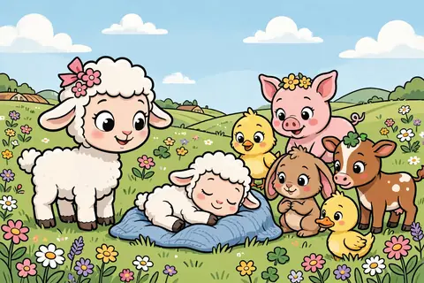
  </a>
  

    <h3><a href="stories/lila-welcomes-her-baby-brother.html">लोलो ने अपने नन्हे भाई का स्वागत किया</a></h3>
    

      <a class="btn btn-read" href="stories/lila-welcomes-her-baby-brother.html">📖 पढ़ें</a>
      <a class="btn btn-pdf" href="book/stories/lila-welcomes-her-baby-brother.pdf">📕 PDF</a>
      <a class="btn btn-share" href="https://wa.me/?text=%E0%A4%B2%E0%A5%8B%E0%A4%B2%E0%A5%8B%20%E0%A4%A8%E0%A5%87%20%E0%A4%85%E0%A4%AA%E0%A4%A8%E0%A5%87%20%E0%A4%A8%E0%A4%A8%E0%A5%8D%E0%A4%B9%E0%A5%87%20%E0%A4%AD%E0%A4%BE%E0%A4%88%20%E0%A4%95%E0%A4%BE%20%E0%A4%B8%E0%A5%8D%E0%A4%B5%E0%A4%BE%E0%A4%97%E0%A4%A4%20%E0%A4%95%E0%A4%BF%E0%A4%AF%E0%A4%BE%20%E2%80%94%20%E0%A4%AE%E0%A5%80%E0%A4%A0%E0%A5%87%20%E0%A4%B8%E0%A4%AA%E0%A4%A8%E0%A5%8B%E0%A4%82%20%E0%A4%95%E0%A5%80%20%E0%A4%95%E0%A4%B9%E0%A4%BE%E0%A4%A8%E0%A4%BF%E0%A4%AF%E0%A4%BE%E0%A4%81%0Ahttps%3A%2F%2Fniteshlhsnda-droid.github.io%2Fkids-book-videos-hindi%2Fstories%2Flila-welcomes-her-baby-brother.html" target="_blank" rel="noopener" title="WhatsApp पर भेजें" aria-label="WhatsApp पर भेजें">📲</a>
    

  

</article>
<article class="story-card" data-search="लोलो मेमना और गरजते बादल luna-the-lamb-and-the-rumbly-clouds">
  <a class="card-art" href="stories/luna-the-lamb-and-the-rumbly-clouds.html" aria-label="लोलो मेमना और गरजते बादल">
    ☁️
    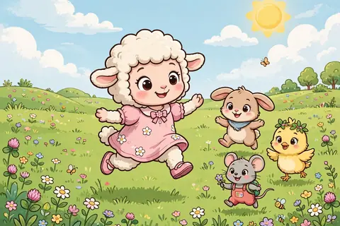
  </a>
  

    <h3><a href="stories/luna-the-lamb-and-the-rumbly-clouds.html">लोलो मेमना और गरजते बादल</a></h3>
    

      <a class="btn btn-read" href="stories/luna-the-lamb-and-the-rumbly-clouds.html">📖 पढ़ें</a>
      <a class="btn btn-pdf" href="book/stories/luna-the-lamb-and-the-rumbly-clouds.pdf">📕 PDF</a>
      <a class="btn btn-share" href="https://wa.me/?text=%E0%A4%B2%E0%A5%8B%E0%A4%B2%E0%A5%8B%20%E0%A4%AE%E0%A5%87%E0%A4%AE%E0%A4%A8%E0%A4%BE%20%E0%A4%94%E0%A4%B0%20%E0%A4%97%E0%A4%B0%E0%A4%9C%E0%A4%A4%E0%A5%87%20%E0%A4%AC%E0%A4%BE%E0%A4%A6%E0%A4%B2%20%E2%80%94%20%E0%A4%AE%E0%A5%80%E0%A4%A0%E0%A5%87%20%E0%A4%B8%E0%A4%AA%E0%A4%A8%E0%A5%8B%E0%A4%82%20%E0%A4%95%E0%A5%80%20%E0%A4%95%E0%A4%B9%E0%A4%BE%E0%A4%A8%E0%A4%BF%E0%A4%AF%E0%A4%BE%E0%A4%81%0Ahttps%3A%2F%2Fniteshlhsnda-droid.github.io%2Fkids-book-videos-hindi%2Fstories%2Fluna-the-lamb-and-the-rumbly-clouds.html" target="_blank" rel="noopener" title="WhatsApp पर भेजें" aria-label="WhatsApp पर भेजें">📲</a>
    

  

</article>
<article class="story-card" data-search="वियान का कीड़ों वाला बगीचा billys-bug-garden">
  <a class="card-art" href="stories/billys-bug-garden.html" aria-label="वियान का कीड़ों वाला बगीचा">
    🌸
    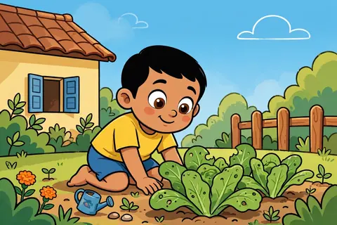
  </a>
  

    <h3><a href="stories/billys-bug-garden.html">वियान का कीड़ों वाला बगीचा</a></h3>
    

      <a class="btn btn-read" href="stories/billys-bug-garden.html">📖 पढ़ें</a>
      <a class="btn btn-pdf" href="book/stories/billys-bug-garden.pdf">📕 PDF</a>
      <a class="btn btn-share" href="https://wa.me/?text=%E0%A4%B5%E0%A4%BF%E0%A4%AF%E0%A4%BE%E0%A4%A8%20%E0%A4%95%E0%A4%BE%20%E0%A4%95%E0%A5%80%E0%A4%A1%E0%A4%BC%E0%A5%8B%E0%A4%82%20%E0%A4%B5%E0%A4%BE%E0%A4%B2%E0%A4%BE%20%E0%A4%AC%E0%A4%97%E0%A5%80%E0%A4%9A%E0%A4%BE%20%E2%80%94%20%E0%A4%AE%E0%A5%80%E0%A4%A0%E0%A5%87%20%E0%A4%B8%E0%A4%AA%E0%A4%A8%E0%A5%8B%E0%A4%82%20%E0%A4%95%E0%A5%80%20%E0%A4%95%E0%A4%B9%E0%A4%BE%E0%A4%A8%E0%A4%BF%E0%A4%AF%E0%A4%BE%E0%A4%81%0Ahttps%3A%2F%2Fniteshlhsnda-droid.github.io%2Fkids-book-videos-hindi%2Fstories%2Fbillys-bug-garden.html" target="_blank" rel="noopener" title="WhatsApp पर भेजें" aria-label="WhatsApp पर भेजें">📲</a>
    

  

</article>
<article class="story-card" data-search="शनाया छछूंदर ने तारों को सुना marnie-the-mole-hears-the-stars">
  <a class="card-art" href="stories/marnie-the-mole-hears-the-stars.html" aria-label="शनाया छछूंदर ने तारों को सुना">
    ⭐
    
  </a>
  

    <h3><a href="stories/marnie-the-mole-hears-the-stars.html">शनाया छछूंदर ने तारों को सुना</a></h3>
    

      <a class="btn btn-read" href="stories/marnie-the-mole-hears-the-stars.html">📖 पढ़ें</a>
      <a class="btn btn-pdf" href="book/stories/marnie-the-mole-hears-the-stars.pdf">📕 PDF</a>
      <a class="btn btn-share" href="https://wa.me/?text=%E0%A4%B6%E0%A4%A8%E0%A4%BE%E0%A4%AF%E0%A4%BE%20%E0%A4%9B%E0%A4%9B%E0%A5%82%E0%A4%82%E0%A4%A6%E0%A4%B0%20%E0%A4%A8%E0%A5%87%20%E0%A4%A4%E0%A4%BE%E0%A4%B0%E0%A5%8B%E0%A4%82%20%E0%A4%95%E0%A5%8B%20%E0%A4%B8%E0%A5%81%E0%A4%A8%E0%A4%BE%20%E2%80%94%20%E0%A4%AE%E0%A5%80%E0%A4%A0%E0%A5%87%20%E0%A4%B8%E0%A4%AA%E0%A4%A8%E0%A5%8B%E0%A4%82%20%E0%A4%95%E0%A5%80%20%E0%A4%95%E0%A4%B9%E0%A4%BE%E0%A4%A8%E0%A4%BF%E0%A4%AF%E0%A4%BE%E0%A4%81%0Ahttps%3A%2F%2Fniteshlhsnda-droid.github.io%2Fkids-book-videos-hindi%2Fstories%2Fmarnie-the-mole-hears-the-stars.html" target="_blank" rel="noopener" title="WhatsApp पर भेजें" aria-label="WhatsApp पर भेजें">📲</a>
    

  

</article>
<article class="story-card" data-search="शर्मीली खोलू tessa-the-shy-tortoise">
  <a class="card-art" href="stories/tessa-the-shy-tortoise.html" aria-label="शर्मीली खोलू">
    🐢
    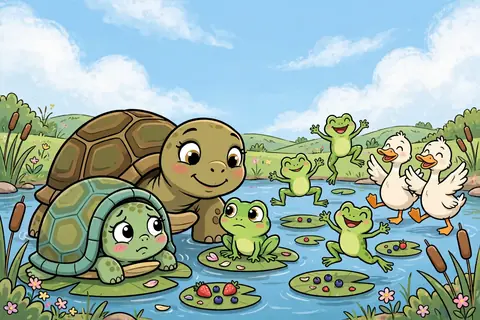
  </a>
  

    <h3><a href="stories/tessa-the-shy-tortoise.html">शर्मीली खोलू</a></h3>
    

      <a class="btn btn-read" href="stories/tessa-the-shy-tortoise.html">📖 पढ़ें</a>
      <a class="btn btn-pdf" href="book/stories/tessa-the-shy-tortoise.pdf">📕 PDF</a>
      <a class="btn btn-share" href="https://wa.me/?text=%E0%A4%B6%E0%A4%B0%E0%A5%8D%E0%A4%AE%E0%A5%80%E0%A4%B2%E0%A5%80%20%E0%A4%96%E0%A5%8B%E0%A4%B2%E0%A5%82%20%E2%80%94%20%E0%A4%AE%E0%A5%80%E0%A4%A0%E0%A5%87%20%E0%A4%B8%E0%A4%AA%E0%A4%A8%E0%A5%8B%E0%A4%82%20%E0%A4%95%E0%A5%80%20%E0%A4%95%E0%A4%B9%E0%A4%BE%E0%A4%A8%E0%A4%BF%E0%A4%AF%E0%A4%BE%E0%A4%81%0Ahttps%3A%2F%2Fniteshlhsnda-droid.github.io%2Fkids-book-videos-hindi%2Fstories%2Ftessa-the-shy-tortoise.html" target="_blank" rel="noopener" title="WhatsApp पर भेजें" aria-label="WhatsApp पर भेजें">📲</a>
    

  

</article>
<article class="story-card" data-search="शुक्रगुज़ार डेज़ी बत्तख daisy-the-grateful-duckling">
  <a class="card-art" href="stories/daisy-the-grateful-duckling.html" aria-label="शुक्रगुज़ार डेज़ी बत्तख">
    🦆
    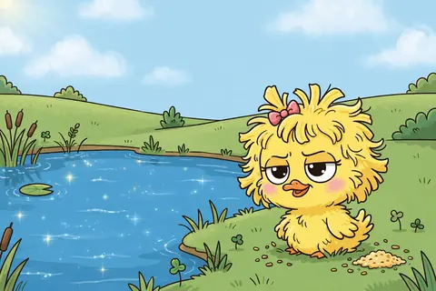
  </a>
  

    <h3><a href="stories/daisy-the-grateful-duckling.html">शुक्रगुज़ार डेज़ी बत्तख</a></h3>
    

      <a class="btn btn-read" href="stories/daisy-the-grateful-duckling.html">📖 पढ़ें</a>
      <a class="btn btn-pdf" href="book/stories/daisy-the-grateful-duckling.pdf">📕 PDF</a>
      <a class="btn btn-share" href="https://wa.me/?text=%E0%A4%B6%E0%A5%81%E0%A4%95%E0%A5%8D%E0%A4%B0%E0%A4%97%E0%A5%81%E0%A4%9C%E0%A4%BC%E0%A4%BE%E0%A4%B0%20%E0%A4%A1%E0%A5%87%E0%A4%9C%E0%A4%BC%E0%A5%80%20%E0%A4%AC%E0%A4%A4%E0%A5%8D%E0%A4%A4%E0%A4%96%20%E2%80%94%20%E0%A4%AE%E0%A5%80%E0%A4%A0%E0%A5%87%20%E0%A4%B8%E0%A4%AA%E0%A4%A8%E0%A5%8B%E0%A4%82%20%E0%A4%95%E0%A5%80%20%E0%A4%95%E0%A4%B9%E0%A4%BE%E0%A4%A8%E0%A4%BF%E0%A4%AF%E0%A4%BE%E0%A4%81%0Ahttps%3A%2F%2Fniteshlhsnda-droid.github.io%2Fkids-book-videos-hindi%2Fstories%2Fdaisy-the-grateful-duckling.html" target="_blank" rel="noopener" title="WhatsApp पर भेजें" aria-label="WhatsApp पर भेजें">📲</a>
    

  

</article>
<article class="story-card" data-search="शुभ-रात्रि वाला चिड़ियाघर the-goodnight-zoo">
  <a class="card-art" href="stories/the-goodnight-zoo.html" aria-label="शुभ-रात्रि वाला चिड़ियाघर">
    🦁
    
  </a>
  

    <h3><a href="stories/the-goodnight-zoo.html">शुभ-रात्रि वाला चिड़ियाघर</a></h3>
    

      <a class="btn btn-read" href="stories/the-goodnight-zoo.html">📖 पढ़ें</a>
      <a class="btn btn-pdf" href="book/stories/the-goodnight-zoo.pdf">📕 PDF</a>
      <a class="btn btn-share" href="https://wa.me/?text=%E0%A4%B6%E0%A5%81%E0%A4%AD-%E0%A4%B0%E0%A4%BE%E0%A4%A4%E0%A5%8D%E0%A4%B0%E0%A4%BF%20%E0%A4%B5%E0%A4%BE%E0%A4%B2%E0%A4%BE%20%E0%A4%9A%E0%A4%BF%E0%A4%A1%E0%A4%BC%E0%A4%BF%E0%A4%AF%E0%A4%BE%E0%A4%98%E0%A4%B0%20%E2%80%94%20%E0%A4%AE%E0%A5%80%E0%A4%A0%E0%A5%87%20%E0%A4%B8%E0%A4%AA%E0%A4%A8%E0%A5%8B%E0%A4%82%20%E0%A4%95%E0%A5%80%20%E0%A4%95%E0%A4%B9%E0%A4%BE%E0%A4%A8%E0%A4%BF%E0%A4%AF%E0%A4%BE%E0%A4%81%0Ahttps%3A%2F%2Fniteshlhsnda-droid.github.io%2Fkids-book-videos-hindi%2Fstories%2Fthe-goodnight-zoo.html" target="_blank" rel="noopener" title="WhatsApp पर भेजें" aria-label="WhatsApp पर भेजें">📲</a>
    

  

</article>
<article class="story-card" data-search="शेरू ने सच कहा leo-tells-the-truth">
  <a class="card-art" href="stories/leo-tells-the-truth.html" aria-label="शेरू ने सच कहा">
    🌙
    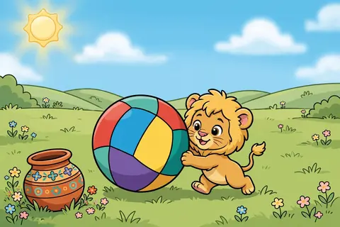
  </a>
  

    <h3><a href="stories/leo-tells-the-truth.html">शेरू ने सच कहा</a></h3>
    

      <a class="btn btn-read" href="stories/leo-tells-the-truth.html">📖 पढ़ें</a>
      <a class="btn btn-pdf" href="book/stories/leo-tells-the-truth.pdf">📕 PDF</a>
      <a class="btn btn-share" href="https://wa.me/?text=%E0%A4%B6%E0%A5%87%E0%A4%B0%E0%A5%82%20%E0%A4%A8%E0%A5%87%20%E0%A4%B8%E0%A4%9A%20%E0%A4%95%E0%A4%B9%E0%A4%BE%20%E2%80%94%20%E0%A4%AE%E0%A5%80%E0%A4%A0%E0%A5%87%20%E0%A4%B8%E0%A4%AA%E0%A4%A8%E0%A5%8B%E0%A4%82%20%E0%A4%95%E0%A5%80%20%E0%A4%95%E0%A4%B9%E0%A4%BE%E0%A4%A8%E0%A4%BF%E0%A4%AF%E0%A4%BE%E0%A4%81%0Ahttps%3A%2F%2Fniteshlhsnda-droid.github.io%2Fkids-book-videos-hindi%2Fstories%2Fleo-tells-the-truth.html" target="_blank" rel="noopener" title="WhatsApp पर भेजें" aria-label="WhatsApp पर भेजें">📲</a>
    

  

</article>
<article class="story-card" data-search="सपने बटोरने वाला तकिया the-dream-collectors-pillow">
  <a class="card-art" href="stories/the-dream-collectors-pillow.html" aria-label="सपने बटोरने वाला तकिया">
    💭
    
  </a>
  

    <h3><a href="stories/the-dream-collectors-pillow.html">सपने बटोरने वाला तकिया</a></h3>
    

      <a class="btn btn-read" href="stories/the-dream-collectors-pillow.html">📖 पढ़ें</a>
      <a class="btn btn-pdf" href="book/stories/the-dream-collectors-pillow.pdf">📕 PDF</a>
      <a class="btn btn-share" href="https://wa.me/?text=%E0%A4%B8%E0%A4%AA%E0%A4%A8%E0%A5%87%20%E0%A4%AC%E0%A4%9F%E0%A5%8B%E0%A4%B0%E0%A4%A8%E0%A5%87%20%E0%A4%B5%E0%A4%BE%E0%A4%B2%E0%A4%BE%20%E0%A4%A4%E0%A4%95%E0%A4%BF%E0%A4%AF%E0%A4%BE%20%E2%80%94%20%E0%A4%AE%E0%A5%80%E0%A4%A0%E0%A5%87%20%E0%A4%B8%E0%A4%AA%E0%A4%A8%E0%A5%8B%E0%A4%82%20%E0%A4%95%E0%A5%80%20%E0%A4%95%E0%A4%B9%E0%A4%BE%E0%A4%A8%E0%A4%BF%E0%A4%AF%E0%A4%BE%E0%A4%81%0Ahttps%3A%2F%2Fniteshlhsnda-droid.github.io%2Fkids-book-videos-hindi%2Fstories%2Fthe-dream-collectors-pillow.html" target="_blank" rel="noopener" title="WhatsApp पर भेजें" aria-label="WhatsApp पर भेजें">📲</a>
    

  

</article>
<article class="story-card" data-search="सपनों का बगीचा the-dream-garden">
  <a class="card-art" href="stories/the-dream-garden.html" aria-label="सपनों का बगीचा">
    🌸
    
  </a>
  

    <h3><a href="stories/the-dream-garden.html">सपनों का बगीचा</a></h3>
    

      <a class="btn btn-read" href="stories/the-dream-garden.html">📖 पढ़ें</a>
      <a class="btn btn-pdf" href="book/stories/the-dream-garden.pdf">📕 PDF</a>
      <a class="btn btn-share" href="https://wa.me/?text=%E0%A4%B8%E0%A4%AA%E0%A4%A8%E0%A5%8B%E0%A4%82%20%E0%A4%95%E0%A4%BE%20%E0%A4%AC%E0%A4%97%E0%A5%80%E0%A4%9A%E0%A4%BE%20%E2%80%94%20%E0%A4%AE%E0%A5%80%E0%A4%A0%E0%A5%87%20%E0%A4%B8%E0%A4%AA%E0%A4%A8%E0%A5%8B%E0%A4%82%20%E0%A4%95%E0%A5%80%20%E0%A4%95%E0%A4%B9%E0%A4%BE%E0%A4%A8%E0%A4%BF%E0%A4%AF%E0%A4%BE%E0%A4%81%0Ahttps%3A%2F%2Fniteshlhsnda-droid.github.io%2Fkids-book-videos-hindi%2Fstories%2Fthe-dream-garden.html" target="_blank" rel="noopener" title="WhatsApp पर भेजें" aria-label="WhatsApp पर भेजें">📲</a>
    

  

</article>
<article class="story-card" data-search="सपनों की नाव the-dream-boat">
  <a class="card-art" href="stories/the-dream-boat.html" aria-label="सपनों की नाव">
    ⛵
    
  </a>
  

    <h3><a href="stories/the-dream-boat.html">सपनों की नाव</a></h3>
    

      <a class="btn btn-read" href="stories/the-dream-boat.html">📖 पढ़ें</a>
      <a class="btn btn-pdf" href="book/stories/the-dream-boat.pdf">📕 PDF</a>
      <a class="btn btn-share" href="https://wa.me/?text=%E0%A4%B8%E0%A4%AA%E0%A4%A8%E0%A5%8B%E0%A4%82%20%E0%A4%95%E0%A5%80%20%E0%A4%A8%E0%A4%BE%E0%A4%B5%20%E2%80%94%20%E0%A4%AE%E0%A5%80%E0%A4%A0%E0%A5%87%20%E0%A4%B8%E0%A4%AA%E0%A4%A8%E0%A5%8B%E0%A4%82%20%E0%A4%95%E0%A5%80%20%E0%A4%95%E0%A4%B9%E0%A4%BE%E0%A4%A8%E0%A4%BF%E0%A4%AF%E0%A4%BE%E0%A4%81%0Ahttps%3A%2F%2Fniteshlhsnda-droid.github.io%2Fkids-book-videos-hindi%2Fstories%2Fthe-dream-boat.html" target="_blank" rel="noopener" title="WhatsApp पर भेजें" aria-label="WhatsApp पर भेजें">📲</a>
    

  

</article>
<article class="story-card" data-search="सीटी बजाने वाली हवा whistle-the-wind">
  <a class="card-art" href="stories/whistle-the-wind.html" aria-label="सीटी बजाने वाली हवा">
    🍃
    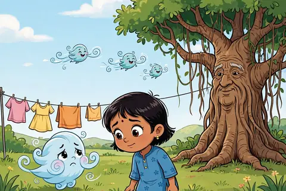
  </a>
  

    <h3><a href="stories/whistle-the-wind.html">सीटी बजाने वाली हवा</a></h3>
    

      <a class="btn btn-read" href="stories/whistle-the-wind.html">📖 पढ़ें</a>
      <a class="btn btn-pdf" href="book/stories/whistle-the-wind.pdf">📕 PDF</a>
      <a class="btn btn-share" href="https://wa.me/?text=%E0%A4%B8%E0%A5%80%E0%A4%9F%E0%A5%80%20%E0%A4%AC%E0%A4%9C%E0%A4%BE%E0%A4%A8%E0%A5%87%20%E0%A4%B5%E0%A4%BE%E0%A4%B2%E0%A5%80%20%E0%A4%B9%E0%A4%B5%E0%A4%BE%20%E2%80%94%20%E0%A4%AE%E0%A5%80%E0%A4%A0%E0%A5%87%20%E0%A4%B8%E0%A4%AA%E0%A4%A8%E0%A5%8B%E0%A4%82%20%E0%A4%95%E0%A5%80%20%E0%A4%95%E0%A4%B9%E0%A4%BE%E0%A4%A8%E0%A4%BF%E0%A4%AF%E0%A4%BE%E0%A4%81%0Ahttps%3A%2F%2Fniteshlhsnda-droid.github.io%2Fkids-book-videos-hindi%2Fstories%2Fwhistle-the-wind.html" target="_blank" rel="noopener" title="WhatsApp पर भेजें" aria-label="WhatsApp पर भेजें">📲</a>
    

  

</article>
<article class="story-card" data-search="सूरज और चाँद की बारी-बारी sun-and-moon-take-turns">
  <a class="card-art" href="stories/sun-and-moon-take-turns.html" aria-label="सूरज और चाँद की बारी-बारी">
    🌙
    
  </a>
  

    <h3><a href="stories/sun-and-moon-take-turns.html">सूरज और चाँद की बारी-बारी</a></h3>
    

      <a class="btn btn-read" href="stories/sun-and-moon-take-turns.html">📖 पढ़ें</a>
      <a class="btn btn-pdf" href="book/stories/sun-and-moon-take-turns.pdf">📕 PDF</a>
      <a class="btn btn-share" href="https://wa.me/?text=%E0%A4%B8%E0%A5%82%E0%A4%B0%E0%A4%9C%20%E0%A4%94%E0%A4%B0%20%E0%A4%9A%E0%A4%BE%E0%A4%81%E0%A4%A6%20%E0%A4%95%E0%A5%80%20%E0%A4%AC%E0%A4%BE%E0%A4%B0%E0%A5%80-%E0%A4%AC%E0%A4%BE%E0%A4%B0%E0%A5%80%20%E2%80%94%20%E0%A4%AE%E0%A5%80%E0%A4%A0%E0%A5%87%20%E0%A4%B8%E0%A4%AA%E0%A4%A8%E0%A5%8B%E0%A4%82%20%E0%A4%95%E0%A5%80%20%E0%A4%95%E0%A4%B9%E0%A4%BE%E0%A4%A8%E0%A4%BF%E0%A4%AF%E0%A4%BE%E0%A4%81%0Ahttps%3A%2F%2Fniteshlhsnda-droid.github.io%2Fkids-book-videos-hindi%2Fstories%2Fsun-and-moon-take-turns.html" target="_blank" rel="noopener" title="WhatsApp पर भेजें" aria-label="WhatsApp पर भेजें">📲</a>
    

  

</article>
<article class="story-card" data-search="सूरी गिलहरी ने एक फल बाँटा sable-the-squirrel-shares-one-acorn">
  <a class="card-art" href="stories/sable-the-squirrel-shares-one-acorn.html" aria-label="सूरी गिलहरी ने एक फल बाँटा">
    🐇
    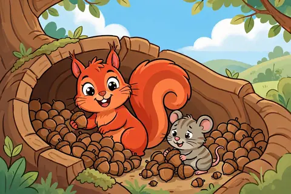
  </a>
  

    <h3><a href="stories/sable-the-squirrel-shares-one-acorn.html">सूरी गिलहरी ने एक फल बाँटा</a></h3>
    

      <a class="btn btn-read" href="stories/sable-the-squirrel-shares-one-acorn.html">📖 पढ़ें</a>
      <a class="btn btn-pdf" href="book/stories/sable-the-squirrel-shares-one-acorn.pdf">📕 PDF</a>
      <a class="btn btn-share" href="https://wa.me/?text=%E0%A4%B8%E0%A5%82%E0%A4%B0%E0%A5%80%20%E0%A4%97%E0%A4%BF%E0%A4%B2%E0%A4%B9%E0%A4%B0%E0%A5%80%20%E0%A4%A8%E0%A5%87%20%E0%A4%8F%E0%A4%95%20%E0%A4%AB%E0%A4%B2%20%E0%A4%AC%E0%A4%BE%E0%A4%81%E0%A4%9F%E0%A4%BE%20%E2%80%94%20%E0%A4%AE%E0%A5%80%E0%A4%A0%E0%A5%87%20%E0%A4%B8%E0%A4%AA%E0%A4%A8%E0%A5%8B%E0%A4%82%20%E0%A4%95%E0%A5%80%20%E0%A4%95%E0%A4%B9%E0%A4%BE%E0%A4%A8%E0%A4%BF%E0%A4%AF%E0%A4%BE%E0%A4%81%0Ahttps%3A%2F%2Fniteshlhsnda-droid.github.io%2Fkids-book-videos-hindi%2Fstories%2Fsable-the-squirrel-shares-one-acorn.html" target="_blank" rel="noopener" title="WhatsApp पर भेजें" aria-label="WhatsApp पर भेजें">📲</a>
    

  

</article>
<article class="story-card" data-search="सोना ने दोस्त को माफ़ किया sona-forgives-her-friend">
  <a class="card-art" href="stories/sona-forgives-her-friend.html" aria-label="सोना ने दोस्त को माफ़ किया">
    🌙
    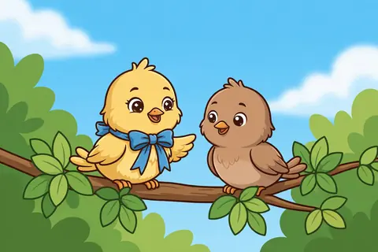
  </a>
  

    <h3><a href="stories/sona-forgives-her-friend.html">सोना ने दोस्त को माफ़ किया</a></h3>
    

      <a class="btn btn-read" href="stories/sona-forgives-her-friend.html">📖 पढ़ें</a>
      <a class="btn btn-pdf" href="book/stories/sona-forgives-her-friend.pdf">📕 PDF</a>
      <a class="btn btn-share" href="https://wa.me/?text=%E0%A4%B8%E0%A5%8B%E0%A4%A8%E0%A4%BE%20%E0%A4%A8%E0%A5%87%20%E0%A4%A6%E0%A5%8B%E0%A4%B8%E0%A5%8D%E0%A4%A4%20%E0%A4%95%E0%A5%8B%20%E0%A4%AE%E0%A4%BE%E0%A4%AB%E0%A4%BC%20%E0%A4%95%E0%A4%BF%E0%A4%AF%E0%A4%BE%20%E2%80%94%20%E0%A4%AE%E0%A5%80%E0%A4%A0%E0%A5%87%20%E0%A4%B8%E0%A4%AA%E0%A4%A8%E0%A5%8B%E0%A4%82%20%E0%A4%95%E0%A5%80%20%E0%A4%95%E0%A4%B9%E0%A4%BE%E0%A4%A8%E0%A4%BF%E0%A4%AF%E0%A4%BE%E0%A4%81%0Ahttps%3A%2F%2Fniteshlhsnda-droid.github.io%2Fkids-book-videos-hindi%2Fstories%2Fsona-forgives-her-friend.html" target="_blank" rel="noopener" title="WhatsApp पर भेजें" aria-label="WhatsApp पर भेजें">📲</a>
    

  

</article>
<article class="story-card" data-search="सोने के लिए तारे गिनना counting-stars-to-sleep">
  <a class="card-art" href="stories/counting-stars-to-sleep.html" aria-label="सोने के लिए तारे गिनना">
    ⭐
    
  </a>
  

    <h3><a href="stories/counting-stars-to-sleep.html">सोने के लिए तारे गिनना</a></h3>
    

      <a class="btn btn-read" href="stories/counting-stars-to-sleep.html">📖 पढ़ें</a>
      <a class="btn btn-pdf" href="book/stories/counting-stars-to-sleep.pdf">📕 PDF</a>
      <a class="btn btn-share" href="https://wa.me/?text=%E0%A4%B8%E0%A5%8B%E0%A4%A8%E0%A5%87%20%E0%A4%95%E0%A5%87%20%E0%A4%B2%E0%A4%BF%E0%A4%8F%20%E0%A4%A4%E0%A4%BE%E0%A4%B0%E0%A5%87%20%E0%A4%97%E0%A4%BF%E0%A4%A8%E0%A4%A8%E0%A4%BE%20%E2%80%94%20%E0%A4%AE%E0%A5%80%E0%A4%A0%E0%A5%87%20%E0%A4%B8%E0%A4%AA%E0%A4%A8%E0%A5%8B%E0%A4%82%20%E0%A4%95%E0%A5%80%20%E0%A4%95%E0%A4%B9%E0%A4%BE%E0%A4%A8%E0%A4%BF%E0%A4%AF%E0%A4%BE%E0%A4%81%0Ahttps%3A%2F%2Fniteshlhsnda-droid.github.io%2Fkids-book-videos-hindi%2Fstories%2Fcounting-stars-to-sleep.html" target="_blank" rel="noopener" title="WhatsApp पर भेजें" aria-label="WhatsApp पर भेजें">📲</a>
    

  

</article>
<article class="story-card" data-search="हवा की लोरी the-winds-bedtime-song">
  <a class="card-art" href="stories/the-winds-bedtime-song.html" aria-label="हवा की लोरी">
    🍃
    
  </a>
  

    <h3><a href="stories/the-winds-bedtime-song.html">हवा की लोरी</a></h3>
    

      <a class="btn btn-read" href="stories/the-winds-bedtime-song.html">📖 पढ़ें</a>
      <a class="btn btn-pdf" href="book/stories/the-winds-bedtime-song.pdf">📕 PDF</a>
      <a class="btn btn-share" href="https://wa.me/?text=%E0%A4%B9%E0%A4%B5%E0%A4%BE%20%E0%A4%95%E0%A5%80%20%E0%A4%B2%E0%A5%8B%E0%A4%B0%E0%A5%80%20%E2%80%94%20%E0%A4%AE%E0%A5%80%E0%A4%A0%E0%A5%87%20%E0%A4%B8%E0%A4%AA%E0%A4%A8%E0%A5%8B%E0%A4%82%20%E0%A4%95%E0%A5%80%20%E0%A4%95%E0%A4%B9%E0%A4%BE%E0%A4%A8%E0%A4%BF%E0%A4%AF%E0%A4%BE%E0%A4%81%0Ahttps%3A%2F%2Fniteshlhsnda-droid.github.io%2Fkids-book-videos-hindi%2Fstories%2Fthe-winds-bedtime-song.html" target="_blank" rel="noopener" title="WhatsApp पर भेजें" aria-label="WhatsApp पर भेजें">📲</a>
    

  

</article>
<article class="story-card" data-search="हिम्मती छपकू — समुद्र का नन्हा चूज़ा pogo-the-proud-puffin">
  <a class="card-art" href="stories/pogo-the-proud-puffin.html" aria-label="हिम्मती छपकू — समुद्र का नन्हा चूज़ा">
    🌙
    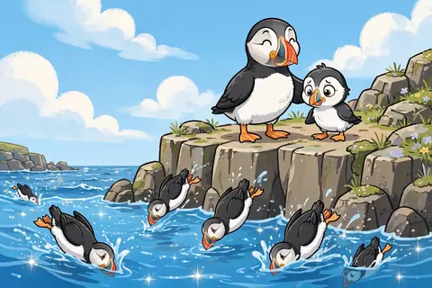
  </a>
  

    <h3><a href="stories/pogo-the-proud-puffin.html">हिम्मती छपकू — समुद्र का नन्हा चूज़ा</a></h3>
    

      <a class="btn btn-read" href="stories/pogo-the-proud-puffin.html">📖 पढ़ें</a>
      <a class="btn btn-pdf" href="book/stories/pogo-the-proud-puffin.pdf">📕 PDF</a>
      <a class="btn btn-share" href="https://wa.me/?text=%E0%A4%B9%E0%A4%BF%E0%A4%AE%E0%A5%8D%E0%A4%AE%E0%A4%A4%E0%A5%80%20%E0%A4%9B%E0%A4%AA%E0%A4%95%E0%A5%82%20%E2%80%94%20%E0%A4%B8%E0%A4%AE%E0%A5%81%E0%A4%A6%E0%A5%8D%E0%A4%B0%20%E0%A4%95%E0%A4%BE%20%E0%A4%A8%E0%A4%A8%E0%A5%8D%E0%A4%B9%E0%A4%BE%20%E0%A4%9A%E0%A5%82%E0%A4%9C%E0%A4%BC%E0%A4%BE%20%E2%80%94%20%E0%A4%AE%E0%A5%80%E0%A4%A0%E0%A5%87%20%E0%A4%B8%E0%A4%AA%E0%A4%A8%E0%A5%8B%E0%A4%82%20%E0%A4%95%E0%A5%80%20%E0%A4%95%E0%A4%B9%E0%A4%BE%E0%A4%A8%E0%A4%BF%E0%A4%AF%E0%A4%BE%E0%A4%81%0Ahttps%3A%2F%2Fniteshlhsnda-droid.github.io%2Fkids-book-videos-hindi%2Fstories%2Fpogo-the-proud-puffin.html" target="_blank" rel="noopener" title="WhatsApp पर भेजें" aria-label="WhatsApp पर भेजें">📲</a>
    

  

</article>
<article class="story-card" data-search="ह्यूगो और चाँद का कंबल mossys-moon-blanket">
  <a class="card-art" href="stories/mossys-moon-blanket.html" aria-label="ह्यूगो और चाँद का कंबल">
    🌙
    
  </a>
  

    <h3><a href="stories/mossys-moon-blanket.html">ह्यूगो और चाँद का कंबल</a></h3>
    

      <a class="btn btn-read" href="stories/mossys-moon-blanket.html">📖 पढ़ें</a>
      <a class="btn btn-pdf" href="book/stories/mossys-moon-blanket.pdf">📕 PDF</a>
      <a class="btn btn-share" href="https://wa.me/?text=%E0%A4%B9%E0%A5%8D%E0%A4%AF%E0%A5%82%E0%A4%97%E0%A5%8B%20%E0%A4%94%E0%A4%B0%20%E0%A4%9A%E0%A4%BE%E0%A4%81%E0%A4%A6%20%E0%A4%95%E0%A4%BE%20%E0%A4%95%E0%A4%82%E0%A4%AC%E0%A4%B2%20%E2%80%94%20%E0%A4%AE%E0%A5%80%E0%A4%A0%E0%A5%87%20%E0%A4%B8%E0%A4%AA%E0%A4%A8%E0%A5%8B%E0%A4%82%20%E0%A4%95%E0%A5%80%20%E0%A4%95%E0%A4%B9%E0%A4%BE%E0%A4%A8%E0%A4%BF%E0%A4%AF%E0%A4%BE%E0%A4%81%0Ahttps%3A%2F%2Fniteshlhsnda-droid.github.io%2Fkids-book-videos-hindi%2Fstories%2Fmossys-moon-blanket.html" target="_blank" rel="noopener" title="WhatsApp पर भेजें" aria-label="WhatsApp पर भेजें">📲</a>
    

  

</article>
<article class="story-card" data-search="ह्यूगो की दस तक गिनती nellie-counts-to-ten">
  <a class="card-art" href="stories/nellie-counts-to-ten.html" aria-label="ह्यूगो की दस तक गिनती">
    🌙
    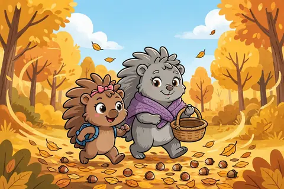
  </a>
  

    <h3><a href="stories/nellie-counts-to-ten.html">ह्यूगो की दस तक गिनती</a></h3>
    

      <a class="btn btn-read" href="stories/nellie-counts-to-ten.html">📖 पढ़ें</a>
      <a class="btn btn-pdf" href="book/stories/nellie-counts-to-ten.pdf">📕 PDF</a>
      <a class="btn btn-share" href="https://wa.me/?text=%E0%A4%B9%E0%A5%8D%E0%A4%AF%E0%A5%82%E0%A4%97%E0%A5%8B%20%E0%A4%95%E0%A5%80%20%E0%A4%A6%E0%A4%B8%20%E0%A4%A4%E0%A4%95%20%E0%A4%97%E0%A4%BF%E0%A4%A8%E0%A4%A4%E0%A5%80%20%E2%80%94%20%E0%A4%AE%E0%A5%80%E0%A4%A0%E0%A5%87%20%E0%A4%B8%E0%A4%AA%E0%A4%A8%E0%A5%8B%E0%A4%82%20%E0%A4%95%E0%A5%80%20%E0%A4%95%E0%A4%B9%E0%A4%BE%E0%A4%A8%E0%A4%BF%E0%A4%AF%E0%A4%BE%E0%A4%81%0Ahttps%3A%2F%2Fniteshlhsnda-droid.github.io%2Fkids-book-videos-hindi%2Fstories%2Fnellie-counts-to-ten.html" target="_blank" rel="noopener" title="WhatsApp पर भेजें" aria-label="WhatsApp पर भेजें">📲</a>
    

  

</article>
<article class="story-card" data-search="ह्यूगो ने फिर कोशिश की hugo-tries-again">
  <a class="card-art" href="stories/hugo-tries-again.html" aria-label="ह्यूगो ने फिर कोशिश की">
    🌙
    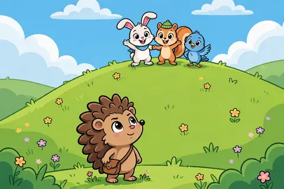
  </a>
  

    <h3><a href="stories/hugo-tries-again.html">ह्यूगो ने फिर कोशिश की</a></h3>
    

      <a class="btn btn-read" href="stories/hugo-tries-again.html">📖 पढ़ें</a>
      <a class="btn btn-pdf" href="book/stories/hugo-tries-again.pdf">📕 PDF</a>
      <a class="btn btn-share" href="https://wa.me/?text=%E0%A4%B9%E0%A5%8D%E0%A4%AF%E0%A5%82%E0%A4%97%E0%A5%8B%20%E0%A4%A8%E0%A5%87%20%E0%A4%AB%E0%A4%BF%E0%A4%B0%20%E0%A4%95%E0%A5%8B%E0%A4%B6%E0%A4%BF%E0%A4%B6%20%E0%A4%95%E0%A5%80%20%E2%80%94%20%E0%A4%AE%E0%A5%80%E0%A4%A0%E0%A5%87%20%E0%A4%B8%E0%A4%AA%E0%A4%A8%E0%A5%8B%E0%A4%82%20%E0%A4%95%E0%A5%80%20%E0%A4%95%E0%A4%B9%E0%A4%BE%E0%A4%A8%E0%A4%BF%E0%A4%AF%E0%A4%BE%E0%A4%81%0Ahttps%3A%2F%2Fniteshlhsnda-droid.github.io%2Fkids-book-videos-hindi%2Fstories%2Fhugo-tries-again.html" target="_blank" rel="noopener" title="WhatsApp पर भेजें" aria-label="WhatsApp पर भेजें">📲</a>
    

  

</article>
<article class="story-card" data-search="ह्यूगो हेजहॉग और मीठी झप्पी holly-the-hedgehogs-gentle-hug">
  <a class="card-art" href="stories/holly-the-hedgehogs-gentle-hug.html" aria-label="ह्यूगो हेजहॉग और मीठी झप्पी">
    🦔
    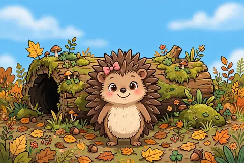
  </a>
  

    <h3><a href="stories/holly-the-hedgehogs-gentle-hug.html">ह्यूगो हेजहॉग और मीठी झप्पी</a></h3>
    

      <a class="btn btn-read" href="stories/holly-the-hedgehogs-gentle-hug.html">📖 पढ़ें</a>
      <a class="btn btn-pdf" href="book/stories/holly-the-hedgehogs-gentle-hug.pdf">📕 PDF</a>
      <a class="btn btn-share" href="https://wa.me/?text=%E0%A4%B9%E0%A5%8D%E0%A4%AF%E0%A5%82%E0%A4%97%E0%A5%8B%20%E0%A4%B9%E0%A5%87%E0%A4%9C%E0%A4%B9%E0%A5%89%E0%A4%97%20%E0%A4%94%E0%A4%B0%20%E0%A4%AE%E0%A5%80%E0%A4%A0%E0%A5%80%20%E0%A4%9D%E0%A4%AA%E0%A5%8D%E0%A4%AA%E0%A5%80%20%E2%80%94%20%E0%A4%AE%E0%A5%80%E0%A4%A0%E0%A5%87%20%E0%A4%B8%E0%A4%AA%E0%A4%A8%E0%A5%8B%E0%A4%82%20%E0%A4%95%E0%A5%80%20%E0%A4%95%E0%A4%B9%E0%A4%BE%E0%A4%A8%E0%A4%BF%E0%A4%AF%E0%A4%BE%E0%A4%81%0Ahttps%3A%2F%2Fniteshlhsnda-droid.github.io%2Fkids-book-videos-hindi%2Fstories%2Fholly-the-hedgehogs-gentle-hug.html" target="_blank" rel="noopener" title="WhatsApp पर भेजें" aria-label="WhatsApp पर भेजें">📲</a>
    

  

</article>
  

</section>

<section class="category cat-classic" id="cat-classic">
  <h2>🏛️ क्लासिक कहानियाँ</h2>
  
पंचतंत्र और लोककथाओं की कालजयी कहानियाँ — सुलाने के अंदाज़ में।

  

<article class="story-card" data-search="अकबर और बीरबल: कौओं की गिनती classic-akbar-birbal-kauon-ki-ginti">
  <a class="card-art" href="stories/classic-akbar-birbal-kauon-ki-ginti.html" aria-label="अकबर और बीरबल: कौओं की गिनती">
    🌙
    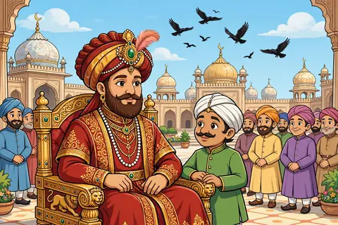
  </a>
  

    <h3><a href="stories/classic-akbar-birbal-kauon-ki-ginti.html">अकबर और बीरबल: कौओं की गिनती</a></h3>
    

      <a class="btn btn-read" href="stories/classic-akbar-birbal-kauon-ki-ginti.html">📖 पढ़ें</a>
      <a class="btn btn-pdf" href="book/stories/classic-akbar-birbal-kauon-ki-ginti.pdf">📕 PDF</a>
      <a class="btn btn-share" href="https://wa.me/?text=%E0%A4%85%E0%A4%95%E0%A4%AC%E0%A4%B0%20%E0%A4%94%E0%A4%B0%20%E0%A4%AC%E0%A5%80%E0%A4%B0%E0%A4%AC%E0%A4%B2%3A%20%E0%A4%95%E0%A5%8C%E0%A4%93%E0%A4%82%20%E0%A4%95%E0%A5%80%20%E0%A4%97%E0%A4%BF%E0%A4%A8%E0%A4%A4%E0%A5%80%20%E2%80%94%20%E0%A4%AE%E0%A5%80%E0%A4%A0%E0%A5%87%20%E0%A4%B8%E0%A4%AA%E0%A4%A8%E0%A5%8B%E0%A4%82%20%E0%A4%95%E0%A5%80%20%E0%A4%95%E0%A4%B9%E0%A4%BE%E0%A4%A8%E0%A4%BF%E0%A4%AF%E0%A4%BE%E0%A4%81%0Ahttps%3A%2F%2Fniteshlhsnda-droid.github.io%2Fkids-book-videos-hindi%2Fstories%2Fclassic-akbar-birbal-kauon-ki-ginti.html" target="_blank" rel="noopener" title="WhatsApp पर भेजें" aria-label="WhatsApp पर भेजें">📲</a>
    

  

</article>
<article class="story-card" data-search="कछुआ और हंस classic-kachhua-aur-hans">
  <a class="card-art" href="stories/classic-kachhua-aur-hans.html" aria-label="कछुआ और हंस">
    🌙
    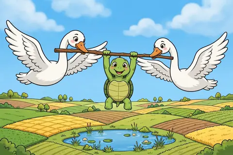
  </a>
  

    <h3><a href="stories/classic-kachhua-aur-hans.html">कछुआ और हंस</a></h3>
    

      <a class="btn btn-read" href="stories/classic-kachhua-aur-hans.html">📖 पढ़ें</a>
      <a class="btn btn-pdf" href="book/stories/classic-kachhua-aur-hans.pdf">📕 PDF</a>
      <a class="btn btn-share" href="https://wa.me/?text=%E0%A4%95%E0%A4%9B%E0%A5%81%E0%A4%86%20%E0%A4%94%E0%A4%B0%20%E0%A4%B9%E0%A4%82%E0%A4%B8%20%E2%80%94%20%E0%A4%AE%E0%A5%80%E0%A4%A0%E0%A5%87%20%E0%A4%B8%E0%A4%AA%E0%A4%A8%E0%A5%8B%E0%A4%82%20%E0%A4%95%E0%A5%80%20%E0%A4%95%E0%A4%B9%E0%A4%BE%E0%A4%A8%E0%A4%BF%E0%A4%AF%E0%A4%BE%E0%A4%81%0Ahttps%3A%2F%2Fniteshlhsnda-droid.github.io%2Fkids-book-videos-hindi%2Fstories%2Fclassic-kachhua-aur-hans.html" target="_blank" rel="noopener" title="WhatsApp पर भेजें" aria-label="WhatsApp पर भेजें">📲</a>
    

  

</article>
<article class="story-card" data-search="गाने वाला गधा classic-the-musical-donkey">
  <a class="card-art" href="stories/classic-the-musical-donkey.html" aria-label="गाने वाला गधा">
    🌙
    
  </a>
  

    <h3><a href="stories/classic-the-musical-donkey.html">गाने वाला गधा</a></h3>
    

      <a class="btn btn-read" href="stories/classic-the-musical-donkey.html">📖 पढ़ें</a>
      <a class="btn btn-share" href="https://wa.me/?text=%E0%A4%97%E0%A4%BE%E0%A4%A8%E0%A5%87%20%E0%A4%B5%E0%A4%BE%E0%A4%B2%E0%A4%BE%20%E0%A4%97%E0%A4%A7%E0%A4%BE%20%E2%80%94%20%E0%A4%AE%E0%A5%80%E0%A4%A0%E0%A5%87%20%E0%A4%B8%E0%A4%AA%E0%A4%A8%E0%A5%8B%E0%A4%82%20%E0%A4%95%E0%A5%80%20%E0%A4%95%E0%A4%B9%E0%A4%BE%E0%A4%A8%E0%A4%BF%E0%A4%AF%E0%A4%BE%E0%A4%81%0Ahttps%3A%2F%2Fniteshlhsnda-droid.github.io%2Fkids-book-videos-hindi%2Fstories%2Fclassic-the-musical-donkey.html" target="_blank" rel="noopener" title="WhatsApp पर भेजें" aria-label="WhatsApp पर भेजें">📲</a>
    

  

</article>
<article class="story-card" data-search="चतुर खरगोश और शेर classic-chatur-khargosh-aur-sher">
  <a class="card-art" href="stories/classic-chatur-khargosh-aur-sher.html" aria-label="चतुर खरगोश और शेर">
    🌙
    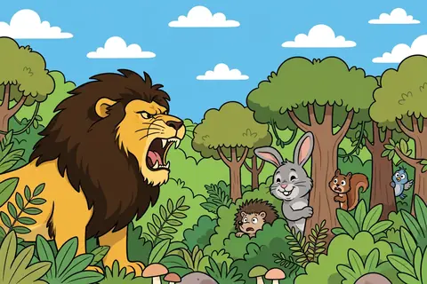
  </a>
  

    <h3><a href="stories/classic-chatur-khargosh-aur-sher.html">चतुर खरगोश और शेर</a></h3>
    

      <a class="btn btn-read" href="stories/classic-chatur-khargosh-aur-sher.html">📖 पढ़ें</a>
      <a class="btn btn-pdf" href="book/stories/classic-chatur-khargosh-aur-sher.pdf">📕 PDF</a>
      <a class="btn btn-share" href="https://wa.me/?text=%E0%A4%9A%E0%A4%A4%E0%A5%81%E0%A4%B0%20%E0%A4%96%E0%A4%B0%E0%A4%97%E0%A5%8B%E0%A4%B6%20%E0%A4%94%E0%A4%B0%20%E0%A4%B6%E0%A5%87%E0%A4%B0%20%E2%80%94%20%E0%A4%AE%E0%A5%80%E0%A4%A0%E0%A5%87%20%E0%A4%B8%E0%A4%AA%E0%A4%A8%E0%A5%8B%E0%A4%82%20%E0%A4%95%E0%A5%80%20%E0%A4%95%E0%A4%B9%E0%A4%BE%E0%A4%A8%E0%A4%BF%E0%A4%AF%E0%A4%BE%E0%A4%81%0Ahttps%3A%2F%2Fniteshlhsnda-droid.github.io%2Fkids-book-videos-hindi%2Fstories%2Fclassic-chatur-khargosh-aur-sher.html" target="_blank" rel="noopener" title="WhatsApp पर भेजें" aria-label="WhatsApp पर भेजें">📲</a>
    

  

</article>
<article class="story-card" data-search="चिड़ियों ने अपना राजा कैसे चुना classic-how-the-birds-picked-a-king">
  <a class="card-art" href="stories/classic-how-the-birds-picked-a-king.html" aria-label="चिड़ियों ने अपना राजा कैसे चुना">
    🌙
    
  </a>
  

    <h3><a href="stories/classic-how-the-birds-picked-a-king.html">चिड़ियों ने अपना राजा कैसे चुना</a></h3>
    

      <a class="btn btn-read" href="stories/classic-how-the-birds-picked-a-king.html">📖 पढ़ें</a>
      <a class="btn btn-share" href="https://wa.me/?text=%E0%A4%9A%E0%A4%BF%E0%A4%A1%E0%A4%BC%E0%A4%BF%E0%A4%AF%E0%A5%8B%E0%A4%82%20%E0%A4%A8%E0%A5%87%20%E0%A4%85%E0%A4%AA%E0%A4%A8%E0%A4%BE%20%E0%A4%B0%E0%A4%BE%E0%A4%9C%E0%A4%BE%20%E0%A4%95%E0%A5%88%E0%A4%B8%E0%A5%87%20%E0%A4%9A%E0%A5%81%E0%A4%A8%E0%A4%BE%20%E2%80%94%20%E0%A4%AE%E0%A5%80%E0%A4%A0%E0%A5%87%20%E0%A4%B8%E0%A4%AA%E0%A4%A8%E0%A5%8B%E0%A4%82%20%E0%A4%95%E0%A5%80%20%E0%A4%95%E0%A4%B9%E0%A4%BE%E0%A4%A8%E0%A4%BF%E0%A4%AF%E0%A4%BE%E0%A4%81%0Ahttps%3A%2F%2Fniteshlhsnda-droid.github.io%2Fkids-book-videos-hindi%2Fstories%2Fclassic-how-the-birds-picked-a-king.html" target="_blank" rel="noopener" title="WhatsApp पर भेजें" aria-label="WhatsApp पर भेजें">📲</a>
    

  

</article>
<article class="story-card" data-search="तीन राजकुमार और जलदानव classic-the-princes-and-the-water-sprite">
  <a class="card-art" href="stories/classic-the-princes-and-the-water-sprite.html" aria-label="तीन राजकुमार और जलदानव">
    🌙
    
  </a>
  

    <h3><a href="stories/classic-the-princes-and-the-water-sprite.html">तीन राजकुमार और जलदानव</a></h3>
    

      <a class="btn btn-read" href="stories/classic-the-princes-and-the-water-sprite.html">📖 पढ़ें</a>
      <a class="btn btn-share" href="https://wa.me/?text=%E0%A4%A4%E0%A5%80%E0%A4%A8%20%E0%A4%B0%E0%A4%BE%E0%A4%9C%E0%A4%95%E0%A5%81%E0%A4%AE%E0%A4%BE%E0%A4%B0%20%E0%A4%94%E0%A4%B0%20%E0%A4%9C%E0%A4%B2%E0%A4%A6%E0%A4%BE%E0%A4%A8%E0%A4%B5%20%E2%80%94%20%E0%A4%AE%E0%A5%80%E0%A4%A0%E0%A5%87%20%E0%A4%B8%E0%A4%AA%E0%A4%A8%E0%A5%8B%E0%A4%82%20%E0%A4%95%E0%A5%80%20%E0%A4%95%E0%A4%B9%E0%A4%BE%E0%A4%A8%E0%A4%BF%E0%A4%AF%E0%A4%BE%E0%A4%81%0Ahttps%3A%2F%2Fniteshlhsnda-droid.github.io%2Fkids-book-videos-hindi%2Fstories%2Fclassic-the-princes-and-the-water-sprite.html" target="_blank" rel="noopener" title="WhatsApp पर भेजें" aria-label="WhatsApp पर भेजें">📲</a>
    

  

</article>
<article class="story-card" data-search="तेनाली रामा और चोर classic-tenali-rama-aur-chor">
  <a class="card-art" href="stories/classic-tenali-rama-aur-chor.html" aria-label="तेनाली रामा और चोर">
    🌙
    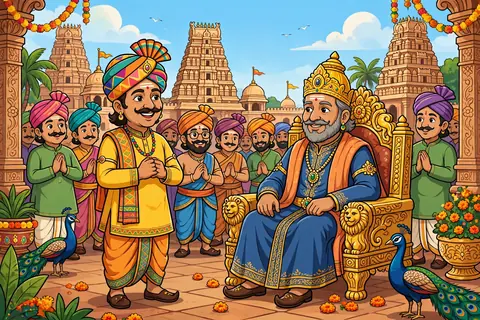
  </a>
  

    <h3><a href="stories/classic-tenali-rama-aur-chor.html">तेनाली रामा और चोर</a></h3>
    

      <a class="btn btn-read" href="stories/classic-tenali-rama-aur-chor.html">📖 पढ़ें</a>
      <a class="btn btn-pdf" href="book/stories/classic-tenali-rama-aur-chor.pdf">📕 PDF</a>
      <a class="btn btn-share" href="https://wa.me/?text=%E0%A4%A4%E0%A5%87%E0%A4%A8%E0%A4%BE%E0%A4%B2%E0%A5%80%20%E0%A4%B0%E0%A4%BE%E0%A4%AE%E0%A4%BE%20%E0%A4%94%E0%A4%B0%20%E0%A4%9A%E0%A5%8B%E0%A4%B0%20%E2%80%94%20%E0%A4%AE%E0%A5%80%E0%A4%A0%E0%A5%87%20%E0%A4%B8%E0%A4%AA%E0%A4%A8%E0%A5%8B%E0%A4%82%20%E0%A4%95%E0%A5%80%20%E0%A4%95%E0%A4%B9%E0%A4%BE%E0%A4%A8%E0%A4%BF%E0%A4%AF%E0%A4%BE%E0%A4%81%0Ahttps%3A%2F%2Fniteshlhsnda-droid.github.io%2Fkids-book-videos-hindi%2Fstories%2Fclassic-tenali-rama-aur-chor.html" target="_blank" rel="noopener" title="WhatsApp पर भेजें" aria-label="WhatsApp पर भेजें">📲</a>
    

  

</article>
<article class="story-card" data-search="दयालु कबूतर classic-the-kind-doves">
  <a class="card-art" href="stories/classic-the-kind-doves.html" aria-label="दयालु कबूतर">
    🌙
    
  </a>
  

    <h3><a href="stories/classic-the-kind-doves.html">दयालु कबूतर</a></h3>
    

      <a class="btn btn-read" href="stories/classic-the-kind-doves.html">📖 पढ़ें</a>
      <a class="btn btn-share" href="https://wa.me/?text=%E0%A4%A6%E0%A4%AF%E0%A4%BE%E0%A4%B2%E0%A5%81%20%E0%A4%95%E0%A4%AC%E0%A5%82%E0%A4%A4%E0%A4%B0%20%E2%80%94%20%E0%A4%AE%E0%A5%80%E0%A4%A0%E0%A5%87%20%E0%A4%B8%E0%A4%AA%E0%A4%A8%E0%A5%8B%E0%A4%82%20%E0%A4%95%E0%A5%80%20%E0%A4%95%E0%A4%B9%E0%A4%BE%E0%A4%A8%E0%A4%BF%E0%A4%AF%E0%A4%BE%E0%A4%81%0Ahttps%3A%2F%2Fniteshlhsnda-droid.github.io%2Fkids-book-videos-hindi%2Fstories%2Fclassic-the-kind-doves.html" target="_blank" rel="noopener" title="WhatsApp पर भेजें" aria-label="WhatsApp पर भेजें">📲</a>
    

  

</article>
<article class="story-card" data-search="नासमझ दोस्त classic-the-foolish-friend">
  <a class="card-art" href="stories/classic-the-foolish-friend.html" aria-label="नासमझ दोस्त">
    🌙
    
  </a>
  

    <h3><a href="stories/classic-the-foolish-friend.html">नासमझ दोस्त</a></h3>
    

      <a class="btn btn-read" href="stories/classic-the-foolish-friend.html">📖 पढ़ें</a>
      <a class="btn btn-share" href="https://wa.me/?text=%E0%A4%A8%E0%A4%BE%E0%A4%B8%E0%A4%AE%E0%A4%9D%20%E0%A4%A6%E0%A5%8B%E0%A4%B8%E0%A5%8D%E0%A4%A4%20%E2%80%94%20%E0%A4%AE%E0%A5%80%E0%A4%A0%E0%A5%87%20%E0%A4%B8%E0%A4%AA%E0%A4%A8%E0%A5%8B%E0%A4%82%20%E0%A4%95%E0%A5%80%20%E0%A4%95%E0%A4%B9%E0%A4%BE%E0%A4%A8%E0%A4%BF%E0%A4%AF%E0%A4%BE%E0%A4%81%0Ahttps%3A%2F%2Fniteshlhsnda-droid.github.io%2Fkids-book-videos-hindi%2Fstories%2Fclassic-the-foolish-friend.html" target="_blank" rel="noopener" title="WhatsApp पर भेजें" aria-label="WhatsApp पर भेजें">📲</a>
    

  

</article>
<article class="story-card" data-search="नीला सियार classic-neela-siyar">
  <a class="card-art" href="stories/classic-neela-siyar.html" aria-label="नीला सियार">
    🌙
    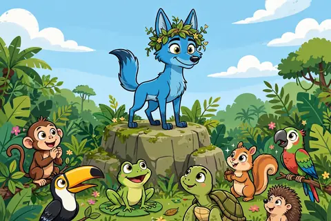
  </a>
  

    <h3><a href="stories/classic-neela-siyar.html">नीला सियार</a></h3>
    

      <a class="btn btn-read" href="stories/classic-neela-siyar.html">📖 पढ़ें</a>
      <a class="btn btn-pdf" href="book/stories/classic-neela-siyar.pdf">📕 PDF</a>
      <a class="btn btn-share" href="https://wa.me/?text=%E0%A4%A8%E0%A5%80%E0%A4%B2%E0%A4%BE%20%E0%A4%B8%E0%A4%BF%E0%A4%AF%E0%A4%BE%E0%A4%B0%20%E2%80%94%20%E0%A4%AE%E0%A5%80%E0%A4%A0%E0%A5%87%20%E0%A4%B8%E0%A4%AA%E0%A4%A8%E0%A5%8B%E0%A4%82%20%E0%A4%95%E0%A5%80%20%E0%A4%95%E0%A4%B9%E0%A4%BE%E0%A4%A8%E0%A4%BF%E0%A4%AF%E0%A4%BE%E0%A4%81%0Ahttps%3A%2F%2Fniteshlhsnda-droid.github.io%2Fkids-book-videos-hindi%2Fstories%2Fclassic-neela-siyar.html" target="_blank" rel="noopener" title="WhatsApp पर भेजें" aria-label="WhatsApp पर भेजें">📲</a>
    

  

</article>
<article class="story-card" data-search="बंदर और फन्नी classic-the-monkey-and-the-wedge">
  <a class="card-art" href="stories/classic-the-monkey-and-the-wedge.html" aria-label="बंदर और फन्नी">
    🌙
    
  </a>
  

    <h3><a href="stories/classic-the-monkey-and-the-wedge.html">बंदर और फन्नी</a></h3>
    

      <a class="btn btn-read" href="stories/classic-the-monkey-and-the-wedge.html">📖 पढ़ें</a>
      <a class="btn btn-share" href="https://wa.me/?text=%E0%A4%AC%E0%A4%82%E0%A4%A6%E0%A4%B0%20%E0%A4%94%E0%A4%B0%20%E0%A4%AB%E0%A4%A8%E0%A5%8D%E0%A4%A8%E0%A5%80%20%E2%80%94%20%E0%A4%AE%E0%A5%80%E0%A4%A0%E0%A5%87%20%E0%A4%B8%E0%A4%AA%E0%A4%A8%E0%A5%8B%E0%A4%82%20%E0%A4%95%E0%A5%80%20%E0%A4%95%E0%A4%B9%E0%A4%BE%E0%A4%A8%E0%A4%BF%E0%A4%AF%E0%A4%BE%E0%A4%81%0Ahttps%3A%2F%2Fniteshlhsnda-droid.github.io%2Fkids-book-videos-hindi%2Fstories%2Fclassic-the-monkey-and-the-wedge.html" target="_blank" rel="noopener" title="WhatsApp पर भेजें" aria-label="WhatsApp पर भेजें">📲</a>
    

  

</article>
<article class="story-card" data-search="बंदर और मगरमच्छ classic-bandar-aur-magarmachh">
  <a class="card-art" href="stories/classic-bandar-aur-magarmachh.html" aria-label="बंदर और मगरमच्छ">
    🌙
    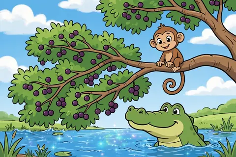
  </a>
  

    <h3><a href="stories/classic-bandar-aur-magarmachh.html">बंदर और मगरमच्छ</a></h3>
    

      <a class="btn btn-read" href="stories/classic-bandar-aur-magarmachh.html">📖 पढ़ें</a>
      <a class="btn btn-pdf" href="book/stories/classic-bandar-aur-magarmachh.pdf">📕 PDF</a>
      <a class="btn btn-share" href="https://wa.me/?text=%E0%A4%AC%E0%A4%82%E0%A4%A6%E0%A4%B0%20%E0%A4%94%E0%A4%B0%20%E0%A4%AE%E0%A4%97%E0%A4%B0%E0%A4%AE%E0%A4%9A%E0%A5%8D%E0%A4%9B%20%E2%80%94%20%E0%A4%AE%E0%A5%80%E0%A4%A0%E0%A5%87%20%E0%A4%B8%E0%A4%AA%E0%A4%A8%E0%A5%8B%E0%A4%82%20%E0%A4%95%E0%A5%80%20%E0%A4%95%E0%A4%B9%E0%A4%BE%E0%A4%A8%E0%A4%BF%E0%A4%AF%E0%A4%BE%E0%A4%81%0Ahttps%3A%2F%2Fniteshlhsnda-droid.github.io%2Fkids-book-videos-hindi%2Fstories%2Fclassic-bandar-aur-magarmachh.html" target="_blank" rel="noopener" title="WhatsApp पर भेजें" aria-label="WhatsApp पर भेजें">📲</a>
    

  

</article>
<article class="story-card" data-search="बरगद वाला हिरन classic-the-banyan-deer">
  <a class="card-art" href="stories/classic-the-banyan-deer.html" aria-label="बरगद वाला हिरन">
    🌙
    
  </a>
  

    <h3><a href="stories/classic-the-banyan-deer.html">बरगद वाला हिरन</a></h3>
    

      <a class="btn btn-read" href="stories/classic-the-banyan-deer.html">📖 पढ़ें</a>
      <a class="btn btn-share" href="https://wa.me/?text=%E0%A4%AC%E0%A4%B0%E0%A4%97%E0%A4%A6%20%E0%A4%B5%E0%A4%BE%E0%A4%B2%E0%A4%BE%20%E0%A4%B9%E0%A4%BF%E0%A4%B0%E0%A4%A8%20%E2%80%94%20%E0%A4%AE%E0%A5%80%E0%A4%A0%E0%A5%87%20%E0%A4%B8%E0%A4%AA%E0%A4%A8%E0%A5%8B%E0%A4%82%20%E0%A4%95%E0%A5%80%20%E0%A4%95%E0%A4%B9%E0%A4%BE%E0%A4%A8%E0%A4%BF%E0%A4%AF%E0%A4%BE%E0%A4%81%0Ahttps%3A%2F%2Fniteshlhsnda-droid.github.io%2Fkids-book-videos-hindi%2Fstories%2Fclassic-the-banyan-deer.html" target="_blank" rel="noopener" title="WhatsApp पर भेजें" aria-label="WhatsApp पर भेजें">📲</a>
    

  

</article>
<article class="story-card" data-search="बिल्ली का फ़ैसला classic-the-cats-judgment">
  <a class="card-art" href="stories/classic-the-cats-judgment.html" aria-label="बिल्ली का फ़ैसला">
    🌙
    
  </a>
  

    <h3><a href="stories/classic-the-cats-judgment.html">बिल्ली का फ़ैसला</a></h3>
    

      <a class="btn btn-read" href="stories/classic-the-cats-judgment.html">📖 पढ़ें</a>
      <a class="btn btn-share" href="https://wa.me/?text=%E0%A4%AC%E0%A4%BF%E0%A4%B2%E0%A5%8D%E0%A4%B2%E0%A5%80%20%E0%A4%95%E0%A4%BE%20%E0%A4%AB%E0%A4%BC%E0%A5%88%E0%A4%B8%E0%A4%B2%E0%A4%BE%20%E2%80%94%20%E0%A4%AE%E0%A5%80%E0%A4%A0%E0%A5%87%20%E0%A4%B8%E0%A4%AA%E0%A4%A8%E0%A5%8B%E0%A4%82%20%E0%A4%95%E0%A5%80%20%E0%A4%95%E0%A4%B9%E0%A4%BE%E0%A4%A8%E0%A4%BF%E0%A4%AF%E0%A4%BE%E0%A4%81%0Ahttps%3A%2F%2Fniteshlhsnda-droid.github.io%2Fkids-book-videos-hindi%2Fstories%2Fclassic-the-cats-judgment.html" target="_blank" rel="noopener" title="WhatsApp पर भेजें" aria-label="WhatsApp पर भेजें">📲</a>
    

  

</article>
<article class="story-card" data-search="बोलने वाली गुफ़ा classic-the-cave-that-talked">
  <a class="card-art" href="stories/classic-the-cave-that-talked.html" aria-label="बोलने वाली गुफ़ा">
    🌙
    
  </a>
  

    <h3><a href="stories/classic-the-cave-that-talked.html">बोलने वाली गुफ़ा</a></h3>
    

      <a class="btn btn-read" href="stories/classic-the-cave-that-talked.html">📖 पढ़ें</a>
      <a class="btn btn-share" href="https://wa.me/?text=%E0%A4%AC%E0%A5%8B%E0%A4%B2%E0%A4%A8%E0%A5%87%20%E0%A4%B5%E0%A4%BE%E0%A4%B2%E0%A5%80%20%E0%A4%97%E0%A5%81%E0%A4%AB%E0%A4%BC%E0%A4%BE%20%E2%80%94%20%E0%A4%AE%E0%A5%80%E0%A4%A0%E0%A5%87%20%E0%A4%B8%E0%A4%AA%E0%A4%A8%E0%A5%8B%E0%A4%82%20%E0%A4%95%E0%A5%80%20%E0%A4%95%E0%A4%B9%E0%A4%BE%E0%A4%A8%E0%A4%BF%E0%A4%AF%E0%A4%BE%E0%A4%81%0Ahttps%3A%2F%2Fniteshlhsnda-droid.github.io%2Fkids-book-videos-hindi%2Fstories%2Fclassic-the-cave-that-talked.html" target="_blank" rel="noopener" title="WhatsApp पर भेजें" aria-label="WhatsApp पर भेजें">📲</a>
    

  

</article>
<article class="story-card" data-search="भरूंडा classic-the-bharunda-birds">
  <a class="card-art" href="stories/classic-the-bharunda-birds.html" aria-label="भरूंडा">
    🌙
    
  </a>
  

    <h3><a href="stories/classic-the-bharunda-birds.html">भरूंडा</a></h3>
    

      <a class="btn btn-read" href="stories/classic-the-bharunda-birds.html">📖 पढ़ें</a>
      <a class="btn btn-share" href="https://wa.me/?text=%E0%A4%AD%E0%A4%B0%E0%A5%82%E0%A4%82%E0%A4%A1%E0%A4%BE%20%E2%80%94%20%E0%A4%AE%E0%A5%80%E0%A4%A0%E0%A5%87%20%E0%A4%B8%E0%A4%AA%E0%A4%A8%E0%A5%8B%E0%A4%82%20%E0%A4%95%E0%A5%80%20%E0%A4%95%E0%A4%B9%E0%A4%BE%E0%A4%A8%E0%A4%BF%E0%A4%AF%E0%A4%BE%E0%A4%81%0Ahttps%3A%2F%2Fniteshlhsnda-droid.github.io%2Fkids-book-videos-hindi%2Fstories%2Fclassic-the-bharunda-birds.html" target="_blank" rel="noopener" title="WhatsApp पर भेजें" aria-label="WhatsApp पर भेजें">📲</a>
    

  

</article>
<article class="story-card" data-search="राजा शिबि और कबूतर classic-king-sibi-and-the-dove">
  <a class="card-art" href="stories/classic-king-sibi-and-the-dove.html" aria-label="राजा शिबि और कबूतर">
    🌙
    
  </a>
  

    <h3><a href="stories/classic-king-sibi-and-the-dove.html">राजा शिबि और कबूतर</a></h3>
    

      <a class="btn btn-read" href="stories/classic-king-sibi-and-the-dove.html">📖 पढ़ें</a>
      <a class="btn btn-share" href="https://wa.me/?text=%E0%A4%B0%E0%A4%BE%E0%A4%9C%E0%A4%BE%20%E0%A4%B6%E0%A4%BF%E0%A4%AC%E0%A4%BF%20%E0%A4%94%E0%A4%B0%20%E0%A4%95%E0%A4%AC%E0%A5%82%E0%A4%A4%E0%A4%B0%20%E2%80%94%20%E0%A4%AE%E0%A5%80%E0%A4%A0%E0%A5%87%20%E0%A4%B8%E0%A4%AA%E0%A4%A8%E0%A5%8B%E0%A4%82%20%E0%A4%95%E0%A5%80%20%E0%A4%95%E0%A4%B9%E0%A4%BE%E0%A4%A8%E0%A4%BF%E0%A4%AF%E0%A4%BE%E0%A4%81%0Ahttps%3A%2F%2Fniteshlhsnda-droid.github.io%2Fkids-book-videos-hindi%2Fstories%2Fclassic-king-sibi-and-the-dove.html" target="_blank" rel="noopener" title="WhatsApp पर भेजें" aria-label="WhatsApp पर भेजें">📲</a>
    

  

</article>
<article class="story-card" data-search="रेत का रास्ता classic-the-sandy-road">
  <a class="card-art" href="stories/classic-the-sandy-road.html" aria-label="रेत का रास्ता">
    🌙
    
  </a>
  

    <h3><a href="stories/classic-the-sandy-road.html">रेत का रास्ता</a></h3>
    

      <a class="btn btn-read" href="stories/classic-the-sandy-road.html">📖 पढ़ें</a>
      <a class="btn btn-share" href="https://wa.me/?text=%E0%A4%B0%E0%A5%87%E0%A4%A4%20%E0%A4%95%E0%A4%BE%20%E0%A4%B0%E0%A4%BE%E0%A4%B8%E0%A5%8D%E0%A4%A4%E0%A4%BE%20%E2%80%94%20%E0%A4%AE%E0%A5%80%E0%A4%A0%E0%A5%87%20%E0%A4%B8%E0%A4%AA%E0%A4%A8%E0%A5%8B%E0%A4%82%20%E0%A4%95%E0%A5%80%20%E0%A4%95%E0%A4%B9%E0%A4%BE%E0%A4%A8%E0%A4%BF%E0%A4%AF%E0%A4%BE%E0%A4%81%0Ahttps%3A%2F%2Fniteshlhsnda-droid.github.io%2Fkids-book-videos-hindi%2Fstories%2Fclassic-the-sandy-road.html" target="_blank" rel="noopener" title="WhatsApp पर भेजें" aria-label="WhatsApp पर भेजें">📲</a>
    

  

</article>
<article class="story-card" data-search="वफ़ादार नेवला classic-the-loyal-mongoose">
  <a class="card-art" href="stories/classic-the-loyal-mongoose.html" aria-label="वफ़ादार नेवला">
    🌙
    
  </a>
  

    <h3><a href="stories/classic-the-loyal-mongoose.html">वफ़ादार नेवला</a></h3>
    

      <a class="btn btn-read" href="stories/classic-the-loyal-mongoose.html">📖 पढ़ें</a>
      <a class="btn btn-share" href="https://wa.me/?text=%E0%A4%B5%E0%A4%AB%E0%A4%BC%E0%A4%BE%E0%A4%A6%E0%A4%BE%E0%A4%B0%20%E0%A4%A8%E0%A5%87%E0%A4%B5%E0%A4%B2%E0%A4%BE%20%E2%80%94%20%E0%A4%AE%E0%A5%80%E0%A4%A0%E0%A5%87%20%E0%A4%B8%E0%A4%AA%E0%A4%A8%E0%A5%8B%E0%A4%82%20%E0%A4%95%E0%A5%80%20%E0%A4%95%E0%A4%B9%E0%A4%BE%E0%A4%A8%E0%A4%BF%E0%A4%AF%E0%A4%BE%E0%A4%81%0Ahttps%3A%2F%2Fniteshlhsnda-droid.github.io%2Fkids-book-videos-hindi%2Fstories%2Fclassic-the-loyal-mongoose.html" target="_blank" rel="noopener" title="WhatsApp पर भेजें" aria-label="WhatsApp पर भेजें">📲</a>
    

  

</article>
<article class="story-card" data-search="वह चूहिया जो लड़की बन गई classic-the-mouse-who-became-a-girl">
  <a class="card-art" href="stories/classic-the-mouse-who-became-a-girl.html" aria-label="वह चूहिया जो लड़की बन गई">
    🌙
    
  </a>
  

    <h3><a href="stories/classic-the-mouse-who-became-a-girl.html">वह चूहिया जो लड़की बन गई</a></h3>
    

      <a class="btn btn-read" href="stories/classic-the-mouse-who-became-a-girl.html">📖 पढ़ें</a>
      <a class="btn btn-share" href="https://wa.me/?text=%E0%A4%B5%E0%A4%B9%20%E0%A4%9A%E0%A5%82%E0%A4%B9%E0%A4%BF%E0%A4%AF%E0%A4%BE%20%E0%A4%9C%E0%A5%8B%20%E0%A4%B2%E0%A4%A1%E0%A4%BC%E0%A4%95%E0%A5%80%20%E0%A4%AC%E0%A4%A8%20%E0%A4%97%E0%A4%88%20%E2%80%94%20%E0%A4%AE%E0%A5%80%E0%A4%A0%E0%A5%87%20%E0%A4%B8%E0%A4%AA%E0%A4%A8%E0%A5%8B%E0%A4%82%20%E0%A4%95%E0%A5%80%20%E0%A4%95%E0%A4%B9%E0%A4%BE%E0%A4%A8%E0%A4%BF%E0%A4%AF%E0%A4%BE%E0%A4%81%0Ahttps%3A%2F%2Fniteshlhsnda-droid.github.io%2Fkids-book-videos-hindi%2Fstories%2Fclassic-the-mouse-who-became-a-girl.html" target="_blank" rel="noopener" title="WhatsApp पर भेजें" aria-label="WhatsApp पर भेजें">📲</a>
    

  

</article>
<article class="story-card" data-search="शर्त जीतने वाला बैल classic-the-ox-who-won-the-bet">
  <a class="card-art" href="stories/classic-the-ox-who-won-the-bet.html" aria-label="शर्त जीतने वाला बैल">
    🌙
    
  </a>
  

    <h3><a href="stories/classic-the-ox-who-won-the-bet.html">शर्त जीतने वाला बैल</a></h3>
    

      <a class="btn btn-read" href="stories/classic-the-ox-who-won-the-bet.html">📖 पढ़ें</a>
      <a class="btn btn-share" href="https://wa.me/?text=%E0%A4%B6%E0%A4%B0%E0%A5%8D%E0%A4%A4%20%E0%A4%9C%E0%A5%80%E0%A4%A4%E0%A4%A8%E0%A5%87%20%E0%A4%B5%E0%A4%BE%E0%A4%B2%E0%A4%BE%20%E0%A4%AC%E0%A5%88%E0%A4%B2%20%E2%80%94%20%E0%A4%AE%E0%A5%80%E0%A4%A0%E0%A5%87%20%E0%A4%B8%E0%A4%AA%E0%A4%A8%E0%A5%8B%E0%A4%82%20%E0%A4%95%E0%A5%80%20%E0%A4%95%E0%A4%B9%E0%A4%BE%E0%A4%A8%E0%A4%BF%E0%A4%AF%E0%A4%BE%E0%A4%81%0Ahttps%3A%2F%2Fniteshlhsnda-droid.github.io%2Fkids-book-videos-hindi%2Fstories%2Fclassic-the-ox-who-won-the-bet.html" target="_blank" rel="noopener" title="WhatsApp पर भेजें" aria-label="WhatsApp पर भेजें">📲</a>
    

  

</article>
<article class="story-card" data-search="शेर बनाने वाले classic-the-lion-makers">
  <a class="card-art" href="stories/classic-the-lion-makers.html" aria-label="शेर बनाने वाले">
    🌙
    
  </a>
  

    <h3><a href="stories/classic-the-lion-makers.html">शेर बनाने वाले</a></h3>
    

      <a class="btn btn-read" href="stories/classic-the-lion-makers.html">📖 पढ़ें</a>
      <a class="btn btn-share" href="https://wa.me/?text=%E0%A4%B6%E0%A5%87%E0%A4%B0%20%E0%A4%AC%E0%A4%A8%E0%A4%BE%E0%A4%A8%E0%A5%87%20%E0%A4%B5%E0%A4%BE%E0%A4%B2%E0%A5%87%20%E2%80%94%20%E0%A4%AE%E0%A5%80%E0%A4%A0%E0%A5%87%20%E0%A4%B8%E0%A4%AA%E0%A4%A8%E0%A5%8B%E0%A4%82%20%E0%A4%95%E0%A5%80%20%E0%A4%95%E0%A4%B9%E0%A4%BE%E0%A4%A8%E0%A4%BF%E0%A4%AF%E0%A4%BE%E0%A4%81%0Ahttps%3A%2F%2Fniteshlhsnda-droid.github.io%2Fkids-book-videos-hindi%2Fstories%2Fclassic-the-lion-makers.html" target="_blank" rel="noopener" title="WhatsApp पर भेजें" aria-label="WhatsApp पर भेजें">📲</a>
    

  

</article>
<article class="story-card" data-search="साँप की सवारी करने वाले मेंढक classic-the-frogs-who-rode-the-snake">
  <a class="card-art" href="stories/classic-the-frogs-who-rode-the-snake.html" aria-label="साँप की सवारी करने वाले मेंढक">
    🌙
    
  </a>
  

    <h3><a href="stories/classic-the-frogs-who-rode-the-snake.html">साँप की सवारी करने वाले मेंढक</a></h3>
    

      <a class="btn btn-read" href="stories/classic-the-frogs-who-rode-the-snake.html">📖 पढ़ें</a>
      <a class="btn btn-share" href="https://wa.me/?text=%E0%A4%B8%E0%A4%BE%E0%A4%81%E0%A4%AA%20%E0%A4%95%E0%A5%80%20%E0%A4%B8%E0%A4%B5%E0%A4%BE%E0%A4%B0%E0%A5%80%20%E0%A4%95%E0%A4%B0%E0%A4%A8%E0%A5%87%20%E0%A4%B5%E0%A4%BE%E0%A4%B2%E0%A5%87%20%E0%A4%AE%E0%A5%87%E0%A4%82%E0%A4%A2%E0%A4%95%20%E2%80%94%20%E0%A4%AE%E0%A5%80%E0%A4%A0%E0%A5%87%20%E0%A4%B8%E0%A4%AA%E0%A4%A8%E0%A5%8B%E0%A4%82%20%E0%A4%95%E0%A5%80%20%E0%A4%95%E0%A4%B9%E0%A4%BE%E0%A4%A8%E0%A4%BF%E0%A4%AF%E0%A4%BE%E0%A4%81%0Ahttps%3A%2F%2Fniteshlhsnda-droid.github.io%2Fkids-book-videos-hindi%2Fstories%2Fclassic-the-frogs-who-rode-the-snake.html" target="_blank" rel="noopener" title="WhatsApp पर भेजें" aria-label="WhatsApp पर भेजें">📲</a>
    

  

</article>
<article class="story-card" data-search="सेरी का सौदागर classic-the-merchant-of-seri">
  <a class="card-art" href="stories/classic-the-merchant-of-seri.html" aria-label="सेरी का सौदागर">
    🌙
    
  </a>
  

    <h3><a href="stories/classic-the-merchant-of-seri.html">सेरी का सौदागर</a></h3>
    

      <a class="btn btn-read" href="stories/classic-the-merchant-of-seri.html">📖 पढ़ें</a>
      <a class="btn btn-share" href="https://wa.me/?text=%E0%A4%B8%E0%A5%87%E0%A4%B0%E0%A5%80%20%E0%A4%95%E0%A4%BE%20%E0%A4%B8%E0%A5%8C%E0%A4%A6%E0%A4%BE%E0%A4%97%E0%A4%B0%20%E2%80%94%20%E0%A4%AE%E0%A5%80%E0%A4%A0%E0%A5%87%20%E0%A4%B8%E0%A4%AA%E0%A4%A8%E0%A5%8B%E0%A4%82%20%E0%A4%95%E0%A5%80%20%E0%A4%95%E0%A4%B9%E0%A4%BE%E0%A4%A8%E0%A4%BF%E0%A4%AF%E0%A4%BE%E0%A4%81%0Ahttps%3A%2F%2Fniteshlhsnda-droid.github.io%2Fkids-book-videos-hindi%2Fstories%2Fclassic-the-merchant-of-seri.html" target="_blank" rel="noopener" title="WhatsApp पर भेजें" aria-label="WhatsApp पर भेजें">📲</a>
    

  

</article>
<article class="story-card" data-search="सोना देने वाला साँप classic-the-gold-giving-snake">
  <a class="card-art" href="stories/classic-the-gold-giving-snake.html" aria-label="सोना देने वाला साँप">
    🌙
    
  </a>
  

    <h3><a href="stories/classic-the-gold-giving-snake.html">सोना देने वाला साँप</a></h3>
    

      <a class="btn btn-read" href="stories/classic-the-gold-giving-snake.html">📖 पढ़ें</a>
      <a class="btn btn-share" href="https://wa.me/?text=%E0%A4%B8%E0%A5%8B%E0%A4%A8%E0%A4%BE%20%E0%A4%A6%E0%A5%87%E0%A4%A8%E0%A5%87%20%E0%A4%B5%E0%A4%BE%E0%A4%B2%E0%A4%BE%20%E0%A4%B8%E0%A4%BE%E0%A4%81%E0%A4%AA%20%E2%80%94%20%E0%A4%AE%E0%A5%80%E0%A4%A0%E0%A5%87%20%E0%A4%B8%E0%A4%AA%E0%A4%A8%E0%A5%8B%E0%A4%82%20%E0%A4%95%E0%A5%80%20%E0%A4%95%E0%A4%B9%E0%A4%BE%E0%A4%A8%E0%A4%BF%E0%A4%AF%E0%A4%BE%E0%A4%81%0Ahttps%3A%2F%2Fniteshlhsnda-droid.github.io%2Fkids-book-videos-hindi%2Fstories%2Fclassic-the-gold-giving-snake.html" target="_blank" rel="noopener" title="WhatsApp पर भेजें" aria-label="WhatsApp पर भेजें">📲</a>
    

  

</article>
<article class="story-card" data-search="सोने का कंगन classic-the-golden-bangle">
  <a class="card-art" href="stories/classic-the-golden-bangle.html" aria-label="सोने का कंगन">
    🌙
    
  </a>
  

    <h3><a href="stories/classic-the-golden-bangle.html">सोने का कंगन</a></h3>
    

      <a class="btn btn-read" href="stories/classic-the-golden-bangle.html">📖 पढ़ें</a>
      <a class="btn btn-share" href="https://wa.me/?text=%E0%A4%B8%E0%A5%8B%E0%A4%A8%E0%A5%87%20%E0%A4%95%E0%A4%BE%20%E0%A4%95%E0%A4%82%E0%A4%97%E0%A4%A8%20%E2%80%94%20%E0%A4%AE%E0%A5%80%E0%A4%A0%E0%A5%87%20%E0%A4%B8%E0%A4%AA%E0%A4%A8%E0%A5%8B%E0%A4%82%20%E0%A4%95%E0%A5%80%20%E0%A4%95%E0%A4%B9%E0%A4%BE%E0%A4%A8%E0%A4%BF%E0%A4%AF%E0%A4%BE%E0%A4%81%0Ahttps%3A%2F%2Fniteshlhsnda-droid.github.io%2Fkids-book-videos-hindi%2Fstories%2Fclassic-the-golden-bangle.html" target="_blank" rel="noopener" title="WhatsApp पर भेजें" aria-label="WhatsApp पर भेजें">📲</a>
    

  

</article>
<article class="story-card" data-search="हाथियों को आज़ाद करने वाले चूहे classic-the-mice-that-set-elephants-free">
  <a class="card-art" href="stories/classic-the-mice-that-set-elephants-free.html" aria-label="हाथियों को आज़ाद करने वाले चूहे">
    🌙
    
  </a>
  

    <h3><a href="stories/classic-the-mice-that-set-elephants-free.html">हाथियों को आज़ाद करने वाले चूहे</a></h3>
    

      <a class="btn btn-read" href="stories/classic-the-mice-that-set-elephants-free.html">📖 पढ़ें</a>
      <a class="btn btn-share" href="https://wa.me/?text=%E0%A4%B9%E0%A4%BE%E0%A4%A5%E0%A4%BF%E0%A4%AF%E0%A5%8B%E0%A4%82%20%E0%A4%95%E0%A5%8B%20%E0%A4%86%E0%A4%9C%E0%A4%BC%E0%A4%BE%E0%A4%A6%20%E0%A4%95%E0%A4%B0%E0%A4%A8%E0%A5%87%20%E0%A4%B5%E0%A4%BE%E0%A4%B2%E0%A5%87%20%E0%A4%9A%E0%A5%82%E0%A4%B9%E0%A5%87%20%E2%80%94%20%E0%A4%AE%E0%A5%80%E0%A4%A0%E0%A5%87%20%E0%A4%B8%E0%A4%AA%E0%A4%A8%E0%A5%8B%E0%A4%82%20%E0%A4%95%E0%A5%80%20%E0%A4%95%E0%A4%B9%E0%A4%BE%E0%A4%A8%E0%A4%BF%E0%A4%AF%E0%A4%BE%E0%A4%81%0Ahttps%3A%2F%2Fniteshlhsnda-droid.github.io%2Fkids-book-videos-hindi%2Fstories%2Fclassic-the-mice-that-set-elephants-free.html" target="_blank" rel="noopener" title="WhatsApp पर भेजें" aria-label="WhatsApp पर भेजें">📲</a>
    

  

</article>

</section>

</main>

